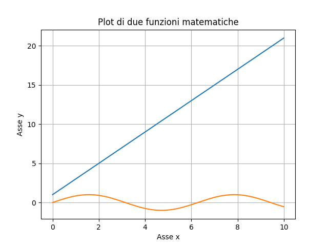

# Visualizzare i dati con Matplotlib (e Seaborn)

Fino a questo momento, abbiamo visualizzato gli output degli algoritmi da riga di comando, il che ovviamente non è un modo ottimale di farlo!

Per ovviare a ciò, abbiamo la necessità di sfruttare altre librerie rispetto a NumPy; vediamo quali.

## Matplotlib

La prima libreria che introdurremo è *Matplotlib*, la quale è senza ombra di dubbio quella maggiormente utilizzata tra quelle disponibili per la visualizzazione dati.

Iniziamo insallandola all'interno del nostro ambiente di lavoro:

```sh
pipenv install matplotlib
```

Una volta completata la procedura, potremo provare ad effettuare il primo plot. Per farlo, apriamo un terminale Python, ed inseriamo queste istruzioni:

```py
>>> import numpy as np
>>> import matplotlib.pylot as plt
>>> rng = np.random.default_rng(42)
>>> x = np.arange(1, 6)
>>> y = rng.integers(low=0, high=10, size=5)
>>> plt.plot(x, y)
>>> plt.show()
```

Se tutto è andato per il verso giusto, dovremmo vedere a schermo un'immagine simile a questa (data la natura casuale di `y`):


Cerchiamo adesso di descrivere più nel dettaglio quello che abbiamo fatto.

### Figure ed assi

Alla base del funzionamento di Matplotlib ci sono due concetti:

* la `Figure`, ovvero l'area nella quale saranno visualizzati i nostri dati;
* l'`Axes`, ovvero l'area nella quale i punti possono essere specificati in termini di coordinate (cartesiane, polari, etc.).

In generale, una `Figure` contiene più `Axes`.

Nel precedente snippet, ci siamo limitati ad usare la funzione `plot`, che consente di visualizzare rapidamente a schermo i valori di un asse `x` rispetto ad un asse `y`. Se volessimo riadattarlo integrando i concetti di `Figure` ed `Axis`, dovremo usare la funzione `subplots`, che permette di creare una figura con un singolo asse.

```py
>>> fig, ax = plt.subplots()
>>> ax.plot()
```

## Parti di una figura

Figure
Rappresenta l'intera figura. La figura tiene traccia di tutti gli assi figli, di una serie di artisti (tiolo, legenda, etc.), e del canvas.Una figura può contenere un numero qualsiasi di assi, ma tipicamente ne ha almeno uno.

Il modo più semplice di crare una nuova figura è usare i metodi figures o subplots.

Axes

Questo è il plot vero e proprio. Rappresenta la regione dell'immagine con lo spazio dei dati. Una data figura può contenere diversi assi, ma un dato oggetto Axes può essere appartenente ad una singola figura. Un oggetto di tipo Axes contiene due o tre oggetti di tipo Axis, un titolo e due/tre label.

Axis

Questi sono oggetti che si occupano di impostare i limiti del grafo e generare i *tick*, ovvero i segni che vediamo sugli assi, e le ticklabels, ovvero le label per i diversi tick.

Artist

Un *artist* è in pratica tutto quello che vediamo su una figura, incluso il testo, i plot, e via dicendo. 

## Esempio di plot

```py
x = np.arange(0., 10., 0.01)
y_1 = 1 + 2 * x
y_2 = np.sin(x)

fig, ax = plt.subplots()
ax.plot(x, y_1)
ax.plot(x, y_2)

ax.set_title('Plot di due funzioni matematiche')
ax.set_xlabel('Asse x')
ax.set_ylabel('Asse y')

ax.grid()

plt.show()
```

Il risultato ottenuto è mostrato in figura.



## Diversi subplot

```py
fig, (ax_1, ax_2) = plt.subplots(2, 1)

fig.suptitle('Due subplot di più funzioni matematiche')

ax_1.plot(x, y_1)
ax_1.set_ylabel('Asse y')

ax_2.plot(x, y_2)
ax_2.set_xlabel('Asse x')
ax_2.set_ylabel('Asse y')

ax_1.grid()
ax_2.grid()

plt.show()
```


## Rappresentazione di un istogramma

```py
x = rng.integers(low=0, high=100, size=1000)

fig, ax = plt.subplots()
n, bins, patches = ax.hist(x, density=True)

ax.set_xlabel('Bin')
ax.set_ylabel('Densità di probabilità')
ax.set_title('Esempio di istogramma')

plt.show()
```

Il risultato sarà


## Plot 3D

```py
fig, ax = plt.subplots(subplot_kw={"projection": "3d"})

X = np.arange(-10, 10, 0.25)
Y = np.arange(-5, 15, 0.25)
X, Y = np.meshgrid(X, Y)
R = np.sqrt(X**2 + Y**2)
Z = np.cos(R)

ax.plot_surface(X, Y, Z, linewidth=0)
ax.set_title('Un esempio di plot tridimensionale')

plt.show()
```

Il risultato che otterremo


!!!tip "La funzione `np.meshgrid()`"
	L'uso della funzione `meshgrid` è necessario a creare una griglia rettangolare a partire dai valori iniziali degli array X ed Y, grazie alla quale potremo poi creare una figura tridimensionale.

## Seaborn

### Installazione

Per prima cosa, installiamo la libreria nel modo usuale:

```sh
pipenv install seaborn
```

heatmap

scatter plot

```py
a = rng.integers(low=0, high=100, size=(20, 20))
coeff = np.corrcoef(a)

fig, ax = plt.subplots()

sns.heatmap(corr)
plt.show()
```

Il risultato sarà del tipo:


