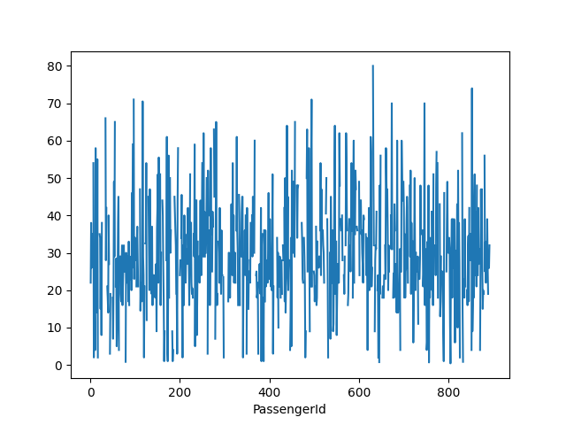
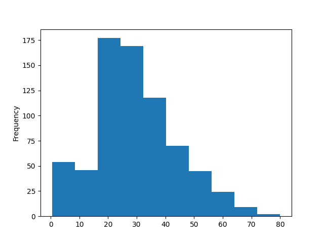

# Introduzione a Pandas

Pandas è l'ultima delle librerie dell'ecosistema SciPy che tratteremo, ma ciò non toglie che è un pezzo *fondamentale* dell'intero framework, in quanto viene usata per la lettura ed elaborazione dei dati provenienti da sorgenti di vario tipo.

## Installazione e configurazione di Pandas

Al solito, provvediamo per prima cosa ad installare Pandas nel nostro ambiente di lavoro.

==="Pip" 
	```sh
	pip install pandas
	```
==="Pipenv"
	```sh
	pipenv install pandas
	```

Così come per le altre librerie (eccetto Jupyter), nel prosieguo presupporemo che Pandas sia importato nel nostro script (o, ancora meglio, nel nostro notebook):

```py
import pandas as pd
```

## I dati gestiti da Pandas

Pandas gestisce dati *tabulari*, ossia dello stesso tipo di quelli comunemente contenuti nei fogli di calcolo o nei database. Questi dati sono sicuramente tra i più diffusi ed utilizzati nell'ambito dell'analisi dati, se si escludono le immagini; per modellarli, Pandas ci mette a disposizione un'apposita struttura denominata `DataFrame`.

Un `DataFrame` altro non è se non una *struttura dati* di tipo bidimensionale, adatta a memorizzare dati di ogni tipo, inclusi stringhe, interi, float, ed altro. I dati sono organizzati in righe (*rows*) e colonne (*columns*), in maniera concettualmente analoga ad un foglio di calcolo o database; tuttavia, è importante sottolinare come, per convenzione, le singole righe rappresentino i *campioni* del dataset, mentre le singole colonne siano associate ai valori assunti dalle *feature* per ciascun campione.

## Il primo `DataFrame`

Facciamo un esempio. Scarichiamo il [Titanic Dataset](../notebooks/base/dataset/train.csv), e scompattiamo l'archivio. Al suo interno, troveremo tre file, ovvero *gender_submission.csv*, *test.csv* e *train.csv*. Per gli scopi di questa lezione, ci concentreremo soltanto sull'ultimo.

Spostiamolo per prima cosa all'interno della nostra cartella di lavoro. A quel punto, usiamo questo codice per caricarlo all'interno di un `DataFrame`:

```py
df = pd.read_csv('train.csv')
```

Usiamo il metodo `head()` per mostrare a schermo le prime cinque righe del DataFrame.

```py
>>> df.head()
   PassengerId  Survived  Pclass                                               Name     Sex   Age  SibSp  Parch            Ticket     Fare Cabin Embarked
0            1         0       3                            Braund, Mr. Owen Harris    male  22.0      1      0         A/5 21171   7.2500   NaN        S
1            2         1       1  Cumings, Mrs. John Bradley (Florence Briggs Th...  female  38.0      1      0          PC 17599  71.2833   C85        C
2            3         1       3                             Heikkinen, Miss. Laina  female  26.0      0      0  STON/O2. 3101282   7.9250   NaN        S
3            4         1       1       Futrelle, Mrs. Jacques Heath (Lily May Peel)  female  35.0      1      0            113803  53.1000  C123        S
4            5         0       3                           Allen, Mr. William Henry    male  35.0      0      0            373450   8.0500   NaN        S
```

Vediamo poi i tipi di ciascuna delle colonne.

```py
>>> df.dtypes
PassengerId      int64
Survived         int64
Pclass           int64
Name            object
Sex             object
Age            float64
SibSp            int64
Parch            int64
Ticket          object
Fare           float64
Cabin           object
Embarked        object
dtype: object
```

Notiamo subito la presenza di tre tipi di colonna, ovvero `int64`, `float64` ed `object`. Laddove i primi due sono autoesplicativi, merita una particolare menzione il tipo `object`, che viene associato automaticamente a tutte le stringhe.

!!!tip "Suggerimento"
	Normalmente, usare il tipo `object` comporta diversi problemi nella successiva fase di analisi dei dati. Potrebbe quindi essere una buona idea parametrizzare la funzione `read_csv` mediante il parametro [`dtype`](https://pandas.pydata.org/pandas-docs/stable/reference/api/pandas.read_csv.html), che accetta un dizionario che specifica il tipo di una o più colonne. Ad esempio, se volessimo specificare che i nomi sono delle stringhe, potremmo usare il tipo `string`:

	> ```py
	  >>> types = {'Name': 'string'}
	  >>> df = pd.read_csv('train.csv', dtype=types)
	  >>> df.dtypes
	  # ...
	  Name            string
	  # ...
	  ```

### Le `Series`

Abbiamo visto come ogni `DataFrame` sia composto da un insieme di colonne, ciascuna rappresentativa di una feature specifica. In realtà, Pandas offre una rappresentazione apposita per ciascuna di queste colonne, chiamata `Series`. Ad esempio, se volessimo isolare la colonna relativa agli identificativi numerici dei passeggeri, potremmo usare le seguenti istruzioni:

```py
>>> df['PassengerId'].head()
0    1
1    2
2    3
3    4
4    5
Name: PassengerId, dtype: int64
>>> type(df['PassengerId'])
<class 'pandas.core.series.Series'>
```

!!!note "Nota"
	Possiamo creare sia una `Series` sia un `DataFrame` da zero usando gli appositi costruttori. Tuttavia, nella maggior parte dei casi, ci limiteremo a manipolare dati già esistenti.

## L'indice del `DataFrame`

Molto importante è l'*indice* associato al `DataFrame` od alla `Series`. Notiamo infatti che, in entrambi i casi precedenti, è stato associato ad ogni riga un indice numerico crescente, che possiamo utilizzare per recuperare uno specifico campione. Potremmo però decidere di usare una colonna del DataFrame come indice (nel nostro caso, ad esempio, `PassengerId`); per farlo, possiamo passare l'apposito parametro `index_col` all'interno del metodo `read_csv`:

```py
df = pd.read_csv('train.csv', index_col='PassengerId')
```

Verifichiamo che il nuovo `DataFrame` abbia come indice la colonna `PassengerId`:

```py
>>> df.head()
             Survived  Pclass                                               Name     Sex   Age  SibSp  Parch            Ticket     Fare Cabin Embarked
PassengerId
1                   0       3                            Braund, Mr. Owen Harris    male  22.0      1      0         A/5 21171   7.2500   NaN        S
2                   1       1  Cumings, Mrs. John Bradley (Florence Briggs Th...  female  38.0      1      0          PC 17599  71.2833   C85        C
3                   1       3                             Heikkinen, Miss. Laina  female  26.0      0      0  STON/O2. 3101282   7.9250   NaN        S
4                   1       1       Futrelle, Mrs. Jacques Heath (Lily May Peel)  female  35.0      1      0            113803  53.1000  C123        S
5                   0       3                           Allen, Mr. William Henry    male  35.0      0      0            373450   8.0500   NaN        S
>>> df.index
Int64Index([  1,   2,   3,   4,   5,   6,   7,   8,   9,  10,
            ...
            882, 883, 884, 885, 886, 887, 888, 889, 890, 891],
           dtype='int64', name='PassengerId', length=891)
```

## Formati di dato (in ingresso ed in uscita)

Finora abbiamo usato la funzione `read_csv` per creare un `DataFrame` a partire dai dati memorizzati in un file in formato CSV. Tuttavia, Pandas, supporta molti altri formati: ad esempio, potremmo leggere un file XLSX (Excel):

```py
df = pd.read_excel('dati.xlsx')
```

!!!warning "Attenzione"
	Per leggere (e scrivere) da (su) Excel è necessario installare la libreria `openpyxl` (`pip install openpyxl`). 

oppure un file in formato JSON:

```py
df = pd.read_json('dati.json')
```

o ancora direttamente da un database:

```py
df = pd.read_sql(SQL_QUERY)
```

Per un elenco completo delle funzioni disponibili, il rimando è alla [reference](https://pandas.pydata.org/pandas-docs/stable/reference/io.html); la sintassi è comunque quasi sempre `read_*(data_source)`, con `*` da sostituire con il tipo di sorgente dati (`csv`, `excel`, etc.).

Esiste anche la funzione duale, che usa il suffisso `to_` al posto di `read_`, e permette di scrivere un `DataFrame` su file. Ad esempio, se volessimo scrivere su un file XLSX:

```py
df.to_excel('train.xlsx')
```

## Aggiungere feature e dati

### Aggiunta di una nuova feature

Immaginiamo di voler aggiungere una nuova feature ad un `DataFrame` esistente. Per farlo, iniziamo creando un `DataFrame` di esempio:

```py
>>> df = pd.DataFrame([1,2,3,4,5], columns=['one'])     
>>> df
   one
0    1
1    2
2    3
3    4
4    5
```

Possiamo aggiungere una nuova colonna semplicemente usando l'operatore di assegnazione e specificandone il nome:

```py
>>> df['two'] = df['one'] * 2
>>> df
   one  two
0    1    2
1    2    4
2    3    6
3    4    8
4    5   10
```

### Aggiunta di nuovi campioni

Possiamo poi aggiungere nuovi campioni in coda al `DataFrame`. Per farlo, possiamo creare un nuovo `DataFrame`, le cui colonne devono essere coerenti con quello già esistente, e poi usare la funzione `insert`: 

```py
>>> df_add = pd.DataFrame([[6,7]], columns=['one', 'two']) 
>>> df.append(df_add)
   one  two
0    1    2
1    2    4
2    3    6
3    4    8
4    5   10
0    6    7
```

### Concatenazione di `DataFrame`

Possiamo usare la funzione `concat` per concatenare due (o più) `DataFrame`. Ad esempio, possiamo concatenare due `DataFrame` per colonne usando il parametro `axis=1`:

```py
>>> df_con_col = pd.DataFrame([3,6,9,12,15], columns=['three'])
>>> pd.concat([df, df_con_col], axis=1)
   one  two  three
0    1    2      3
1    2    4      6
2    3    6      9
3    4    8     12
4    5   10     15
```

Usando il parametro `axis=0`, si effettua una concatenazione per righe (campioni):

```py
>>> df_con_row = pd.DataFrame([[6,7]], columns=['one', 'two'])
>>> pd.concat([df, df_con_row])
   one  two
0    1    2
1    2    4
2    3    6
3    4    8
4    5   10
0    6    7
```

!!!note "Nota"
	Notiamo che `concat` accetta una *lista* di `DataFrame`.

## Scegliere i dati

### Dimensioni del `DataFrame`

Per conoscere le dimensioni del `DataFrame` sotto analisi, possiamo usare l'attributo `shape`. Ovviamente, l'attributo è analogo a quello usato in NumPy, e restituisce il numero di campioni e feature contenuti nel `DataFrame`. Ad esempio:

```py
>>> df.shape
(891, 11)
```

### Selezionare un insieme di colonne

Immaginiamo di voler selezionare soltanto le colonne relative alle caratteristiche anagrafiche dei passeggeri, ad esempio nome, genere ed età. In modo simile a come si opera su un array NumPy, possiamo usare la seguente notazione:

```py
>>> passengers_anagraphical = df[['Name', 'Sex', 'Age']]
>>> passengers_anagraphical.head()
                                                          Name     Sex   Age
PassengerId
1                                      Braund, Mr. Owen Harris    male  22.0
2            Cumings, Mrs. John Bradley (Florence Briggs Th...  female  38.0
3                                       Heikkinen, Miss. Laina  female  26.0
4                 Futrelle, Mrs. Jacques Heath (Lily May Peel)  female  35.0
5                                     Allen, Mr. William Henry    male  35.0
```

In pratica, stiamo semplicemente selezionando alcune colonne del `DataFrame`.

!!!warning "Attenzione"
	I nomi delle colonne devono essere validi e presenti nel `DataFrame`.

### Selezionare un insieme di campioni in base ad una o più condizioni

Supponiamo di voler selezionare soltanto gli uomini maggiorenni presenti nel `DataFrame`. Per farlo, usiamo la seguente istruzione:

```py
>>> men = df[(df['Age'] > 18) & (df['Sex'] == 'male')] 
>>> men.head()
             Survived  Pclass                            Name   Sex  ...     Ticket     Fare  Cabin Embarked
PassengerId                                                          ...
1                   0       3         Braund, Mr. Owen Harris  male  ...  A/5 21171   7.2500    NaN        S       
5                   0       3        Allen, Mr. William Henry  male  ...     373450   8.0500    NaN        S       
7                   0       1         McCarthy, Mr. Timothy J  male  ...      17463  51.8625    E46        S       
13                  0       3  Saundercock, Mr. William Henry  male  ...  A/5. 2151   8.0500    NaN        S       
14                  0       3     Andersson, Mr. Anders Johan  male  ...     347082  31.2750    NaN        S
```

In pratica, stiamo filtrando il `DataFrame` in base a due condizioni:

* `df['Age'] > 18`: questa condizione genera una *maschera booleana* che è `True` soltanto se l'età per quel passeggero è maggiore di 18 anni;
* `df['Sex'] == 'male'`: questa condizione genera una maschera booleana che è vera soltanto se il genere del passeggero è maschile.

Possiamo combinare le due condizioni mediante un *and logico* per ottenere la maschera complessiva:

```py
(df['Age'] > 18) & (df['Sex'] == 'male')
```

A quel punto, estraiamo i campioni in cui la maschera è vera:

```py
df[(df['Age'] > 18) & (df['Sex'] == 'male')]
```

### Le funzioni `loc` ed `iloc`

Possiamo anche selezionare dei sottoinsiemi di dati in maniera non dissimile da come faremmo con gli array NumPy. Per farlo, abbiamo a disposizione due funzioni, ovvero `loc` ed `iloc`.

Entrambe permettono di selezionare un sottoinsieme di campioni mediante slicing. Ad esempio:

```py
>>> df.loc[:5:2]
             Survived  Pclass                      Name     Sex  ...            Ticket   Fare  Cabin Embarked
PassengerId                                                      ...
1                   0       3   Braund, Mr. Owen Harris    male  ...         A/5 21171  7.250    NaN        S      
3                   1       3    Heikkinen, Miss. Laina  female  ...  STON/O2. 3101282  7.925    NaN        S      
5                   0       3  Allen, Mr. William Henry    male  ...            373450  8.050    NaN        S
>>> df.iloc[:5:2]
             Survived  Pclass                      Name     Sex  ...            Ticket   Fare  Cabin Embarked
PassengerId                                                      ...
1                   0       3   Braund, Mr. Owen Harris    male  ...         A/5 21171  7.250    NaN        S      
3                   1       3    Heikkinen, Miss. Laina  female  ...  STON/O2. 3101282  7.925    NaN        S      
5                   0       3  Allen, Mr. William Henry    male  ...            373450  8.050    NaN        S
```

La differenza tra le due funzioni sta principalmente nell'indicizzazione delle colonne. Infatti, la funzione `loc` si attende il nome della colonna:

```py
>>> df.loc[:5, 'Survived']
PassengerId
1    0
2    1
3    1
4    1
5    0
```

D'altro canto, `iloc` (composizione di *integer location*) si attende l'indice numerico, su cui si può ovviamente anche applicare lo slicing:

```py
>>> df.iloc[:5, 0]
PassengerId
1    0
2    1
3    1
4    1
5    0
```

## Visualizzazione dei dati in Pandas

Pandas offre un supporto nativo ad un *backend* Matplotlib per la visualizzazione dei dati; per farlo, basta usare la funzione `plot()` su una `Series` o su un intero `DataFrame`. Ad esempio, se volessimo plottare le età dei passeggeri:

```py
>>> df['Age'].plot()
>>> plt.show()
```

Il risultato sarà mostrato in figura.



Possiamo anche fare il plot dell'intero `DataFrame`:

```py
>>> df.plot()
>>> plt.show()
```

Il risultato è mostrato in figura.


### Istogrammi ed altro

Ovviamente, è possibile usare Pandas anche per fare il plot di altri tipi di grafico, come ad esempio gli istogrammi. Per farlo, si usano le apposite sotto-funzioni di `plot`:

```py
>>> df['Age'].plot.hist()
>>> plt.show()
```

Il risultato è mostrato in figura.



## Statistiche su un `DataFrame`

Pandas ci mette a disposizione delle funzioni, simili a quelle offerte da NumPy, per calcolare delle statistiche per ciascuna delle colonne presenti in un DataFrame. Ad esempio:

```py
>>> df.mean()
PassengerId    446.000000
Survived         0.383838
Pclass           2.308642
Age             29.699118
SibSp            0.523008
Parch            0.381594
Fare            32.204208
dtype: float64
```

Ovviamente, esistono funzioni anche per calcolare varianza (`df.var()`), mediana (`df.median()`), deviazione standard (`df.std()`), e via discorrendo.

Particolarmente interessante è la funzione `describe()`, che ci mosta tutte le statistiche più significative per ognuna delle feature considerate.

```py
>>> df.describe()
       PassengerId    Survived      Pclass         Age       SibSp       Parch        Fare
count   891.000000  891.000000  891.000000  714.000000  891.000000  891.000000  891.000000
mean    446.000000    0.383838    2.308642   29.699118    0.523008    0.381594   32.204208
std     257.353842    0.486592    0.836071   14.526497    1.102743    0.806057   49.693429
min       1.000000    0.000000    1.000000    0.420000    0.000000    0.000000    0.000000
25%     223.500000    0.000000    2.000000   20.125000    0.000000    0.000000    7.910400
50%     446.000000    0.000000    3.000000   28.000000    0.000000    0.000000   14.454200
75%     668.500000    1.000000    3.000000   38.000000    1.000000    0.000000   31.000000
max     891.000000    1.000000    3.000000   80.000000    8.000000    6.000000  512.329200
```

## La funzione `groupby`

Possiamo sfruttare la funzione [`groupby`](https://pandas.pydata.org/pandas-docs/stable/reference/api/pandas.DataFrame.groupby.html) per raggruppare insiemi di dati (normalmente pertinenti a *categorie*).

Ad esempio, potremmo raggruppare i passeggeri per genere:

```py
>>> df.groupby(['Sex'])
```

Possiamo ovviamente estrarre delle statistiche a partire da questi raggruppamenti. Vediamo, ad esempio, l'età media dei passeggeri di sesso femminile e maschile:

```py
>>> df.groupby(['Sex'])['Age'].mean()
Sex
female    27.915709
male      30.726645
Name: Age, dtype: float64
```
