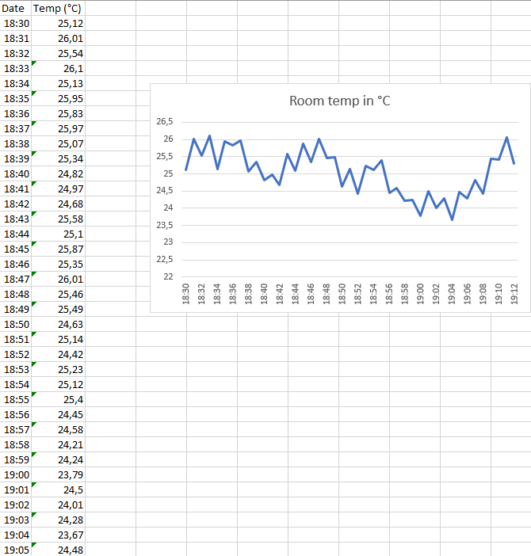

# 17 - Concetti introduttivi al machine learning

## 17.1 - Il dataset

Un dataset, in senso lato, serve a modellare un dato fenomeno sotto osservazione; nel caso del dataset *Titanic*, infatti, stiamo modellando, o per meglio dire *caratterizzando*, i passeggeri presenti sul Titanic durante l'unico, sfortunato, viaggio della nave.

!!!note "Sui dataset"
    Al giorno d'oggi, esistono dataset su praticamente ogni cosa, dalle saldature, alla videosorveglianza, passando per la qualità dell'aria, e chi più ne ha, più ne metta. TODO: inserire link a repository online

Un dataset è concettualmente assimilabile ad una tabella, nella quale le righe sono i *campioni*, mentre le colonne sono le *feature*. Vediamo nel dettaglio di cosa si tratta.

### 17.1.1 - I campioni

I campioni sono le singole *osservazioni* del fenomeno sotto esame. Ad esempio, tornando al solito dataset Titanic, ogni campione è associato ad un passeggero; in analoga maniera, il singolo campione può essere associato ad un frame acquisito dalle videocamere di sorveglianza, o alla lettura di un dato da un sensore.

Ovviamente, è anche possibile che, a valle di un qualche errore hardware o software, ci siano dati ripetuti; in questo caso, è bene effettuare un *preprocessing* del dataset, andando ad isolare ed eliminare eventuali ridondanze.

#### 17.1.1.1 - Sbilanciamento del dataset

Esistono delle particolari situazioni nelle quali vi è una "abbondanza" di dati di un certo tipo, contrapposta alla "scarsità" di dati di un altro tipo. Ad esempio, in un dataset per la videosorveglianza, potrebbero essere stati ripresi molti più uomini che donne, oppure ancora in un dataset simile a quello del Titanic potrebbero esserci molti più bambini che adulti. In questi casi non è detto che il nostro algoritmo di machine learning si comporti sempre in maniera ottimale: infatti, se gli uomini fossero prevalenti rispetto alle donne, l'algoritmo potrebbe iniziare a riconoscere soltanto i primi, proprio perché *non conosce a sufficienza* le seconde; si parla quindi di *sbilanciamento del dataset*.

!!!note "Nota"
    Per fortuna, esistono degli approcci volti a ridurre l'impatto negativo di un possibile sbilanciamento, "ribilanciando" i dati. Ne parleremo in una delle sezioni successive.

### 17.1.2 - Le feature

Per quello che riguarda le feature, queste sono le *caratteristiche* che definiscono ciascun campione del nostro dataset. Nel caso dei passeggeri del Titanic, avremo, tra gli altri, il loro nome, la cabina in cui allogiavano, la modalità d'imbarco, l'età ed il sesso, mentre nel caso di un dataset relativo a dati acquisiti da sensori per il controllo della qualità dell'aria potremmo avere le letture di temperatura ed umidità per ogni campione temporale.

!!!note "Nota"
    In caso di dati *non strutturati*, ovvero che non possono essere caratterizzati direttamente con una tabella, come ad esempio le immagini, le feature devono essere di solito estratte mediante opportuni algoritmi. Ad esempio, nel caso delle immagini, potremmo utilizzare feature estratte a partire dal colore o dalle forme presenti nelle stesse, mentre per un file audio potrebbe essere necessario utilizzare trasformate nel dominio frequenziale o caratterizzazioni più a basso livello come gli [MFCC](https://en.wikipedia.org/wiki/Mel-frequency_cepstrum).

#### 17.1.2.1 - Feature selection

Così come per i campioni, è possibile che esistano delle feature ridondanti. In questo caso, tuttavia, la ridondanza va valutata tenendo conto dell'intero insieme di valori assunto dalle feature sotto esame.

Facciamo un breve esempio. Supponiamo innanzitutto di avere un sistema che legga temperatura ed umidità dell'ambiente in cui viene collocato. Nel sistema ci sono tre sensori: uno di umidità, uno di misurazione di temperatura in gradi centigradi, ed uno di misurazione di temperatura in gradi Kelvin. Supponiamo inoltre che, per un qualche errore di calibrazione, la lettura di umidità del sensore riporti sempre un valore pari al $50\%$. Allora:

1. potremo scartare *in toto* la lettura di umidità, in quanto non ci permetterà in alcun modo di discriminare tra letture differenti;
2. dato che le letture dei due sensori di temperatura sono linearmente dipendenti (ovvero, la lettura del sensore che misura in gradi centigradi è pari a quella del sensore che misura in Kelvin a meno di un offset di 273 gradi), potremo tranquillamente considerarle ridondanti, e scartarne una.

Con questi accorgimenti, abbiamo effettuato una (rudimentale, ma efficace) procedura di *feature selection*.

!!!note "Sulle feature a bassa varianza"
    Non vi è una relazione tra la rottura di un sensore ed una lettura a bassa varianza; quest'ultima, infatti, potrebbe essere meramente determinata dal fenomeno fisico sotto osservazione. Di conseguenza, è sempre necessario *osservare e valutare i numeri*.

##### 17.1.2.1.1 - La curse of dimensionality

L'importanza della feature selection è particolarmente rilevante nella mitigazione della *curse of dimensionality*, ovvero quel fenomeno che insorge quando il numero di feature è paragonabile a quello dei campioni.

Dobbiamo ricordare che gli algoritmi di machine learning non fanno altro che provare ad "estrarre" una relazione tra i campioni e le feature che li rappresentano: in altre parole, gli algoritmi tentano di capire se, ad esempio, esiste una correlazione tra tutti i passeggeri maschi di età inferiore ai 18 anni, oppure se le donne con età superiore ai 60 anni hanno aderito ad un certo piano tariffario, e via dicendo. Per far questo, è necessario che ci siano abbastanza campioni per descrivere ogni possibile comportamento del fenomeno sotto osservazione: ad esempio, se vi è soltanto una donna che ha pagato il biglietto più di 10 dollari, è plausibile che questa informazione sia *inutile*, ancorché *fuorviante*, mentre se un gran numero di ragazzi è stipato nelle cabine del secondo piano, allora, l'informazione avrà un valore del tutto differente.

La conseguenza immediata di ciò, e che è alla base della curse of dimensionality, risiede quindi nel fatto che quando il numero di feature è circa uguale a quello dei campioni è *molto probabile* che l'algoritmo non sarà in grado di caratterizzare in maniera adeguata il fenomeno sottostante. Le soluzioni a quel punto saranno due: da un lato, potremo provare ad aumentare il numero dei campioni, mentre dall'altro potremo provare a rimuovere le feature poco significative, o anche quelle tra loro correlate, aiutando a mitigare la curse of dimensionality.

## 17.2 - Tipi di problema

Un altro aspetto fondamentale nell'analisi dei dati è la valutazione del *tipo* di problema cui siamo di fronte, il che determina, di conseguenza, la scelta dell'algoritmo da utilizzare. In tal senso, esistono due tipi di problema: da un lato, ci sono quelli che riguardano i *dati indipendenti ed identicamente distribuiti* (*IID*), mentre dall'alto vi sono le *serie temporali*.

### 17.2.1 - Problemi con dati IID

I problemi con dati IID prevedono l'analisi di dati che, come suggerisce il nome stesso, sono *indipendenti* l'uno dall'altro. In altre parole, il meccanismo di generazione dei dati fa in modo che ogni istanza del processo non sia generata a partire da un'altra, ma soltanto secondo le regole del meccanismo stesso.

Per chiarire l'esempio, immaginiamo di avere un dataset che raccolga tutti gli studenti all'interno di un corso di laurea. In tal senso, le caratteristiche di ogni studente saranno *indipendenti* da quelle degli altri, in quanto non determinate a partire da questi ultimi. Per capirci, l'età e la media voto dello studente A non dipenderà dall'età o dalla media voto dello studente B, così come i nomi e cognomi dei due, l'andamento dei loro esami, e così via.

!!!warning "Gli studenti sono veramente indipendenti tra loro?"
    I più attenti tra i lettori noteranno come nel caso degli studenti siano state fatte delle ipotesi *semplificative*. Infatti, l'età, il nome ed il cognome degli studenti potrebbero influenzarsi in caso di familiari, mentre la media voto potrebbe essere simile per studenti abituati a studiare in gruppo. Tuttavia, molto spesso dovremo effettuare ipotesi di questo tipo, supponendo trascurabili situazioni nei fatti *marginali* come quelle descritte in precedenza.

!!!note "Definizione sintetica di IID"
    Diamo una definizione sintetica di dati IID: **i dati IID sottendono alla stessa distribuzione**, ed il valore di un campione dipende solo da quest'ultima.

Tipicamente, esistono tre tipi di problemi che possono essere utilizzati per caratterizzare dati IID, ovvero *classificazione*, *regressione* e *clustering*.

* La *classificazione* di dati IID prevede che ad ogni dato sia assegnata una determinata *classe*, intesa come "raggruppamento" di cui il singolo campione fa parte. Ad esempio, nel caso degli studenti, potremmo utilizzare le classi "Matricola", "In corso" e "Fuori corso" per determinare la possibilità di uno studente di accedere ad uno specifico appello, mentre nel caso dei passeggeri del Titanic potremmo classificare tra "Sopravvissuti" e "Non sopravvissuti".
* La *regressione* di dati IID cerca invece una relazione tra le feature di ciascun campione ed un dato valore numerico (continuo). Rimanendo ai passeggeri del Titanic, potremmo voler valutare il rapporto esistente tra l'età del passeggero ed il prezzo che questi ha pagato per il biglietto.
* In ultimo, il *clustering* prova ad inferire dei "raggruppamenti", chiamati appunto *cluster*, di dati omogenei, separando contestualmente dati eterogenei.

!!!note "Tecniche supervisionate e non supervisionate"
    Di solito, le tecniche di classificazione sono spesso *supervisionate*, ovvero prevedono la presenza di un insieme di dati precedente *etichettato* da un *esperto di dominio* mediante una procedura di *labeling*. Di contro, le tecniche di clustering sono *non superivisionate*, ed inferiscono eventuali omogeneità a partire dai dati stessi.

### 17.2.2 - Problemi con serie temporali

A differenza dei dati IID, le serie temporali sono composte da dati tra loro interdipendenti, e "correlati" da appositi vincoli temporali. Facciamo un paio di esempi di dati di questo tipo.

* Il primo esempio è quello di un *video*, il quale è composto da una *sequenza*, o *serie*, di immagini disposte in un ben preciso ordine temporale. Ad esempio, osserviamo i frame riportati nelle figure 1 e 2: è facile ntoare come il secondo, successivo al primo, comporti dei movimenti del calciatore con la palla *causati* dalle azioni che questi ha compiuto nel frame precedente. In tal senso, le informazioni contenute nel secondo frame sono quindi legate a quelle contenute nel primo da un rapporto di *causalità*, per cui si parla di serie temporale.

{: .center}

    <b>
        Figura 1: frame 1
    </b>

{: .center}

    <b>
        Figura 2: frame 2
    </b>

* Il secondo esempio è quello di una *serie di letture* di un sensore di temperatura, prese ad una frequenza di un minuto, come mostrato nella figura successiva. In questo caso, è facile evidenziare come la lettura al tempo $t$ sia influenzata (almeno) dalla lettura al tempo $t-1$.

{: .center}

    <b>
        Figura 3: serie temporale
    </b>

!!!note "Sulle influenze di una serie temporale"
    Si noti come abbiamo usato la parola *almeno* in merito alle influenze temporali. Questo è legato al fatto che, per semplicità, abbiamo rappresentato la serie temporale delle letture di temperatura come un fenomeno *univariato*, ossia dipendente soltanto dal valore dello stesso in istanti precedenti. Nella realtà, invece, molto spesso i fenomeni osservati sono *multivariati*, e dipendono da un numero più o meno alto di variabili in gioco.
