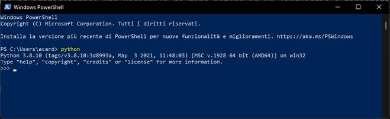

# 1.1.1 - Introduction to Python

Before we delve into Python, it's essential to ensure that the Python interpreter is installed on our system. To check if it's already installed, we can open a terminal (Shell or Command Prompt, depending on our system) and enter the following command:

```sh
python
```

If a screen similar to the one shown in Figure 1 appears, it means that Python is already correctly installed on our system.

<figure markdown>
  
  <figcaption>Figure 1: Python Interpreter</figcaption>
</figure>

Alternatively, if Python is not installed, we will need to follow the procedure outlined on the [official website](https://www.python.org/) to install it and add it to the system path.

## Python and Typing

### Dynamic Typing

Python is both an interpreted and dynamically typed language, which means that the interpreter determines the type of each variable during runtime, and this type can change during program execution.

But what does this mean for programmers? It's actually quite straightforward.

Let's consider the scenario of defining and initializing an integer variable in a statically typed language like C++. In C++, we would write something like:

```c++
int var = 0;
```

However, in Python, we can omit the type declaration, and it will be inferred from the assigned value directly:

```py
var = 0
```

Now, let's imagine that we need the variable to hold a decimal value. In C++, we would need to perform casting:

```c++
float fVar = float(var);
fVar + 1.1;
```

In Python, casting is not required, and we can directly perform the desired operations:

```py
var + 1.1			# The result will be 1.1
```

This apparent simplicity can make our lives easier since we no longer need to worry about variable types. However, it's important to note that not everything is as it seems. This brings us to the concept of 'duck typing,' which we'll discuss next.

#### Duck Typing

Duck typing can be summarized by the famous maxim:

!!!quote "Duck Typing"
    *If it walks like a duck and quacks like a duck, then it must be a duck.*

Ok, great, but what does it actually mean? Let's try with a quick example.

Let's instruct our Python interpreter to assign the value of `1` to our variable `var`. The interpreter observes that the variable "behaves" like an integer and, therefore, assumes it to be of type `int`.

Next, let's try to add a value of `1.1` to `var`. As expected, the result will be a decimal number, prompting the interpreter to "change its mind" and recognize `var` as a variable of type `float`.

The usefulness of duck typing becomes evident in scenarios like this, as it eliminates the need for numerous casting operations, simplifying code writing and maintenance. However, when working with classes and objects, it's important to consider that the interpreter infers and uses types based on the context in which variables are used. This can bring both conveniences and potential pitfalls that developers should be mindful of.

## Built-in Types in Python

Python provides a range of built-in types, which are inherently available in the language. There are numerous types available, but the ones we commonly use are summarized in Table 1.

| Type | Description | Example |
| ---- | ----------- | ------- |
| [`int`](https://docs.python.org/3/library/functions.html#int) | Integer numbers | `1` |
| [`float`](https://docs.python.org/3/library/functions.html#float) | Decimal numbers | `1.0` |
| [`complex`](https://docs.python.org/3/library/functions.html#complex) | Complex numbers | `1 + 1j` |
| [`list`](https://docs.python.org/3/library/stdtypes.html#list) | Lists of objects | `[1, 'foo', [1, 2, 3]]` |
| [`tuple`](https://docs.python.org/3/library/stdtypes.html#tuple) | Tuples of objects | `(1, 'foo', [1, 2, 3])` |
| [`str`](https://docs.python.org/3/library/stdtypes.html#str) | Strings | `'foo'` |
| [`set`](https://docs.python.org/3/library/stdtypes.html#set) | Sets | `{1, 2, 3}` |
| [`dict`](https://docs.python.org/3/library/stdtypes.html#dict) | Dictionaries | `{'a': 1, 2: 'b'}` |

In the upcoming lesson, we will explore some of the most commonly used operators on numeric data in the [next lesson](./02_operators.md).
