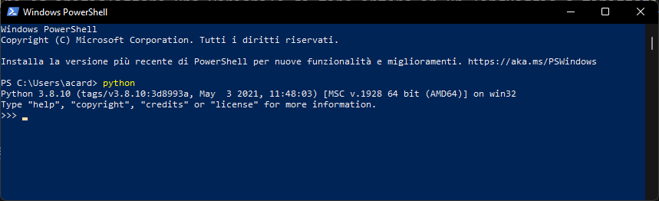

# 1 - Introduction to Python

Before introducing the Python language, let us check whether the Python interpreter is installed within our system. To do that, let's open a terminal (either a Shell or a Command Prompt, according to our system), and let's write:

```sh
python
```

Should a window similar to the one shown in figure 1.1 appear, you are good to go.

<figure markdown>
  { width="450" }
  <figcaption>Figure 1.1 - Python interpreter</figcaption>
</figure>

If Python is not correctly installed, you'll need to do that by following the procedure shown on the [official site](https://www.python.org/).
