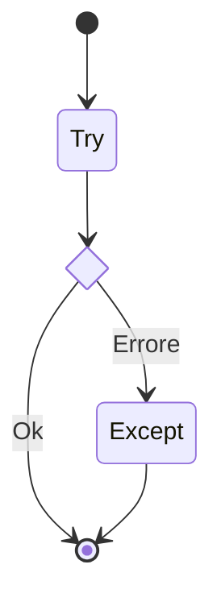

# 1.2.5 - Gestione delle eccezioni

Nei linguaggi interpretati l'esecuzione di un programma termina non appena viene individuato un errore. In Python ne esistono due tipi: il primo è quello *sintattico*, mentre il secondo è chiamato *eccezione*.

## Errori sintattici ed eccezioni

Gli **errori di sintassi** avvengono quando il parser individua un'istruzione scritta in maniera non corretta. Ad esempio:

```py
>>> print(0/0))
  File "<stdin>", line 1
    print(0/0))
              ^
SyntaxError: unmatched ')'
```

In questo caso, notiamo la presenza di una parentesi di chiusura di troppo. Python lancia un `SyntaxError` prima ancora di eseguire il codice. Proviamo adesso a rimuovere la parentesi.

```py
>>> print(0/0)
```

Se proviamo ad eseguire questa istruzione, avremo l'altro tipo di errore, ovvero l'**eccezione**. In questo caso, il codice è sintatticamente corretto, ma durante l'esecuzione avviene un evento "impossibile" (divisione per zero), descritto nel `Traceback`:

```py
Traceback (most recent call last):
  File "<stdin>", line 1, in <module>
ZeroDivisionError: division by zero
```

Il traceback ci dice:
* il *file* e la *riga* dell'errore;
* il *tipo* di eccezione (`ZeroDivisionError`);
* una breve descrizione dell'errore.

!!!note "Eccezioni built-in"
    Python include moltissime eccezioni predefinite. Per una panoramica completa, consultate la [reference ufficiale](https://docs.python.org/3/library/exceptions.html#built-in-exceptions).

## Lanciare un'eccezione (`raise`)

Possiamo lanciare volontariamente un'eccezione usando l'istruzione `raise`. Questo è utile, ad esempio, per validare un dato:

```py
x = 10
if x > 5:
    raise ValueError(f'x vale {x}. Non deve superare 5.')
```

Eseguendo il codice:
```py
Traceback (most recent call last):
  ...
ValueError: x vale 10. Non deve superare 5.
```

## L'istruzione `assert`

L'istruzione `assert` serve a verificare una condizione che *riteniamo debba essere vera* per il corretto funzionamento della logica (invarianti). Se la condizione è falsa, viene lanciato un `AssertionError`.

```py
import sys
# Verifica che siamo su Linux, altrimenti errore
assert ('linux' in sys.platform), 'Questo codice richiede Linux!'
```

!!!warning "Assert vs Raise"
    Ricordiamo di non utilizzare l'istruzione `assert` per validare dati utente o effettuare un controllo di sicurezza. Infatti, se dovessimo lanciare il nostro codice con l'opzione di ottimizzazione `-O`, scenario molto comune in produzione, tutte le istruzioni `assert` verrannno **ignorate e rimosse**.

## Gestione delle eccezioni: il blocco `try` / `except`

Per evitare che il programma vada in crash, possiamo decidere di *catturare* l'errore usando il blocco `try/except`.



Facciamo un esempio pratico, provando a dividere un numero per zero:

```py
try:
    risultato = 10 / 0
except ZeroDivisionError:
    print("Errore: Non puoi dividere per zero!")
```

In questo caso, invece di mostrare un traceback ed interrompersi, il programma stamperà il messaggio, continuando l'esecuzione qualora possibile.

### Catturare i dettagli dell'errore

Possiamo anche decidere di accedere ai dettagli dell'errore usando la keyword `as`:

```py
try:
    with open('file_inesistente.txt') as file:
        data = file.read()
except FileNotFoundError as error:
    print(f"Ops! Si è verificato un errore: {error}")
```

Questo darà all'utente una maggiore contezza di dove si è verificato il problema e delle procedure da seguire per risolvere il tutto.

### Gestione di eccezioni multiple

E' interessante anche notare come un blocco `try` possa generare diversi tipi di errore, che possono essere gestiti in maniera separata:

```py
try:
    valore = int(input("Inserisci un numero: "))
    risultato = 10 / valore
except ValueError:
    print("Devi inserire un numero intero!")
except ZeroDivisionError:
    print("Non puoi inserire zero!")
except Exception as e:
    # Cattura qualsiasi altro errore imprevisto
    print(f"Errore generico imprevisto: {e}")
```

!!!danger "Attenzione all'`except:`!"
    E' importante evitare di scrivere l'istruzione `except:` senza specificare il tipo di errore. Così facendo, infatti, cattureremmo anche eventi come il `KeyboardInterrupt` (CTRL+C), impedendo all'utente di fermare il programma manualmente. Per evitare una situazione di questo tipo, potremmo decidere di usare l'istruzione `except Exception:`.

## Le clausole `else` e `finally`

Il costrutto completo prevede altri due blocchi:

* `else`: eseguito **solo se non ci sono stati errori**.
* `finally`: eseguito **sempre**, alla fine, utile per pulire risorse (chiudere file, DB).

Ad esempio, qualora volessimo gestire in maniera corretta l'apertura e chiusura di un file, potremmo scrivere il seguente blocco di codice:

```py
try:
    f = open("dati.txt", "r")
except FileNotFoundError:
    print("File non trovato.")
else:
    print(f"File aperto con successo. Righe: {len(f.readlines())}")
finally:
    print("Operazione di lettura conclusa (con o senza successo).")
    f.close()
```

## Il principio EAFP

Un principio molto diffuso in Python è il cosiddetto **EAFP**, acronimo che sta per *It's Easier to Ask for Forgiveness than Permission*. In italiano, prevedibilmente, equivale a dire che *è più facile chiedere perdono che permesso*.

!!!danger "Attenzione"
    Potreste essere tentati di provare a giustificare le vostre eventuali mancanze affettive affermando un'ipotetica adesione agli standard Python. Non fatelo.

In pratica, lo standard EAFP prevede che, invece di controllare preventivamente se un'operazione è possibile, in Python spesso si prova a fare l'operazione e, solo successivamente, si gestisce l'eventuale errore intercorso. Questo contrasta quindi con l'approccio **LBYL** (*Look Before You Leap*) tipico di linguaggi come il C.

Ad esempio, se volessimo utilizzare l'approccio LBYL, potremmo provare a cercare la presenza di una chiave `eta` all'interno di un dizionario `user` e, qualora questa non sia presente, scrivere a schermo un messaggio di errore, gestendo il tutto con un'istruzione condizionale:

```python
user = {"nome": "Mario"}
if "eta" in user:
    print(user["eta"])
else:
    print("Età sconosciuta")
```

Nell'approccio EAFP, invece, l'analisi della presenza dell'errore verrebbe gestita esclusivamente mediante un'eccezione:

```python
try:
    print(user["eta"])
except KeyError:
    print("Età sconosciuta")
```

Ovviamente, l'approccio EAFP è spesso meno oneroso dal punto di vista computazionale, specie se l'errore si verifica raramente. Inoltre, il codice sarebbe più leggibile, evitando potenziali proliferazioni ed annidamenti di istruzioni condizionali.
