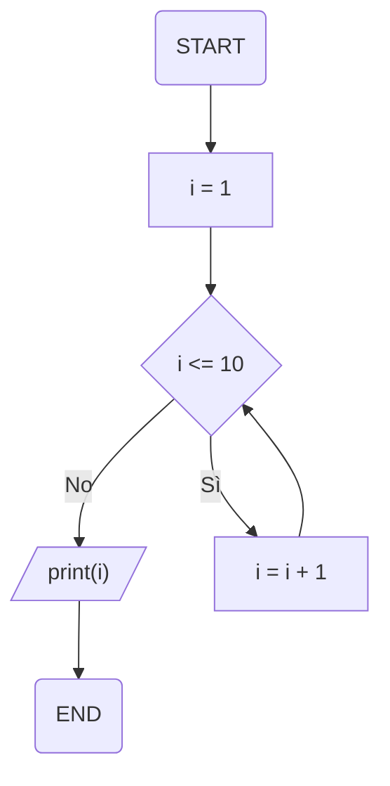

# Esercitazione 1.2

## Esercizi sulla programmazione strutturata

### Esecizio 2.1

Scriviamo un ciclo che iteri fino a che il valore associato ad un contatore intero risulta essere minore di 10. Usiamo sia un ciclo `while`, sia un ciclo `for`.

**Soluzione**

Per prima cosa, è opportuno tracciare un breve diagramma di flusso che mostri l'andamento delle informazioni all'interno del nostro codice.



Implementiamo il codice in primis utilizzando un ciclo `while`. Per farlo, inizializziamo a zero un contatore `i` e come condizione verifichiamo che `i` sia minore di `10`:

```py
>>> i = 1
>>> while i <= 10:
...     print(f'Il valore di i è {i}')
...     i = i + 1
```

Se proviamo ad eseguire questo codice, otterremo il seguente risultato:

```py
Il valore di i è 1
Il valore di i è 2
Il valore di i è 3
Il valore di i è 4
Il valore di i è 5
Il valore di i è 6
Il valore di i è 7
Il valore di i è 8
Il valore di i è 9
Il valore di i è 10
```

Proviamo adesso ad usare un `for`. In questo caso, potremo limitarci ad usare in maniera opportuna la funzione `range()`:

```py
>>> for i in range(1, 11):
...     print(f'Il valore di i è {i}')
```

Eseguendo questa istruzione, otterremo un risultato analogo al precedente.

### Esercizio 2.2

Data una lista di numeri, scrivere una funzione che iteri fino a che non si trova un numero divisibile per $7$. Utilizzare un ciclo `for`.

**Soluzione**

La soluzione a questo esercizio prevede l'utilizzo dell'istruzione `break`, che dovrà essere lanciata quando troveremo un multiplo intero di $7$.

```py linenums="1"
def multiplo_sette(lista):
    for el in lista:
        if el % 7 == 0:
            print(f'{el} è multiplo di 7. Uscita in corso.')
            break
        else:
            print(f'{el} non è multiplo di 7.')
```

In pratica:

* alla riga 2 iteriamo su ogni elemento della lista;
* alla riga 3, se l'elemento è perfettamente divisibile per $7$ (e, quindi, il modulo della divisione è $0$), stampiamo a schermo un messaggio ed usciamo dalla funzione;
* se la precedente non è verficata, continuiamo l'iterazione sulla lista.

Ad esempio:

```py
>>> l = [1, 2, 5, 13, 21, 5]
>>> multiplo_sette(l)
1 non è multiplo di 7.
2 non è multiplo di 7.
5 non è multiplo di 7.
13 non è multiplo di 7.
21 è multiplo di 7. Uscita in corso.
```

## Esercizi sulle funzioni

### Esercizio 2.3

Estraiamo tutti gli indici pari di una lista arbitraria di dieci elementi in ordine inverso. Per farlo, usiamo sia la funzione `range` sia lo slicing.

**Soluzione**

Una possibile implementazione delle funzioni è la seguente:

```py linenums="1"
def estrai_con_slice(l):
    return l[-1::-2]

def estrai_con_range(l):
    l_out = []
    for i in range(len(l) - 1, -2, -2):
        l_out.append(l[i])
    return l_out
```

Partiamo dalla funzione `estrai_con_slice(l)`. Qui sfruttiamo il meccanismo di slicing su lista, che ricordiamo essere dato dall'espressione:

```py
l[i:f:s]
```

dove `l` è la lista sotto analisi, `i` è l'indice iniziale, `f` è l'indice di terminazione, ed `s` è lo step da utilizzare. In questo caso, stiamo specificando `i` pari a `-1`, per cui lo slicing partirà dall'ultimo elemento della lista, ed andrà verso l'indice finale (che omettiamo). Tuttavia, se omettessimo anche `s`, lo slicing ci restituirebbe esclusivamente l'ultimo elemento della lista; di conseguenza, specifichiamo un passo negativo, che ci assicurerà che `l` venga completamente attraversata considerando soltanto gli elementi pari. Un altro modo sarebbe stato il seguente:

```py
>>> l_out = l[1::2]
>>> l_out.reverse()
>>> l_out
[10, 8, 6, 4, 2]
```

In questo caso, aabbiamo potuto utilizzare uno slicing "classico", da sinistra verso destra, ma abbiamo dovuto utilizzare il metodo `reverse()` per invertire l'ordine della lista.

Applichiamo la funzione alla lista `l`:

```py
>>> l = [1, 2, 3, 4, 5, 6, 7, 8, 9, 10]
>>> estrai_con_slice(l)
[10, 8, 6, 4, 2]
```

Nella funzione `estrai_con_range()`, invece, definiamo un ciclo `for` su una sequenza generata dalla funzione `range(i, f, s)`, specificando `i = len(l) - 1`, ovvero `9`, ed `f = 0`. Ciò è legato al fatto che `l[9]` è, a causa dello 0-indexing di Python, l'ultimo elemento della lista. Come step manteniamo, come prevedibile, `-2`.

```py
>>> estrai_con_range(l)
[10, 8, 6, 4, 2]
```

!!!tip "Suggerimento"
    Nel caso della funzione `estrai_con_range()`, anche `f = -1` è valido. Tuttavia, se impostassimo `f = -2`, il risultato sarebbe `[10, 8, 6, 4, 2, 10]`. Il motivo è legato al fatto che, all'ultima iterazione, staremmo considerando `l[-1]`, che è proprio `10`.

### Esercizio 2.4

Duplicare una lista passata come argomento in ingresso. Provare ad utilizzare un ciclo `for`.

**Soluzione**

Potremmo essere tentati di scrivere una funzione come la seguente:

```py
def raddoppia_lista(lista):
    for elemento in lista:
        lista.append(elemento)
        print(f"Lista all'iterazione attuale: {lista}")
```

Se provassimo ad utilizzare questa funzione, faremmo finire l'interprete in un ciclo infinito. Infatti, la funzione tenta di agire sulla lista originaria che, ad ogni iterazione, aumenta le sue dimensioni di un elemento, il che, ovviamente, rende impossibile raggiungere il termine della stessa!

Per ottenere il risultato previsto, dobbiamo usare una *deep copy*, ovvero fare una copia *esatta* della lista. Per chi ha familiarità con il C, si tratta, in poche parole, di una copia per valore. Usiamo il metodo `deepcopy`:

```py
from copy import deepcopy

def raddoppia_lista_deep(lista):
    lista_appoggio = deepcopy(lista)
    for elemento in lista_appoggio:
        lista.append(elemento)
        print(f"Lista di appoggio: {lista_appoggio}")
        print(f"Lista attuale: {lista}")
```

Stiamo creando una nuova lista, chiamata `lista_appoggio`, che sarà utilizzata come base per duplicare la lista originaria. Provando a chiamare questa funzione, otterremo il risultato desiderato:

```py
>>> raddoppia_lista_deep([1, 2])
Lista di appoggio: [1, 2]
Lista attuale: [1, 2, 1]
Lista di appoggio: [1, 2]
Lista attuale: [1, 2, 1, 2]
```

### Esercizio 2.5

Generare una lista di elementi casuali compresi tra $0$ e $10$. Usare sia una funzione con un unico parametro opzionale.

**Soluzione**

Scriviamo la seguente funzione:

```py
import random

def genera_lista_casuale(lunghezza=5):
    l = []
    for i in range(lunghezza):
        l.append(random.randint(0, 10))
    return l
```

In particolare, `genera_lista_casuale()` accetta come parametro opzionale `lunghezza`, il cui valore è 5, ed usa la funzione `append()` per aggiungere un valore generato casualmente.

Volendo, è possibile usare anche una list comprehension:

```py
def genera_lista_casuale_con_l_c(lunghezza=5):
    return [random.randint(0, 10) for i in range(lunghezza)]
```

Verifichiamo entrambe le funzioni:

```py
>>> genera_lista_casuale()
[0, 2, 1, 0, 2]
>>> genera_lista_casuale(lunghezza=10) 
[2, 2, 2, 9, 5, 1, 5, 10, 9, 6]
>>> genera_lista_casuale_con_l_c()
[10, 7, 2, 5, 1]
>>> genera_lista_casuale_con_l_c(lunghezza=10) 
[0, 9, 3, 7, 1, 3, 9, 3, 8, 7]
```

## Esercizi su liste e strutture dati

### Esercizio 2.6

Selezionare tutti i nomi che iniziano con la lettera `B` dalla seguente lista. Utilizzare sia un ciclo sia una list comprehension.

```py
lista_nomi = [
    "Jax Teller",
    "Walter White",
    "Billy Butcher",
    "Luke Skywalker",
    "Bobby Singer",
    "Johnny Lawrence"
]
```

**Soluzione**

Proviamo innanzitutto ad usare un ciclo. In particolare, useremo un `for` che itera su tutti le stringhe nella lista, verificando se il primo carattere è `B`.

```py
l_out = []
for nome in lista_nomi:
    if nome[0] == "B":
        l_out.append(nome)
```

La formulazione mediante list comprehension è molto più compatta, ma utilizza lo stesso principio:

```py
output = [nome for nome in lista_nomi if nome[0] == "B"]
```

### Esercizio 2.7

Ottenere la lista di tutti i quadrati dei numeri da 1 a 10. Utilizzare una list comprehension ed un'apposita funzione per il calcolo del quadrato.

**Soluzione**

Per prima cosa, definiamo la funzione `quadrato()` che accetta un `numero` e restituisce il suo quadrato:

```py
def quadrato(numero):
    return numero ** 2
```

A questo punto, possiamo invocare la funzione direttamente da una list comprehension:

```py
l_out = [quadrato(i) for i in range(1, 11)]
```

### Esercizio 2.8

Data una lista di interi `l_int`, ottenere una lista `l_out` il cui $i$-mo elemento sia la stringa `'pari'` se l'$i$-mo elemento di `l_int` è pari, e `'dispari'` altrimenti.

**Soluzione**

Possiamo risolvere l'esercizio utilizzando la list comprehension nella forma completa (ovvero con l'`if/else`). Ad esempio:

```py
>>> l_int = [1, 5, 2, 4]
>>> l_out = ['pari' if el % 2 == 0 else 'dispari' for el in l_int] 
>>> l_out
['dispari', 'dispari', 'pari', 'pari']
```

### Esercizio 2.9

Scrivere una dict comprehension che permetta di ottenere il dizionario `vecchio_o_giovane` dato il seguente dizionario:

```py
dizionario = {
    'Jax Teller': 27,
    'Walter White': 52,
    'Billy Butcher': 41,
    'Luke Skywalker': 79,
    'Bobby Singer': 68,
    'Johnny Lawrence': 49
}
```

In particolare, il dizionario `vecchio_o_giovane` avrà le stesse chiavi del dizionario di partenza, a cui sarà associato il valore `'giovane'` soltanto se il valore della chiave del dizionario di partenza è inferiore a 65.

**Soluzione**

Ricordando che la sintassi della dict comprehension è sostanzialmente analoga a quella della list comprehension, possiamo scrivere:

```py
vecchio_o_giovane = {k: 'vecchio' if v > 65 else 'giovane' for (k, v) in dizionario.items()}
```

In pratica, stiamo associando il valore `'vecchio'` alla chiave `k` se il valore `v` ad essa associato in `dizionario` è superiore a `65`. Da notare inoltre come l'iterazione avvenga su tutte le coppie chiave - valore presenti in `dizionario`, ottenibili mediante il metodo `items()`.

## Esercizi sulla programmazione orientata agli oggetti

### Esercizio 2.10

Scrivere una classe `Persona` applicando i concetti visti durante la lezione.

**Soluzione**

Supponiamo che la classe `Persona` abbia tre attributi:

* un attributo `nome`, stringa rappresentativa del nome della persona;
* un attributo `cognome`, stringa rappresentativa del cognome della persona;
* un attributo `eta`, intero rappresentativo dell'età della persona.

Per prima cosa, scriviamo il metodo `__init__`:

```py
def __init__(self, nome, cognome, eta):
    self.nome = nome
    self.cognome = cognome
    self.eta = eta
```

Passeremo al metodo `__init__` tre parametri che, per semplicità, chiameremo proprio `nome`, `cognome` ed `eta`. Questi parametri andranno ad inizializzare gli omonimi attributi di classe.

Fatto questo, scriviamo tre proprietà, una per ciascun attributo:

```py
@property
def nome(self):
    return self.__nome

@nome.setter
def nome(self, value):
    if len(value) < 2:
        raise ValueError('La lunghezza del nome non può essere inferiore a due caratteri.')
    else:
        self.__nome = value

@property
def cognome(self):
    return self.__cognome

@cognome.setter
def cognome(self, value):
    if len(value) < 2:
        raise ValueError('La lunghezza del cognome non può essere inferiore a due caratteri.')
    else:
        self.__cognome = value

@property
def eta(self):
    return self.__eta

@eta.setter
def eta(self, value):
    if value < 0:
        raise ValueError("L'età non può essere negativa.")
    else:
        self.__eta = value
```

Notiamo come le proprietà `nome` e `cognome` siano fatte in modo che se la lunghezza della stringa passata risulta essere inferiore a due caratteri venga lanciato un errore di tipo `ValueError`. Analogamente, il valore della proprietà `eta` non potrà essere inferiore a zero.

Facciamo un esempio di uso della nostra classe mediante l'interprete Python:

```py
>>> draco = Persona('Draco', 'Malfoy', 12)
>>>	print(draco.nome)
'Draco'
>>> print(draco.eta)
12
>>> hermione = Persona('', 'Granger', 18)
Traceback (most recent call last):
    File "<stdin>", line 1, in <module>
    File "<stdin>", line 3, in __init__
    File "<stdin>", line 12, in nome
ValueError: La lunghezza del nome non può essere inferiore a due caratteri.
```

!!!tip "Codice"
    Il codice completo per questo esercizio è disponibile [qui](./ex_2_10.py).

### Esercizio 2.11

Creare le classi `Quadrato` e `Cerchio` che modellano (rispettivamente) i quadrati ed i cerchi. Entrambe devono essere progettate in modo da discendere da una classe base chiamata `Figura`.

**Soluzione**

Per prima cosa, definiamo la classe `Figura` come classe *astratta*. In particolare, definiremo due proprietà comuni a tutte le figure, ovvero il `perimetro` e l'`area`, e due metodi astratti `calcola_perimetro` e `calcola_area` che andremo ad implementare nelle diverse sottoclassi.

```py
from abc import ABC, abstractmethod

class Figura(ABC):

    def __init__(self, perimetro=0, area=0):
        self.perimetro = perimetro
        self.area = area

    @property
    def perimetro(self):
        return self.__perimetro

    @area.setter
    def perimetro(self, value):
        if value <= 0:
            raise ValueError("L'area non può essere negativa.")
        self.__perimetro = value

    @property
    def area(self):
        return self.__area
    
    @area.setter
    def area(self, value):
        if value <= 0:
            raise ValueError("L'area non può essere negativa.")
        self.__area = value

    @abstractmethod
    def calcola_perimetro(self):
        pass

    @abstractmethod
    def calcola_area(self):
        pass
```

Notiamo come implementiamo un metodo `__init__` di base che inizializza i valori di perimetro ed area; di default, inseriremo dei valori pari a `0` per entrambe le proprietà.

Fatto questo, potremo implementare le singole sottoclassi. In particolare, il `Quadrato` sarà inizializzato mediante una specifica proprietà `lato`, ed imposterà il perimetro e l'area secondo le leggi del quadrato; il `Cerchio`, invece, avrà la proprietà `raggio`, mentre perimetro ed area seguiranno le specifiche convenzioni. 

```py
from math import pi

class Quadrato(Figura):

    def __init__(self, lato, area=0, perimetro=0):
        super().__init__(perimetro, area)
        self.lato = lato

    @property
    def lato(self):
        return self.__lato

    @lato.setter
    def lato(self, value):
        self.__lato = value

    def calcola_perimetro(self):
        self.perimetro = self.lato * 4

    def calcola_area(self):
        self.area = self.lato ** 2


class Cerchio(Figura):

    def __init__(self, raggio, area=0, perimetro=0):
        super().__init__(perimetro, area)
        self.raggio = raggio

    @property
    def raggio(self):
        return self.__raggio

    @raggio.setter
    def raggio(self, value):
        self.__raggio = value

    def calcola_perimetro(self):
        self.perimetro = 2 * pi * self.raggio

    def calcola_area(self):
        self.area = pi * (self.raggio ** 2)
```

Notiamo che entrambi i metodi `__init__` richiamano l'omologo della classe `Figura` mediante il metodo `super()`.

Proviamo ad utilizzare il codice precedente:

```py
q = Quadrato(5)
q.calcola_area()
q.calcola_perimetro()
print(f'Lato: {q.lato} - Perimetro: {q.perimetro} - Area: {q.area}')

c = Cerchio(5)
c.calcola_area()
c.calcola_perimetro()
print(f'Raggio: {c.raggio} - Perimetro: {c.perimetro} - Area: {c.area}')
```

!!!tip "Codice"
    Il codice completo per questo esercizio è disponibile [qui](./ex_2_11.py).
