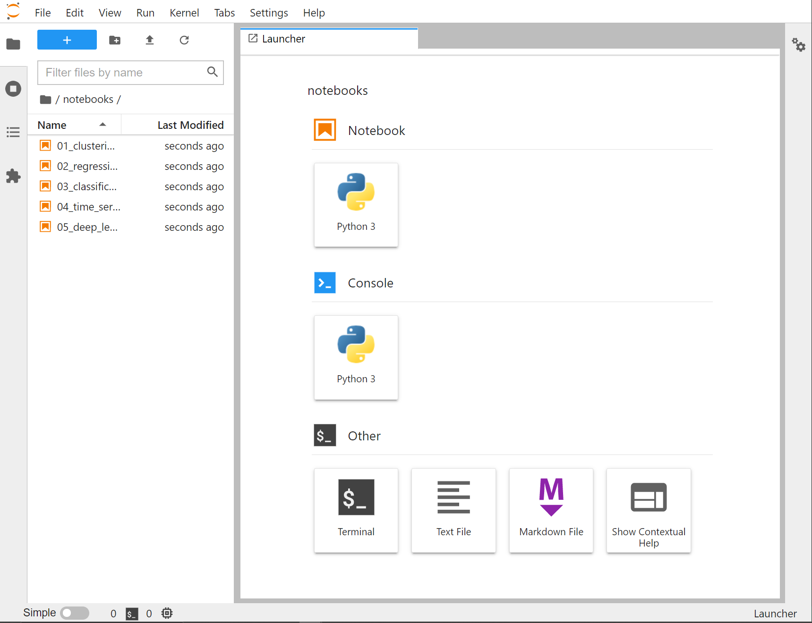

# 6. iPython e Jupyter Lab

Fino a questo momento ci siamo limitati a lanciare script Python direttamente da riga di comando. Tuttavia, è evidente come questo approccio sia limitato, specialmente in applicazioni in ambito data science.

Per ovviare a queste problematiche, all'interno del framework SciPy viene proposto [Jupyter Lab](https://jupyter.org/),  che introduce uno tra gli strumenti più utilizzati dai data analyst al giorno d'oggi, ovvero i *notebook*.

## 6.1 - Anatomia di un notebook

Un notebook è, in poche parole, un *ambiente interattivo* che permette di *scrivere* e *testare* il nostro codice. In particolare, ptoremo scrivere una o più istruzioni, ed eseguirle in maniera separata dalle altre mediante il meccanismo delle *celle*, che altro non sono se non dei singoli "blocchi" di codice.

!!!tip "Suggerimento"
	I notebook Jupyter ci permettono di inserire anche commenti, descrizioni ed equazioni utilizzando due linguaggi di markup molto noti, ovvero [Markdown](https://daringfireball.net/projects/markdown/) e [Latex](https://www.latex-project.org/).

Vediamo adesso come creare ed utilizzare il nostro primo notebook.

## 6.2 - Installazione e lancio di Jupyter Lab

!!!note "Installazione di una libreria"
    Ricordiamo che le diverse opzioni utilizzabili per installare una libreria sono descritte nel dettaglio nell'[appendice B](../../appendix/02_libraries/lecture.md).

Per installare Jupyter Lab, ricorriamo all'utilizzo di `pip`, preferibilmente all'interno di un ambiente virtuale:

```sh
workon my-virtual-env
(my-virtual-env) pip install jupyterlab
```

A differenza delle altre librerie, Jupyter non andrà (necessariamente) importato; infatti, è possibile lanciare un ambiente interattivo utilizzando la seguente istruzione da riga di comando:

```sh
jupyter lab
```

!!!note "Importare iPython"
	In teoria è possibile importare iPython ed utilizzare i metodi e le classi messe a disposizione come una qualsiasi libreria. Nei fatti, però, molto spesso ci si limita ad utilizzare l'ambiente interattivo offerto dai notebook.

## 6.3 - Il primo notebook

A questo punto ci troveremo davanti ad una schermata simile a quella mostrata nella figura successiva.

{: .center}

Creiamo il nostro primo notebook premendo il pulsante *Python 3* nel menu *Notebook*. Una volta terminata la procedura, potremo iniziare ad interagire con l'ambiente. Prima di procedere, però, definiamo il nome del nostro notebook dal menu a sinistra.

Proviamo a fare qualcosa di semplice: creiamo una funzione che sommi due variabili di tipo numerico, restituendo il risultato, e chiamiamola su due diversi valori.

Per prima cosa, scriviamo il codice della funzione all'interno della prima cella:

```py
def somma(a, b):
	somma = a + b
	return somma
```

Per eseguire il codice all'interno della cella, premiamo il tasto `Play`, oppure la combinazione di tasti `Shift+Invio`. Una volta eseguita la prima cella, Jupyter ne creerà in automatico un'altra; al suo interno, potremo scrivere le istruzioni necessarie a chiamare la funzione `somma()` su due diversi valori.

```py
somma(5, 7)
```

Eseguiamo l'istruzione; noteremo che al di sotto della cella apparirà il valore assunto dalla funzione.

## 6.4 - Altre operazioni utili

Jupyter ci permette di effettuare una serie di operazioni utili, tra cui:

* cancellare un'intera cella;
* inserire una cella al di sopra o al di sotto di quella attualmente selezionata;
* stoppare il kernel;
* riavviare il kernel.

Soffermiamoci per un attimo sulle ultime due operazioni. Può capitare, infatti, che ci sia la necessità di interrompere il flusso attuale dell'esecuzione delle istruzioni, oppure ancora che sia necessario riavviare il notebook. Dato che Jupyter si basa sul concetto di *kernel*, il quale è il responsabile per l'esecuzione del notebook, diremo in gergo che possiamo *interrompere*, o *stoppare*, il kernel, oppure ancora che possiamo *riavviarlo*.

L'interruzione del kernel si limita a fermare l'esecuzione della cella attuale: ciò non comporta alcuna perdita di dati, e potremo riprendere ad eseguire il codice nel notebook in ogni momento, sia dall'inizio di quella cella, sia dall'interno di un'altra. Il riavvio del kernel, invece, "blocca" completamente l'esecuzione, andando a cancellare anche le variabili presenti in memoria: si tratta, quindi, di un vero e proprio "reset", da utilizzare quando, ad esempio, abbiamo la necessità di riorganizzare il codice, oppure quando abbiamo effettuato un numero eccessivo di modifiche per le quali i risultati iniziano a non essere coerenti con le nostre attese.
