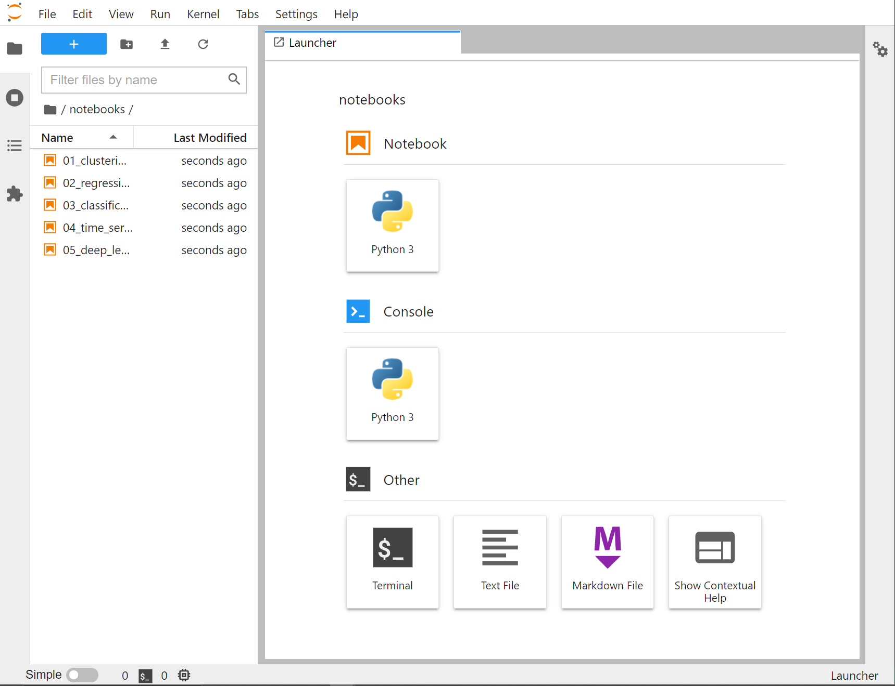

# 2.1 - Jupyter Lab

!!!tip "Notebook di accompagnamento"
	Per questa lezione (e per le successive) esiste un *notebook di accompagnamento*, reperibile a [questo indirizzo](https://github.com/anhelus/pcs-exercises/blob/master/01_libs/00_jupyter_sample.ipynb).

Fino a questo momento ci siamo limitati a scrivere e lanciare script Python direttamente da riga di comando o file `.py`. Sebbene questo sia l'approccio standard per l'ingegneria del software (sviluppo di API, backend, ecc.), risulta limitante in ambito **Data Science e Machine Learning**.

Quando analizziamo dati, abbiamo bisogno di esplorarli passo-passo, visualizzare grafici e testare trasformazioni senza dover ricaricare in memoria dataset giganti a ogni singola esecuzione.

Per ovviare a queste problematiche, l'ecosistema Python offre [Jupyter](https://jupyter.org/), che introduce lo strumento più utilizzato dai data analyst: i **Notebook**.

## Anatomia di un notebook

Un notebook è un *ambiente interattivo* che permette di fondere codice, testo formattato e output visivi (come grafici o tabelle) in un unico documento.

Il notebook è suddiviso in **celle**, che possono essere di due tipi principali:
1.  **Celle di Codice:** Contengono codice Python. Possiamo eseguire una singola cella alla volta; le variabili create resteranno in memoria e saranno accessibili dalle celle successive.
2.  **Celle Markdown:** Permettono di inserire commenti, titoli, descrizioni testuali e formule matematiche in [LaTeX](https://www.latex-project.org/).

## Installazione e lancio di Jupyter Lab

!!!note "Gestione degli Ambienti"
    Come abbiamo imparato nel Modulo 1, è fondamentale installare le librerie all'interno di un ambiente virtuale isolato, e non nel sistema globale.

Per installare Jupyter Lab, attiviamo il nostro ambiente virtuale e usiamo `pip`:

```sh
# Attiviamo l'ambiente (es. su Windows / Mac)
# .venv\Scripts\activate  OPPURE  source .venv/bin/activate

pip install jupyterlab
```

A differenza delle normali librerie che importiamo nel codice, Jupyter è una vera e propria applicazione web. Per lanciare l'ambiente interattivo, digitiamo da terminale:

```sh
jupyter lab
```

Questo comando aprirà automaticamente una nuova scheda nel tuo browser predefinito, mostrando l'interfaccia del programma. Il terminale rimarrà "bloccato" a fare da server locale finché non deciderai di chiuderlo (con `CTRL+C`).

## Il primo notebook

Una volta avviato Jupyter Lab, ci troveremo davanti alla schermata introduttiva (Launcher).

<figure markdown>
  { width="450" }
  <figcaption>Figura 1 - La schermata introduttiva di Jupyter Lab</figcaption>
</figure>

Creiamo il nostro primo notebook cliccando sull'icona **Python 3 (ipykernel)** sotto la voce *Notebook*. Rinominamo il file appena creato (dal menu a sinistra o cliccando sul nome in alto).

Proviamo a fare qualcosa di semplice. Clicchiamo sulla prima cella e definiamo una funzione (usando i Type Hints che abbiamo imparato!):

```py
def somma(a: float, b: float) -> float:
	return a + b
```

Per eseguire il codice all'interno della cella, possiamo premere il tasto `Play` in alto, oppure usare la comodissima combinazione di tasti `Shift + Invio`. 

Jupyter eseguirà il codice (salvando la funzione in memoria) e creerà automaticamente una nuova cella sottostante. Qui possiamo chiamare la nostra funzione:

```py
somma(5.5, 7.0)
```

Premendo di nuovo `Shift + Invio`, noteremo che immediatamente sotto la cella apparirà l'output della funzione (ovvero `12.5`).

## Gestione del Kernel e "Stato Nascosto"

Jupyter si basa sul concetto di **Kernel**. Il Kernel è il "motore" Python in background che esegue effettivamente il codice e memorizza le variabili.

Jupyter ci permette di effettuare operazioni cruciali sul Kernel tramite il menu in alto:
*   **Interrupt Kernel (Interrompi):** Ferma l'esecuzione della cella attuale (utile se abbiamo scritto un ciclo `while` infinito per sbaglio o se un calcolo sta impiegando troppo tempo). Non cancella i dati in memoria.
*   **Restart Kernel (Riavvia):** "Spegne e riaccende" il motore. **Tutte le variabili in memoria vengono cancellate**.

!!!warning "Il problema dello Stato Nascosto (Hidden State)"
    Nei notebook non sei obbligato a eseguire le celle in ordine dall'alto verso il basso. Puoi eseguire la cella 5, poi la 2, poi di nuovo la 5. 
    Questo causa spessissimo bug in cui una variabile ha un valore diverso da quello che vedi scritto, perché l'hai modificata eseguendo un'altra cella in precedenza. 
    **Best Practice:** Quando il tuo notebook sembra avere comportamenti inspiegabili, clicca su *"Kernel -> Restart Kernel and Run All Cells"*. Se il codice è corretto, funzionerà in modo sequenziale dall'inizio alla fine.

## Lavorare in Visual Studio Code

Oggi non è strettamente necessario lanciare Jupyter dal browser. Se utilizzi un IDE moderno come **Visual Studio Code (VS Code)**, puoi semplicemente creare un file con estensione `.ipynb` direttamente nell'editor.

VS Code riconoscerà automaticamente che si tratta di un Notebook Jupyter e ti mostrerà un'interfaccia integrata che unisce la comodità dei notebook (celle, grafici inline) con la potenza dell'IDE (autocompletamento avanzato, GitHub Copilot, linter). È la scelta preferita da molti professionisti.

## Google Colab (Notebook in Cloud)

Il Machine Learning e il Deep Learning (che vedremo nei moduli successivi) richiedono risorse computazionali enormi, in particolare l'uso di **GPU** (Schede Video), che non tutti possiedono sui propri computer portatili.

Per ovviare a questo problema, Google mette a disposizione uno strumento gratuito chiamato **[Google Colab](https://colab.research.google.com/)**.
Colab non è altro che un ambiente Jupyter Notebook ospitato sui server di Google, pre-installato con tutte le librerie di Data Science più famose (NumPy, Pandas, TensorFlow, Scikit-Learn) e che offre l'accesso gratuito (con alcuni limiti di tempo) a GPU e TPU.

Sarà il nostro strumento di elezione quando arriveremo ad addestrare reti neurali complesse.
