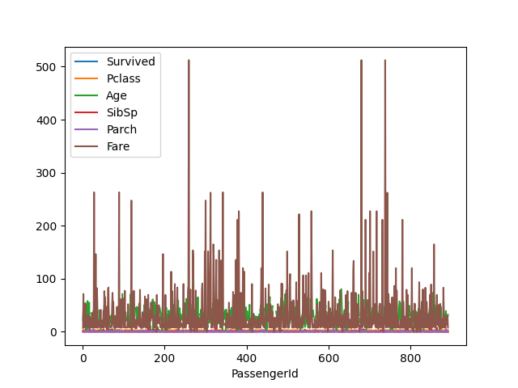

# 2.3.4 - Manipolazione dei DataFrame

## Visualizzazione dei DataFrame

Pandas ci offre un supporto nativo a Matplotlib per permettere la visualizzazione dei dati contenuti all'interno di un dataframe.

In tal senso, possiamo usare la funzione `plot()` su una serie o su un intero dataframe; ad esempio, potremmo plottare le età dei passeggeri:

```py
df['Age'].plot()
plt.show()
```

ottenendo il risultato mostrato in figura 1:

<figure markdown>
  
  <figcaption>Figura 1 - Le età dei passeggeri nel dataset Titanic</figcaption>
</figure>

Possiamo anche fare il plot dell'intero `DataFrame`:

```py
df.plot()
plt.show()
```

che risulterà nella figura 2:

<figure markdown>
  
  <figcaption>Figura 2 - Il dataset Titanic (in grafico)</figcaption>
</figure>

Ovviamente, è possibile usare Pandas anche per fare il plot di altri tipi di grafico, come ad esempio gli istogrammi. Per farlo, si usano le apposite sotto-funzioni di `plot`:

```py
df['Age'].plot.hist()
plt.show()
```

Il risultato è mostrato in figura 3.

<figure markdown>
  
  <figcaption>Figura 3 - Istogramma delle età dei passeggeri</figcaption>
</figure>

!!!note "Pandas e Seaborn"
    Pandas si integra in maniera naturale anche con la libreria Seaborn, di cui tratteremo in una delle [prossime lezioni](../04_visualization/02_seaborn.md).

## Gestione dei valori mancanti

Chiunque abbia provato almeno una volta ad effettuare una campagna di acquisizione dati sa bene come questa non sia (quasi) mai una procedura in cui va tutto per il verso giusto. Ad esempio, potremmo avere un guasto ad un sensore, il quale comporterebbe la perdita di un determinato insieme di dati per un certo periodo; oppure, un utente del nostro sistema potrebbe omettere la sua età, che quindi non risulterebbe poi nell'insieme di dati finali.

Queste evenienze ci pongono di fronte ad una situazione "spinosa", legata alla gestione di dataset con al loro interno uno o più *valori mancanti*. Ad esempio, riprendiamo le prime sei righe del dataset Titanic:

```sh
   PassengerId  Survived  Pclass                                               Name     Sex   Age  SibSp  Parch            Ticket     Fare Cabin Embarked
0            1         0       3                            Braund, Mr. Owen Harris    male  22.0      1      0         A/5 21171   7.2500   NaN        S
1            2         1       1  Cumings, Mrs. John Bradley (Florence Briggs Th...  female  38.0      1      0          PC 17599  71.2833   C85        C
2            3         1       3                             Heikkinen, Miss. Laina  female  26.0      0      0  STON/O2. 3101282   7.9250   NaN        S
3            4         1       1       Futrelle, Mrs. Jacques Heath (Lily May Peel)  female  35.0      1      0            113803  53.1000  C123        S
4            5         0       3                           Allen, Mr. William Henry    male  35.0      0      0            373450   8.0500   NaN        S
5            6         0       3                                   Moran, Mr. James    male   NaN      0      0            330877   8.4583   NaN        Q
```

Notiamo come, per la feature `Cabin`, sia associato ai passeggeri `1`, `3`, `5` e `6` il valore `NaN`, così come per il parametro `Age` del passeggero `6`. Questo indica che, nel dataset originario, il valore corrispondente risulta essere assente: `NaN`, infatti, è un acronimo che sta per *Not a Number*, e viene per convenzione utilizzato come *placeholder* per tutte le feature di cui non è possibile leggere il valore a partire dal dataset iniziale.

La presenza (o, per meglio dire *assenza*) di questi valori comporta l'impossibilità di utilizzare alcuni degli algoritmi che vedremo successivamente, in quanto questi prevedono la valorizzazione integrale di ciascun campione presente nel dataset. Per ovviare a questa problematica, Pandas ci mette a disposizione principalmente due alternative.

##### Opzione 1: rimozione dei dati mancanti

La prima alternativa offerta da Pandas sta nella *rimozione* dei dati mancanti usando la funzione [`dropna()`](https://pandas.pydata.org/docs/reference/api/pandas.DataFrame.dropna.html), che ci permette di eliminare i campioni o le feature dove sono presenti valori mancanti.

In particolare, per eliminare i campioni che presentano dei valori mancanti, dovremo impostare il parametro `axis` a `0` (e, quindi, lavorare sulle righe):

```py
>>> df.dropna(axis=0)
     PassengerId  Survived  Pclass                                               Name     Sex   Age  SibSp  Parch    Ticket     Fare        Cabin Embarked
1              2         1       1  Cumings, Mrs. John Bradley (Florence Briggs Th...  female  38.0      1      0  PC 17599  71.2833          C85        C
3              4         1       1       Futrelle, Mrs. Jacques Heath (Lily May Peel)  female  35.0      1      0    113803  53.1000         C123        S
6              7         0       1                            McCarthy, Mr. Timothy J    male  54.0      0      0     17463  51.8625          E46        S
10            11         1       3                    Sandstrom, Miss. Marguerite Rut  female   4.0      1      1   PP 9549  16.7000           G6        S
11            12         1       1                           Bonnell, Miss. Elizabeth  female  58.0      0      0    113783  26.5500         C103        S
```

Per eliminare invece una feature che presenta uno o più dati mancanti *nella sua interezza*, agiamo per colonne, impostando `axis=1`:

```py
>>> df.dropna(axis=1)
     PassengerId  Survived  Pclass                                               Name     Sex  SibSp  Parch            Ticket     Fare
0              1         0       3                            Braund, Mr. Owen Harris    male      1      0         A/5 21171   7.2500
1              2         1       1  Cumings, Mrs. John Bradley (Florence Briggs Th...  female      1      0          PC 17599  71.2833
2              3         1       3                             Heikkinen, Miss. Laina  female      0      0  STON/O2. 3101282   7.9250
3              4         1       1       Futrelle, Mrs. Jacques Heath (Lily May Peel)  female      1      0            113803  53.1000
4              5         0       3                           Allen, Mr. William Henry    male      0      0            373450   8.0500
```

!!!tip "Soglie per l'eliminazione di un campione o di una feature"
    Eliminare interamente un campione (o addirittura una feature) per la presenza di un unico valore mancante potrebbe risultare una misura *draconiana*. Per evitare di far questo, possiamo decidere di impostare il parametro `how` ad `all`, nel qual caso il campione/feature sarà eliminato *solo* se tutti i valori risultano essere mancanti:
    > ```py
      >>> df.dropna(axis=1, how='all')
      ```
    
    In alternativa, possiamo impostare il parametro `thresh`, che ci permette di impostare una soglia minima di valori mancanti per eliminare il campione o la feature. Ad esempio, se volessimo eliminare tutte quelle feature che presentano almeno il $50\%$ di valori mancanti, dovremmo scrivere:
    > ```py
      >>> df.dropna(axis=1, thresh=0.5)
      ```

##### Opzione 2: riempimento dei dati mancanti

L'altra opzione messa a disposizione da Pandas è quella del *riempimento* dei dati mancanti. Questa strada è percorribile usando la funzione [`fillna()`](https://pandas.pydata.org/docs/reference/api/pandas.DataFrame.fillna.html).

Nell'interpretazione base, possiamo usare `fillna()` parametrizzandolo con il valore che vogliamo utilizzare. Ad esempio:

```py
>>> df.fillna(0) 
     PassengerId  Survived  Pclass                                               Name     Sex   Age  SibSp  Parch            Ticket     Fare Cabin Embarked
0              1         0       3                            Braund, Mr. Owen Harris    male  22.0      1      0         A/5 21171   7.2500     0        S
1              2         1       1  Cumings, Mrs. John Bradley (Florence Briggs Th...  female  38.0      1      0          PC 17599  71.2833   C85        C
2              3         1       3                             Heikkinen, Miss. Laina  female  26.0      0      0  STON/O2. 3101282   7.9250     0        S
3              4         1       1       Futrelle, Mrs. Jacques Heath (Lily May Peel)  female  35.0      1      0            113803  53.1000  C123        S
4              5         0       3                           Allen, Mr. William Henry    male  35.0      0      0            373450   8.0500     0        S
```

In questo caso, andremo ad associare il valore `0` a tutti i `NaN`. Un utilizzo più raffinato prevede la specifica di un *metodo di riempimento* dei dati. Ad esempio, potremmo indicare a Pandas di riempire i `NaN` con i valori immediatamente precedenti:

```py
>>> df.fillna(method='ffill')
     PassengerId  Survived  Pclass                                               Name     Sex   Age  SibSp  Parch            Ticket     Fare Cabin Embarked
0              1         0       3                            Braund, Mr. Owen Harris    male  22.0      1      0         A/5 21171   7.2500   NaN        S
1              2         1       1  Cumings, Mrs. John Bradley (Florence Briggs Th...  female  38.0      1      0          PC 17599  71.2833   C85        C
2              3         1       3                             Heikkinen, Miss. Laina  female  26.0      0      0  STON/O2. 3101282   7.9250   C85        S
3              4         1       1       Futrelle, Mrs. Jacques Heath (Lily May Peel)  female  35.0      1      0            113803  53.1000  C123        S
4              5         0       3                           Allen, Mr. William Henry    male  35.0      0      0            373450   8.0500  C123        S
```

In questo caso, notiamo come il valore di `Cabin` per la prima riga non venga riempito, perché non vi sono dati "precedenti" da cui attingere. Potremmo però porvi rimedio utilizzando in cascata due chiamate a `fillna()`:

```py
>>> df.fillna(method='ffill').fillna(method='bfill')
     PassengerId  Survived  Pclass                                               Name     Sex   Age  SibSp  Parch            Ticket     Fare Cabin Embarked
0              1         0       3                            Braund, Mr. Owen Harris    male  22.0      1      0         A/5 21171   7.2500   C85        S
1              2         1       1  Cumings, Mrs. John Bradley (Florence Briggs Th...  female  38.0      1      0          PC 17599  71.2833   C85        C
2              3         1       3                             Heikkinen, Miss. Laina  female  26.0      0      0  STON/O2. 3101282   7.9250   C85        S
3              4         1       1       Futrelle, Mrs. Jacques Heath (Lily May Peel)  female  35.0      1      0            113803  53.1000  C123        S
4              5         0       3                           Allen, Mr. William Henry    male  35.0      0      0            373450   8.0500  C123        S
```

Questa volta, al primo indice, `Cabin` diventa pari al valore del secondo indice, grazie alla chiamata in cascata di un `ffill` e di un `bfill` (ovvero, un riempimento "all'indietro"). Da notare anche l'influenza del parametro `axis`. Negli esempi precedenti, infatti, abbiamo ragionato per colonne; tuttavia, possiamo anche ragionare per righe, specificando `axis=1`:

```py
>>> df.fillna(method='ffill', axis=1)
    PassengerId Survived Pclass                                               Name     Sex     Age SibSp Parch            Ticket     Fare  Cabin Embarked
0             1        0      3                            Braund, Mr. Owen Harris    male    22.0     1     0         A/5 21171     7.25   7.25        S
1             2        1      1  Cumings, Mrs. John Bradley (Florence Briggs Th...  female    38.0     1     0          PC 17599  71.2833    C85        C
2             3        1      3                             Heikkinen, Miss. Laina  female    26.0     0     0  STON/O2. 3101282    7.925  7.925        S
3             4        1      1       Futrelle, Mrs. Jacques Heath (Lily May Peel)  female    35.0     1     0            113803     53.1   C123        S
4             5        0      3                           Allen, Mr. William Henry    male    35.0     0     0            373450     8.05   8.05        S
```

Vediamo come la feature `Cabin` venga stavolta valorizzata con il valore di `Fare`.

!!!tip "Suggerimento"
    Va da sé che la precedente trattazione sia *a meno scopo illustrativo*. Non ha infatti senso andare ad assegnare a `Cabin` un valore numerico, o far propagare i valori delle cabine precedenti/successive. In questo caso, infatti, potrebbe essere conveniente eliminare del tutto la feature o il campione. Come vedremo quando parleremo di Scikit-Learn, l'assegnazione dei valori mancanti ha significato soprattutto quando vi sono delle relazioni, dirette o indirette, tra i diversi campioni presenti nel dataset.

## Operazioni statistiche sui dataframe

Pandas ci mette a disposizione delle funzioni, simili a quelle offerte da NumPy, per calcolare delle statistiche per ciascuna delle colonne presenti in un DataFrame. Ad esempio, possiamo calcolare la media usando la funzione [`mean()`](https://pandas.pydata.org/docs/reference/api/pandas.DataFrame.mean.html):

```py
>>> df.mean()
PassengerId    446.000000
Survived         0.383838
Pclass           2.308642
Age             29.699118
SibSp            0.523008
Parch            0.381594
Fare            32.204208
dtype: float64
```

Ovviamente, esistono funzioni anche per calcolare varianza ([`var()`](https://pandas.pydata.org/docs/reference/api/pandas.DataFrame.var.html)), mediana ([`median()`](https://pandas.pydata.org/docs/reference/api/pandas.DataFrame.median.html)), deviazione standard ([`std()`](https://pandas.pydata.org/docs/reference/api/pandas.DataFrame.std.html)), e via discorrendo.

Particolarmente interessante è la funzione `describe()`, che ci mosta tutte le statistiche più significative per ognuna delle feature considerate.

```py
>>> df.describe()
       PassengerId    Survived      Pclass         Age       SibSp       Parch        Fare
count   891.000000  891.000000  891.000000  714.000000  891.000000  891.000000  891.000000
mean    446.000000    0.383838    2.308642   29.699118    0.523008    0.381594   32.204208
std     257.353842    0.486592    0.836071   14.526497    1.102743    0.806057   49.693429
min       1.000000    0.000000    1.000000    0.420000    0.000000    0.000000    0.000000
25%     223.500000    0.000000    2.000000   20.125000    0.000000    0.000000    7.910400
50%     446.000000    0.000000    3.000000   28.000000    0.000000    0.000000   14.454200
75%     668.500000    1.000000    3.000000   38.000000    1.000000    0.000000   31.000000
max     891.000000    1.000000    3.000000   80.000000    8.000000    6.000000  512.329200
```

<!-- # TODO: apply, map, sample -->
