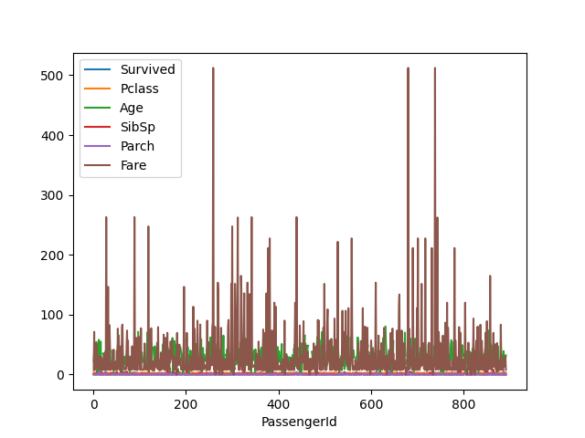

# 9 - Introduzione a Pandas

Pandas è una delle librerie più importanti dell'ecosistema SciPy, e viene usata per la lettura ed elaborazione dei dati provenienti da sorgenti di vario tipo, come ad esempio file CSV o Excel, ma anche file di testo e database. Vediamo quindi brevemente come usare la libreria, tenendo presente che ne approfondiremo il funzionamento anche durante le lezioni successive.

## 9.1 - Installazione e configurazione di Pandas

Al solito, provvediamo ad installare Pandas:

```sh
pip install pandas
```

Così come per le altre librerie, nel prosieguo presupporemo che Pandas sia già stato importato nel nostro script/notebook:

```py
import pandas as pd
```

## 9.2 - Pandas e la gestione dei dati

Pandas gestisce prevalentemente dati *strutturati* sotto forma *tabellare*, ossia simili a quelli comunemente contenuti all'interno dei fogli di calcolo o nei database. Questi dati sono sicuramente tra i più diffusi ed utilizzati nel contesto dell'analisi dei dati, ovviamente escludendo le immagini: in tal senso, per modellarli, Pandas ci mette a disposizione un'apposita struttura denominata **dataframe**.

I dataframe sono quindi delle strutture atte a contenere dati di ogni tipo. Questi sono normalmente organizzati in righe e colonne, in maniera del tutto analoga a quella in cui sono organizzati i fogli di calcolo ed i database. Importante anche sottolineare come, per convenzione, le singole righe rappresentino i *campioni* del dataset, mentre le colonne siano associati ai valori assunti dalle diverse caratteristiche, o *feature*, di ciascun campione.

Facciamo un esempio usando il dataset [Titanic](../../data/titanic.csv), che è uno tra i più utilizzati a scopi di sperimentazione. Per prima cosa, generiamo un dataframe rappresentativo dei dati contenuti nel dataset:

```py
df = pd.read_csv('titanic.csv')
```

Usiamo il metodo `head()` per mostrare a schermo le prime cinque righe del dataframe.

```py
>>> df.head()
   PassengerId  Survived  Pclass                                               Name     Sex   Age  SibSp  Parch            Ticket     Fare Cabin Embarked
0            1         0       3                            Braund, Mr. Owen Harris    male  22.0      1      0         A/5 21171   7.2500   NaN        S
1            2         1       1  Cumings, Mrs. John Bradley (Florence Briggs Th...  female  38.0      1      0          PC 17599  71.2833   C85        C
2            3         1       3                             Heikkinen, Miss. Laina  female  26.0      0      0  STON/O2. 3101282   7.9250   NaN        S
3            4         1       1       Futrelle, Mrs. Jacques Heath (Lily May Peel)  female  35.0      1      0            113803  53.1000  C123        S
4            5         0       3                           Allen, Mr. William Henry    male  35.0      0      0            373450   8.0500   NaN        S
```

Vediamo rapidamente che ad ogni passeggero sono associate delle feature, di cui possiamo inferire il tipo (lo verificheremo a breve):

| Feature | Descrizione | Tipo |
| ------- | ----------- | ---- |
| PassengerId | Identificativo univoco del passeggero. | Intero |
| Survived | Stabilisce se il passeggero è sopravvissuto. | Intero/booleano |
| Pclass | Rappresenta la classe del passeggero | Intero |
| Name | Nome completo del passeggero | Stringa |
| Sex | Genere del passeggero | Stringa |
| Age | Età del passeggero | Decimale |
| SibSp | Crasi di "Siblings/Spouses", rappresenta il numero di fratelli/sorelle/coniugi a bordo per ogni passeggero | Intero |
| Parch | Crasi di "Parents/Children", rappresenta il numero di genitori/figli a bordo per ogni passeggero | Intero |
| Ticket | Rappresenta l'identificativo per il ticket del passeggero. | Stringa |
| Tariffa | Rappresenta la tariffa pagata dal passeggero. | Decimale |
| Cabin | Rappresenta la cabina in cui allogiava il passeggero. | Stringa |
| Embarked | Rappresenta il punto di imbarco del passeggero. | Stringa |

Verifichiamo che le nostre ipotesi sul tipo di dato siano corrette; per farlo, possiamo usare la proprietà `dtypes` del dataframe:

```py
>>> df.dtypes
PassengerId      int64
Survived         int64
Pclass           int64
Name            object
Sex             object
Age            float64
SibSp            int64
Parch            int64
Ticket          object
Fare           float64
Cabin           object
Embarked        object
dtype: object
```

Notiamo subito la presenza di tre tipi di colonna, ovvero `int64`, `float64` e `object`. Laddove i primi due sono autoesplicativi, merita una particolare menzione il tipo `object`, che viene associato automaticamente a tutte le stringhe.

!!!tip "Suggerimento"
	Normalmente, usare il tipo `object` comporta diversi problemi nella successiva fase di analisi dei dati. Potrebbe quindi essere una buona idea parametrizzare la funzione `read_csv()` mediante il parametro [`dtype`](https://pandas.pydata.org/pandas-docs/stable/reference/api/pandas.read_csv.html), che accetta un dizionario che specifica il tipo di una o più colonne. Ad esempio, se volessimo specificare che i nomi sono delle stringhe, potremmo usare il tipo `string`:

	> ```py
	  >>> types = {'Name': 'string'}
	  >>> df = pd.read_csv('train.csv', dtype=types)
	  >>> df.dtypes
	  # ...
	  Name            string
	  # ...
	  ```

Appare chiaro come il dataset ci illustri numerose proprietà per ogni passeggero imbarcato. Queste potranno quindi essere utilizzate per un'analisi approfondita della struttura dei dati sotto diversi aspetti e punti di vista; ne parleremo più estesamente nel seguito.

### 9.2.1 - Le Series

Abbiamo visto come ogni dataframe sia in realtà composto da diverse colonne, ciascuna rappresentativa di una feature specifica. Nella pratica, Pandas ci offre un modo per rappresentare singolarmente ciascuna di queste colonne, mediante un oggetto di classe `Series`. Ad esempio, potremmo estrarre la serie relativa agli identificativi numerici dei passeggeri:

```py
names = df['Name']
names.head()

# Output restituito
0                              Braund, Mr. Owen Harris
1    Cumings, Mrs. John Bradley (Florence Briggs Th...
2                               Heikkinen, Miss. Laina
3         Futrelle, Mrs. Jacques Heath (Lily May Peel)
4                             Allen, Mr. William Henry
Name: Name, dtype: object
```

#### 9.2.1.1 - Accesso agli elementi di una serie

Possiamo accedere ad un singolo elemento di una serie mediante una classica procedura di indicizzazione. Notiamo infatti come ogni campione all'interno della serie sia associato ad un indice numerico crescente il cui valore iniziale è pari a 0; pertanto, possiamo accedere all'$i$-mo elemento della serie richiamando l'$i-1$-mo indice, esattamente come accade per le liste o le sequenze.

```py
>>> names[0]
'Braund, Mr. Owen Harris'
```

!!!note "Nota"
   L'indicizzazione può essere anche usata per impostare il valore associato ad uno specifico indice della serie.

#### 9.2.1.2 - Accesso agli elementi del dataframe

L'accesso agli elementi del dataframe può avvenire attraverso diverse modalità. In primo luogo, possiamo accedere allo specifico valore di una feature di un dato campione mediante il *chained indexing*:

```py
>>> df['Age'][1
38
```

In alternativa, è possibile usare la funzione `loc(row_idx, col)`, che permette di accedere al valore assunto dalla feature `col` per l'elemento in posizione `row_idx`:

```py
>>> df.loc[1, ('Age')]
38.0
```

La funzione `loc()` può operare anche su delle slice di dati:

```py
>>> df.loc[1:5, ('Age')]
1    38.0
2    26.0
3    35.0
4    35.0
5     NaN
```

o su insiemi di feature:

```py
>>> df.loc[1:5, ('Age', 'Sex')]
   Age     Sex
1  38.0  female
2  26.0  female
3  35.0  female
4  35.0    male
5   NaN    male
```

Sottolineamo che la funzione `loc()` opera sugli *indici di riga*. In questo caso, il nostro dataframe ha degli indici di riga interi, assegnati automaticamente in fase di lettura del dataframe. Nel caso decidessimo di usare una colonna del dataframe come indice, potremmo usare il metodo `set_index()`:

```py
df = df.set_index('Ticket')
```

Notiamo che, come al solito, le funzioni lavorano sul valore, e non sulla reference. Di conseguenza, se omettessimo l'assegnazione, `df` rimarrebbe invariato. Un modo per evitare di usare ogni volta l'operazione di assegnazione è quello di impostare il parametro `inplace` a `True`:

```py
df.set_index('Ticket', inplace=True)
```

In alternativa, possiamo decidere di impostare l'indice direttamente nel metodo `read_csv()` impostando il parametro `index_col`:

```py
df = pd.read_csv('titanic.csv', index_col='Ticket')
```

In questo caso, la funzione `loc()` dovrà essere utilizzata usando come parametri di lettura per righe i nuovi indici. Ad esempio:

```py
>>> df.loc['STON/O2. 3101282', 'Name']
'Heikkinen, Miss. Laina'
```

Oltre alla funzione `loc()` Pandas ci mette a disposizione la funzione `iloc()`, la quale ci offre la possibilità di selezionare un sottoinsieme di campion del dataframe mediante indici interi (da cui la `i`):

```py
>>> df.iloc[2:5, 2:4]
                  Pclass                                          Name
Ticket                                                                
STON/O2. 3101282       3                        Heikkinen, Miss. Laina
113803                 1  Futrelle, Mrs. Jacques Heath (Lily May Peel)
373450                 3                      Allen, Mr. William Henry
```

### 9.2.2 - Maschere booleane

Supponiamo di voler selezionare soltanto gli uomini maggiorenni presenti nel dataset del Titanic. Per farlo, possiamo usare un'istruzione che implementi delle logiche di tipo booleano:

```py
>>> men = df[(df['Age'] > 18) & (df['Sex'] == 'male')]
>>> men.head()
    PassengerId  Survived  Pclass                            Name   Sex   Age
0             1         0       3         Braund, Mr. Owen Harris  male  22.0   
4             5         0       3        Allen, Mr. William Henry  male  35.0   
6             7         0       1         McCarthy, Mr. Timothy J  male  54.0   
12           13         0       3  Saundercock, Mr. William Henry  male  20.0   
13           14         0       3     Andersson, Mr. Anders Johan  male  39.0   
```

Nella pratica, stiamo filtrando il dataset in base all'`AND` logico tra due condizioni:

* `df['Age'] > 18`: questa condizione genera una *maschera booleana* che è `True` soltanto se l'età per quel passeggero è maggiore di 18 anni;
* `df['Sex'] == 'male'`: questa condizione genera una maschera booleana che è vera soltanto se il genere del passeggero è maschile.

### 9.2.3 - La funzione `groupby`

Possiamo sfruttare la funzione [`groupby`](https://pandas.pydata.org/pandas-docs/stable/reference/api/pandas.DataFrame.groupby.html) per raggruppare insiemi di dati (normalmente pertinenti a *categorie*).

Ad esempio, potremmo raggruppare i passeggeri per genere:

```py
>>> df.groupby(['Sex'])
```

Possiamo ovviamente estrarre delle statistiche a partire da questi raggruppamenti. Vediamo, ad esempio, l'età media dei passeggeri di sesso femminile e maschile:

```py
>>> df.groupby(['Sex'])['Age'].mean()
Sex
female    27.915709
male      30.726645
Name: Age, dtype: float64
```

## 9.3 - Scrittura e lettura dei dataframe

### 9.3.1 - Lettura di dati da sorgenti eterogenee

Nel nostro primo esempio abbiamo usato la funzione `read_csv` per creare un dataframe partendo dai dati memorizzati in un file in formato CSV. Tuttavia, Pandas supporta molti altri formati.

Ad esempio, potremmo provare a leggere un file Excel:

```py
df = pd.read_excel('dati.xlsx')
```

!!!warning "Attenzione"
	Per leggere (e scrivere) da (su) Excel è necessario installare la libreria `openpyxl` (`pip install openpyxl`).

In alternativa, può essere letto un file in formato JSON, oppure ancora direttamente un database:

```py
df = pd.read_json('dati.json')
df = pd.read_sql(SQL_QUERY)
```

Esiste un elenco completo delle (numerose) funzioni disponibili, che possono essere individuate sulla [reference](https://pandas.pydata.org/pandas-docs/stable/reference/io.html). In generale, comunque, la sintassi è sempre `read_*(data_source)`, con `*` da sostituire con il tipo di sorgente dati (`csv`, `excel`, etc.).

### 9.3.2 - Scrittura di dati su destinazioni eterogenee

Possiamo anche scrivere un dataframe su file mediante le funzioni duali alle `read_`, che usano il suffisso `to_` seguito dall'estensione del file destinazione. Ad esempio, potremmo scrivere un file CSV con il metodo `to_csv`:

```py
df.to_csv('train.xlsx')
```

## 9.4 - Aggiunta di feature e dati

Immaginiamo adesso di voler aggiungere una nuova feature ad un dataframe già esistente. Per farlo, iniziamo creando un dataframe da zero:

```py
>>> df = pd.DataFrame([1,2,3,4,5], columns=['one'])
   one
0    1
1    2
2    3
3    4
4    5
```

Possiamo aggiungere una nuova colonna semplicemente usando l'operatore di assegnazione e specificandone il nome:

```py
>>> df['two'] = df['one'] * 2
   one  two
0    1    2
1    2    4
2    3    6
3    4    8
4    5   10
```

Possiamo poi inserire nuovi campioni in coda al dataframe. Per farlo, dovremo prima creare un nuovo dataframe dalle dimensioni coerenti con quello già esistente, e poi usare la funzione `concat()`:

```py
>>> df_add = pd.DataFrame([[6,7]], columns=['one', 'two'])
>>> df = pd.concat([df, df_add])
   one  two
0    1    2
1    2    4
2    3    6
3    4    8
4    5   10
0    6    7
```

Notiamo che la funzione `concat()` accetta, tra gli altri, il parametro `axis`. Se questo è uguale a zero (come lo è di default), la `concat()` effettua la concatenazione per righe; se è pari ad 1, invece, la concatenazione avviene per colonne. Tuttavia, è importante sottolineare come la concatenazione avvenga anche nel caso le misure non siano completamente coerenti: infatti, se provassimo ad effettuare una concatenazione per colonne, avremmo un risultato del tipo:

```py
>>> pd.concat([df, df_add], axis=1)
   one  two  one  two
0    1    2  6.0  7.0
1    2    4  NaN  NaN
2    3    6  NaN  NaN
3    4    8  NaN  NaN
4    5   10  NaN  NaN
```

I valori relativi alle righe con indice che va da 1 a 4, che ovviamente non saranno presenti, saranno automaticamente impostati a *NaN*, acronimo di *Not a Number*.

## 9.5 - Visualizzazione dei dati in Pandas

Pandas ci offre un supporto nativo a Matplotlib per permettere la visualizzazione dei dati contenuti all'interno di un dataframe.

In tal senso, possiamo usare la funzione `plot()` su una serie o su un intero dataframe; ad esempio, potremmo plottare le età dei passeggeri:

```py
df['Age'].plot()
plt.show()
```

ottenendo il risultato mostrato in figura:

{: .center}

Possiamo anche fare il plot dell'intero `DataFrame`:

```py
df.plot()
plt.show()
```

che risulterà nella seguente figura:

{: .center}

Ovviamente, è possibile usare Pandas anche per fare il plot di altri tipi di grafico, come ad esempio gli istogrammi. Per farlo, si usano le apposite sotto-funzioni di `plot`:

```py
df['Age'].plot.hist()
plt.show()
```

Il risultato è mostrato in figura.

{: .center}

!!!note "Pandas e Seaborn"
   Pandas si integra in maniera naturale anche con la libreria Seaborn, di cui tratteremo nella prossima lezione.

## 9.6 - Operazioni statistiche sui dataframe

Pandas ci mette a disposizione delle funzioni, simili a quelle offerte da NumPy, per calcolare delle statistiche per ciascuna delle colonne presenti in un DataFrame. Ad esempio:

```py
>>> df.mean()
PassengerId    446.000000
Survived         0.383838
Pclass           2.308642
Age             29.699118
SibSp            0.523008
Parch            0.381594
Fare            32.204208
dtype: float64
```

Ovviamente, esistono funzioni anche per calcolare varianza (`df.var()`), mediana (`df.median()`), deviazione standard (`df.std()`), e via discorrendo.

Particolarmente interessante è la funzione `describe()`, che ci mosta tutte le statistiche più significative per ognuna delle feature considerate.

```py
>>> df.describe()
       PassengerId    Survived      Pclass         Age       SibSp       Parch        Fare
count   891.000000  891.000000  891.000000  714.000000  891.000000  891.000000  891.000000
mean    446.000000    0.383838    2.308642   29.699118    0.523008    0.381594   32.204208
std     257.353842    0.486592    0.836071   14.526497    1.102743    0.806057   49.693429
min       1.000000    0.000000    1.000000    0.420000    0.000000    0.000000    0.000000
25%     223.500000    0.000000    2.000000   20.125000    0.000000    0.000000    7.910400
50%     446.000000    0.000000    3.000000   28.000000    0.000000    0.000000   14.454200
75%     668.500000    1.000000    3.000000   38.000000    1.000000    0.000000   31.000000
max     891.000000    1.000000    3.000000   80.000000    8.000000    6.000000  512.329200
```
