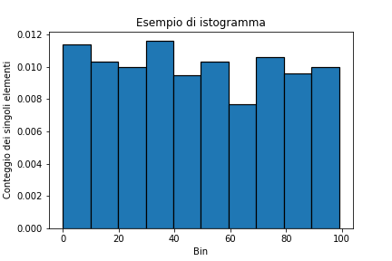
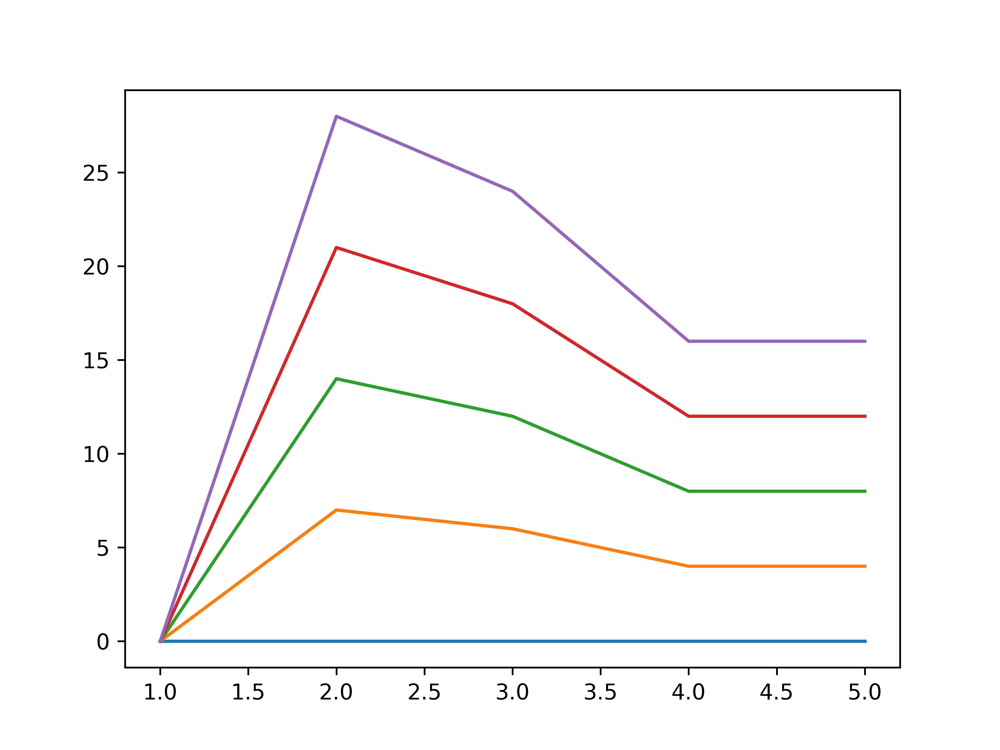

# 4.1 - Matplotlib

Nelle lezioni precedenti, ci siamo limitati a visualizzare i risultati ottenuti usando l'output fornito dalla riga di comando o dal notebook Jupyter/Colab. Tuttavia, è chiaro come questo modo di procedere sia giocoforza limitante: cosa ne è di tutti i coloratissimi grafici che possiamo ammirare in siti ed articoli scientifici? *Saranno per caso relegati esclusivamente al mondo di Excel?*

In realtà, per ottenerli dovremo necessariamente integrare il nostro ambiente di lavoro con altre librerie. Ne esistono diverse, ma la più utilizzata è senza dubbio [Matplotlib](https://matplotlib.org/), cui si può affiancare [Seaborn](https://seaborn.pydata.org/), che tratteremo in una delle [prossime lezioni](./02_seaborn.md).

## Setup della libreria

Prima di utilizzare Matplotlib, dovremo ovviamente installare la libreria. Per farlo, abbiamo al solito le opzioni mostrate in [appendice](../../appendix/03_libraries/lecture.md); di seguito, riportiamo l'opzione di installazione tramite `pip`:

```sh
pip install matplotlib
```

Passiamo poi ad importare la libreria all'interno del nostro programma. In particolare, il package più utilizzato è [`pyplot`](https://matplotlib.org/stable/tutorials/introductory/pyplot.html) che, come dice la documentazione, altro non è che un insieme di funzioni (palesemente) ispirate a MATLAB. Useremo quindi un alias per questo package:

```py
import matplotlib.pylot as plt
```

Saremo a questo punto pronti per utilizzare le funzioni messe a disposizione da Matplotlib.

## Il primo plot

Per creare il nostro primo plot, utilizziamo il seguente codice:

```py linenums="1"
rng = np.random.default_rng(42)
x = np.arange(1, 6)
y = rng.integers(low=0, high=10, size=5)
fig, ax = plt.subplots()
ax.plot(x, y)
plt.show()
```

In particolare:

* alla riga 1, creiamo un generatore di numeri casuali;
* alla riga 2, definiamo tutti i valori di `x` compresi nell'intervallo tra 1 e 5 usando la funzione `numpy.arange()`;
* alla riga 3, definiamo tutti i valori di `y` come valori interi casuali compresi tra `0` e `10`;
* alla riga 4, creiamo una `figure` ed un `axes` mediante il metodo [`subplots()`](https://matplotlib.org/stable/api/_as_gen/matplotlib.pyplot.subplots.html);
* alla riga 5, effettuiamo il plot su `ax`, mettendo come ascissa i valori di `x`, e come ordinata quelli di `y`;
* alla riga 6, chiamiamo il metodo [`show()`](https://matplotlib.org/stable/api/_as_gen/matplotlib.pyplot.show.html) per mostrare a schermo il grafico ottenuto.

Se tutto è andato per il verso giusto, dovremmo vedere a schermo l'immagine mostrata nella figura 1.

<figure markdown>
  { width="450" }
  <figcaption>Figura 1 - Un semplice plot in Matplotlib</figcaption>
</figure>

!!!tip "Suggerimento"
	Se avete seguito pedissequamente il tutorial, a schermo dovrebbe essere visualizzata *esattamente* l'immagine mostrata nella figura 1. Questo perché al generatore di numeri (pseudo) casuali viene passato il parametro `seed`, usato come base per la generazione degli stessi, che risulteranno quindi essere sempre gli stessi, indipendentemente dall'iterazione.

## Figure ed assi

L'esempio precedente ci permette di illustrare in poche righe di codice tutti i concetti su cui si basa Matplotlib. Tuttavia, è opportuno scendere maggiormente nel dettaglio.

In particolare, alla base del funzionamento di Matplotlib ci sono quattro classi fondamentali.

#### La classe `Figure`

Per prima cosa, ci sono le [`Figure`](https://matplotlib.org/stable/api/figure_api.html#matplotlib.figure.Figure), rappresentative dell'intera area mostrata a schermo da Matplotlib. Un oggetto di questa classe conterrà un numero arbitrario di elementi, permettendone visualizzazione e contestuale manipolazione.

#### La classe `Axes`

Gli oggetti di classe [`Axes`](https://matplotlib.org/stable/api/_as_gen/matplotlib.axes.Axes.html#matplotlib.axes.Axes), rappresentano l'area della `Figure` all'interno della quale saranno visualizzati i dati. La relazione tra `Figure` ed `Axes` è strettamente gerarchica: in pratica, una `Figure` può avere diversi `Axes`, ma ogni `Axes` appartiene esclusivamente ad una `Figure`.

#### La classe `Axis`

All'interno di un oggetto `Axes` troviamo poi due o tre oggetti di tipo [`Axis`](https://matplotlib.org/stable/api/axis_api.html#axis-objects), ognuno dei quali rappresenta l'asse vero e proprio. In altri termini, avremo due `Axis` per i plot bidimensionali, rappresentativi degli assi $x$ ed $y$, ed un terzo `Axis` per i plot tridimensionali, rappresentativo ovviamente dell'asse $z$. Gli oggetti `Axis` ci permettono quindi di definire gli intervalli dati, l'eventuale griglia, e via discorrendo.

!!!warning "`Axes` ed `Axis`"
	Fate attenzione a non confondere gli `Axes` con gli `Axis`! In pratica: gli `Axes` sono i singoli plot, mentre gli `Axis` sono gli assi contenuti in ciascun plot.

#### La classe `Artist`

L'ultimo concetto fondamentale di Matplotlib è quello degli *artist*, oggetti derivati dalla classe base [`Artist`](https://matplotlib.org/stable/api/artist_api.html#artist-class), delegata al rendering vero e proprio dei plot.

### Rivisitazione dell'esempio precedente

Torniamo brevemente al precedente snippet. La funzione `subplots()` ci servirà quindi a creare un oggetto di tipo `Figure` assieme agli `Axes` desiderati:

```py
fig, ax = plt.subplots()
```

A questo punto, possiamo plottare i valori di `x` ed `y` su nostro oggetto `Axes`, che conterrà a sua volta due `Axis`, uno per l'asse delle $x$, e l'altro per l'asse delle $y$:

```py
ax.plot(x, y)
```

Vediamo adesso qualche esempio più significativo

## Esempio 1: Plot di più funzioni

L'obiettivo di questo esempio è mostrare su uno stesso `Axes` due diverse funzioni. In particolare, scegliamo come funzioni da rappresentare una retta ed una funzione seno.

Per prima cosa, definiamo i nostri dati:

```py linenums="1"
x = np.arange(0., 10., 0.01)
y_1 = 1 + 2 * x
y_2 = np.sin(x)
```

Alla riga 1, definiamo l'intervallo sull'asse $x$ come quello compreso tra $0$ e $10$ e campionato a passo $0.01$. Così facendo, avremo un campionamento molto fitto, con un totale di $1000$ punti considerati. Alla riga 2 definiamo la nostra retta, la cui equazione sarà $y = 2x + 1$, mentre alla riga 3 andremo a definire la funzione seno.

Adesso, creiamo la nostra `Figure` con relativo `Axes`, ed effettuiamo il plot di entrambe le funzioni.

```py
fig, ax = plt.subplots()
ax.plot(x, y_1, label='Retta')
ax.plot(x, y_2, label='Funzione sinusoidale')
```

Notiamo la presenza del parametro `label` che indica l'etichetta assegnata ai due plot; questa sarà utilizzata successivamente per generare la legenda. Passiamo adesso ad impostare il titolo e le label sugli assi $x$ e $y$ usando rispettivamente le funzioni `set_title()`, `set_xlabel()` e `set_ylabel()`:

```py
ax.set_title('Plot di due funzioni matematiche')
ax.set_xlabel('Asse x')
ax.set_ylabel('Asse y')
```

Usiamo adesso la funzione `grid()` per mostrare una griglia sulla figura, e la funzione `legend()` per far apparire la legenda che descrive le funzioni visualizzate.

```py
ax.legend()
ax.grid()
```

In ultimo, mostriamo a schermo la figura con la funzione `show()`:

```py
plt.show()
```

Il risultato ottenuto è mostrato in figura 2.

<figure markdown>
  { width="450" }
  <figcaption>Figura 2 - Plot di due funzioni</figcaption>
</figure>

## Esempio 2: Subplot multipli

Alle volte, può essere conveniente affiancare più subplot all'interno di un unico plot principale. In tal senso, abbiamo in precedenza detto che possiamo definire più `Axes` per un'unica `Figure`; per farlo, possiamo parametrizzare la funzione `subplots(i, j)`, in maniera tale che vengano creati $i \times j$ plot all'interno della stessa figura.

Per creare 2 subplot in "riga", ad esempio, parametrizzeremo `subplots()` come segue:

```py
fig, (ax_1, ax_2) = plt.subplots(2, 1)
```

Notiamo la presenza di due `Axes`, rispettivamente `ax_1` ed `ax_2`. Ognuno di questi potrà essere trattato come descritto in precedenza.

Per prima cosa, usiamo la funzione `suptitle()` sulla `Figure` `fig` per dare un titolo all'intero plot:

```py
fig.suptitle('Due subplot di più funzioni matematiche')
```

A questo punto, procediamo ad effettuare i plot sui relativi assi:

```py
# Primo subplot
ax_1.plot(x, y_1, label='Retta')
ax_1.set_xlabel('Asse x')
ax_1.set_ylabel('Asse y')
ax_1.legend()
ax_1.grid()
# Secondo subplot
ax_2.plot(x, y_2, label='Funzione sinusoidale')
ax_2.set_xlabel('Asse x')
ax_2.set_ylabel('Asse y')
ax_2.legend()
ax_2.grid()
```

Mostriamo quindi a schermo il plot:

```py
plt.show()
```

Il risultato sarà simile a quello mostrato in figura 3:

<figure markdown>
  { width="450" }
  <figcaption>Figura 3 - Subplot multipli</figcaption>
</figure>

## Esempio 3: Istogramma

Abbiamo già parlato degli [istogrammi in NumPy](../02_numpy/06_statistics.md#istogramma). Tuttavia, un istogramma raggiunge la massima espressività possibile quando ne si utilizza la rappresentazione visiva. In tal senso, Matplotlib ci offre una funzione apposita chiamata [`hist()`](https://matplotlib.org/stable/api/_as_gen/matplotlib.pyplot.hist.html).

Proviamo ad utilizzarla. Per farlo, creiamo in primis un vettore di $1000$ numeri interi casuali compresi tra $0$ e $100$.

```py
x = rng.integers(low=0, high=100, size=1000)
```

Al solito, creiamo la nostra figura, ed usiamo la funzione `hist()` passandogli il vettore `x` creato in precedenza e il parametro `density`, che ci permetterà di normalizzare l'istogramma (ovvero, fare in modo tale che la sommatoria dei singoli bin sia esattamente pari ad 1).

```py
fig, ax = plt.subplots()
ax.hist(x, edgecolor='black', linewidth=1.2, density=True)
```

Notiamo anche l'uso dei parametri `edgecolor`, che permette di impostare il colore del bordo di ciascuna barra dell'istogramma, e `linewidth`, che consente di specificarne lo spessore.

Al solito, usiamo i metodi opportuni per impostare titolo e label degli assi, e mostriamo la figura.

```py
ax.set_xlabel('Bin')
ax.set_ylabel('Conteggio dei singoli elementi')
ax.set_title('Esempio di istogramma')

plt.show()
```

Il risultato sarà simile a quello mostrato nella figura 4.

<figure markdown>
  { width="450" }
  <figcaption>Figura 4 - Istogramma</figcaption>
</figure>

## Esempio 4: Scatter plot

Lo *scatter plot* è una modalità alternativa di mostrare la distribuzione dei dati lungo gli assi $x$, $y$ ed, opzionalmente, $z$. In particolare, questo tipo di visualizzazione differisce dal normale plot in quanto i singoli punti dati non sono collegati da una linea, ma rappresentati in modo discreto, ed è particolarmente utile quando si vuole valutare visivamente la distribuzione di una serie di dati in due o tre dimensioni. Ovviamente, Matplotlib ci mette a disposizione un'apposita funzione per la visualizzazione di questo tipo di plot, chiamata [`scatter()`](https://matplotlib.org/stable/api/_as_gen/matplotlib.pyplot.scatter.html).

Il funzionamento è totalmente analogo al `plot()`. Ad esempio, considerando i valori di `x` ed `y` utilizzati nel primo esempio del tutorial, potremmo generare uno scatter plot come segue:

```py
rng = np.random.default_rng(42)
x = np.arange(1, 6)
y = rng.integers(low=0, high=10, size=5)
fig, ax = plt.subplots()
ax.set_xlabel('Asse x')
ax.set_ylabel('Asse y')
ax.set_title('Esempio di scatter plot')
ax.plot(x, y)
plt.show()
```

Il risultato sarà simile a quello mostrato in figura 5.

<figure markdown>
  { width="450" }
  <figcaption>Figura 5 - Scatter plot</figcaption>
</figure>

## Note finali: salvataggio e chiusura di una figura

Chiudiamo questa breve carrellata specificando che, per salvare una figura, è necessario usare la funzione [`savefig()`](https://matplotlib.org/stable/api/_as_gen/matplotlib.pyplot.savefig.html), che accetta come primo parametro il nome del file su cui salveremo l'immagine:

```py
plt.savefig('file_name.png')
```

Oltre a questo, dei parametri molto utili da utilizzare sono `dpi`, che ci permette di specificare la risoluzione della figura, e `bbox_inches`, per il quale il suggerimento è di impostarlo a `tight` per evitare eccessivi spazi bianchi attorno alla figura (o, al contrario, il taglio di parti delle label).

Infine, facciamo un cenno alla funzione [`close()`](https://matplotlib.org/2.1.2/api/_as_gen/matplotlib.pyplot.close.html), delegata alla chiusura di un oggetto di tipo `Figure`:

```py
plt.close()
```

La funzione `close()` assume particolare rilevanza nel momento in cui vogliamo, ad esempio, plottare diverse figure al variare di alcune condizioni, come ad esempio in un ciclo. Infatti, se non chiudessimo la figura attuale al termine di ciascuna iterazione, Matplotlib andrebbe a disegnare la nuova funzione *sempre sulla stessa figura*. Ad esempio:

```py
for i in range(5):
	plt.plot(x, y*i)
plt.show()
```

In questo caso, dato che non stiamo chiudendo la figura, avremo un risultato come visto in figura 6.

<figure markdown>
  { width="450" }
  <figcaption>Figura 6 - Plot senza l'invocazione di `close()`</figcaption>
</figure>

Se invece chiamassimo sempre la `close()`, all'ultima iterazione avremmo il plot mostrato in figura 7.

```py
for i in range(5):
    plt.plot(x, y*i)
    plt.show()
    plt.close()
```

<figure markdown>
  { width="450" }
  <figcaption>Figura 7 - Plot con l'invocazione di `close()`</figcaption>
</figure>

Nella [prossima lezione](02_seaborn.md), approfondiremo l'utilizzo di una libreria *discendente* da Matplotlib, ovvero [Seaborn](https://seaborn.pydata.org/).
