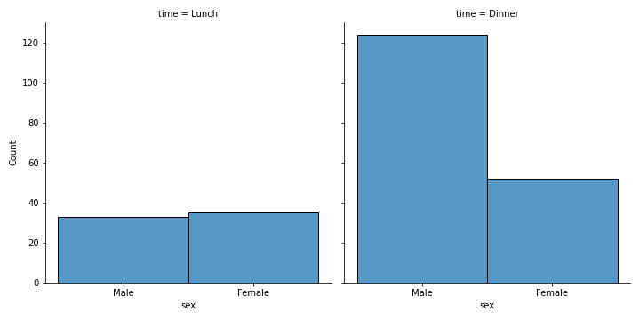

# 4.2 - Seaborn

!!!tip "Notebook di accompagnamento"
	Per questa lezione esiste un *notebook di accompagnamento*, reperibile a [questo indirizzo](https://github.com/anhelus/pcs-exercises/blob/master/01_libs/02_visualization/02_seaborn.ipynb).

[Seaborn](https://seaborn.pydata.org/) è una libreria che estende [Matplotlib](01_matplotlib.md) aggiungendone diverse funzionalità, tutte nell'ottica della data analysis, e sulla scia di quello che abbiamo presentato in Pandas in una delle [precedenti lezioni](../03_pandas/01_intro.md). Ciò permette quindi di mantenere un'interfaccia molto simile a quella di Matplotlib, estendendone al contempo le possibilità. Vediamo qualche esempio.

## Setup della libreria

Come in ogni altro caso, partiamo dall'installazione della libreria, che potrà essere fatta usando il seguente comando:

```sh
pip install seaborn
```

Una volta completata l'installazione, potremo importare Seaborn mediante un alias:

```py
import seaborn as sns
```

## Analisi esplorativa dei dati

Come abbiamo detto in precedenza, Seaborn risulta utile in diverse situazioni collegate alla data analysis.

In tal senso, supponiamo di voler effettuare un'analisi dei dati esplorativa ([*Exploratory Data Analysis*](https://en.wikipedia.org/wiki/Exploratory_data_analysis), o *EDA*), visualizzando le relazioni che intercorrono tra le diverse feature presenti all'interno di un certo dataset. Nel nostro esempio, utilizzeremo il dataset [*tips*](https://github.com/mwaskom/seaborn-data/blob/master/tips.csv), contenuto all'interno di Seaborn, il quale descrive le caratteristiche dei clienti di un generico ristorante, ed in particolare:

* **total_bill**: il conto totale;
* **tip**: la mancia lasciata dal cliente pagante;
* **sex**: il genere del cliente pagante;
* **smoker**: il fatto che il tavolo sia o meno in zona fumatori;
* **day**: la giornata nella quale il pasto è stato consumato;
* **time**: la parte della giornata nella il pasto è stato consumato (in particolare, pranzo o cena);
* **size**: il numero di clienti seduti al tavolo.

Partiamo caricando il dataset. Per farlo, utilizziamo il metodo [`load_dataset()`](https://seaborn.pydata.org/generated/seaborn.load_dataset.html), che ci permette di scaricare rapidamente il dataset passato come parametro, salvandolo in un apposito `DataFrame`:


```py
tips = sns.load_dataset('tips')
```

!!!note "I dataset"
    L'elenco dei dataset integrati in Seaborn è presente a [questo indirizzo](https://github.com/mwaskom/seaborn-data).

Partiamo ispezionando il `DataFrame` appena scaricato mediante il comando `head()`. Vediamo che gli elementi precedentemente descritti sono organizzati in questo modo:

```sh
  total_bill   tip     sex smoker  day    time  size
0       16.99  1.01  Female     No  Sun  Dinner     2
1       10.34  1.66    Male     No  Sun  Dinner     3
2       21.01  3.50    Male     No  Sun  Dinner     3
3       23.68  3.31    Male     No  Sun  Dinner     2
4       24.59  3.61  Female     No  Sun  Dinner     4
```

La struttura del `DataFrame` è quindi la seguente:

* ogni riga è associata ad una specifica ordinazione;
* le colonne sono associate rispettivamente a conto (`total_bill`), mancia (`tip`), genere (`sex`), fumatore (`smoker`), giorno (`day`), orario (`time`) e numero di attendenti (`size`), come descritto in precedenza.

## Visualizzare le relazioni tra dati

La prima funzione che andremmo ad utilizzare è la [`relplot()`](https://seaborn.pydata.org/generated/seaborn.relplot.html), la quale ci permette di analizzare rapidamente le relazioni intercorrenti tra le diverse feature del dataset. Ad esempio, possiamo vedere come cambiano il conto e la mancia al variare della giornata:

```py linenums="1"
sns.relplot(
    data=tips,
    x='total_bill',
    y='tip',
    col='day')
```

In particolare:

* il parametro `data` viene valorizzato con `tips`, ovvero il `DataFrame` che contiene i dati che vogliamo analizzare;
* il parametro `x`, che definisce i dati visualizzati sull'asse delle ascisse, sarà parametrizzato a `total_bill`, ovvero il nome della feature che vogliamo visualizzare sul suddetto asse;
* in maniera simile al precedente, `y`, che definisce i dati visualizzati sull'asse delle ordinate, sarà parametrizzato a `tip`;
* il parametro `col`, invece, genererà tanti grafici quante sono le possibili valorizzazioni della colonna `day`, ognuno dei quali corrispondente all'andamento dei parametri indicati su `x` ed `y` per quello specifico giorno.

I risultati sono mostrati nella figura 1.

<figure markdown>
  
  <figcaption>Figura 1 - Comparazione tra conto e mance al variare del giorno in Seaborn</figcaption>
</figure>

Proviamo adesso a valutare come cambia il rapporto conto/mance in base al sesso:

```py
sns.relplot(
    data=tips,
    x='total_bill',
    y='tip',
    col='sex',
    size='tip')
```

I risultati sono mostrati in figura 2. Notiamo come, impostando il parametro `size`, potremo modificare la dimensione di ciascun punto, rendendola direttamente proporzionale alla mancia data.

<figure markdown>
  
  <figcaption>Figura 2 - Comparazione tra conto e mance al variare del sesso. La dimensione di ciascun punto è data dall'entità della mancia</figcaption>
</figure>

Una funzione simile alla `relplot()` è la [`lmplot()`](https://seaborn.pydata.org/generated/seaborn.lmplot.html), la quale offre anche un'approssimazione ai minimi quadrati dei dati impostati sugli assi cartesiani. Ad esempio, proviamo a mostrare lo stesso rapporto illustrato in figura 2 con la `lmplot()`:

```py
sns.lmplot(
    data=tips,
    x='total_bill',
    y='tip',
    col='time',
    hue='day')
```

Da notare come in questo caso abbiamo specificato il parametro `hue`, che regola la tinta dei punti dati. I risultati sono mostrati in figura 3.

<figure markdown>
  
  <figcaption>Figura 3 - Comparazione tra conto e mance con approssimazione dei dati ai minimi quadrati</figcaption>
</figure>

## Analisi della distribuzione dati

Seaborn ci permette di effettuare un'analisi della distribuzione delle variabili all'interno del dataset sotto analisi. Per farlo, usiamo la funzione [`displot()`](https://seaborn.pydata.org/generated/seaborn.displot.html), che ci permette di visualizzare la distribuzione dei dati sulla base di determinate condizioni sfruttando un istogramma.

Ad esempio, potremmo visualizzare la distribuzione dei clienti in base al loro genere ed al momento della giornata in cui effettuano la consumazione:

```py
sns.displot(
    data=tips,
    x='sex',
    col='time',
    kde=True)
```

Il risultato è mostrato in figura 4:

<figure markdown>
  
  <figcaption>Figura 4 - Distribuzione dei clienti in base al loro genere ed al momento della giornata in cui viene effettuata la consumazione</figcaption>
</figure>

Specificando il parametro `kde`, è possibile ottenere un'approssimazione della distribuzione mediante [*kernel density estimation*](https://en.wikipedia.org/wiki/Kernel_density_estimation), come mostrato in figura 5.

<figure markdown>
  
  <figcaption>Figura 5 - Distribuzione dei clienti in base al loro genere ed al momento della giornata in cui viene effettuata la consumazione. La visualizzazione sfrutta la KDE</figcaption>
</figure>

## Plot di dati categorici

Seaborn offre anche dei plot specializzati per la creazione e visualizzazione di dati (o feature) di tipo *categorico*, ovvero dati appartenenti ad una tra diverse possibili categorie. In tal senso, un esempio di feature categorica è il genere dei clienti del ristorante, che nel dataset sono soltanto uomini o donne.

!!!note "Dati categorici e numerici"
    Oltre ai dati categorici, esistono i dati *numerici* che, ovviamente, rappresentano dei numeri.

I plot di questo tipo possono essere generati mediante la funzione [`catplot()`](https://seaborn.pydata.org/generated/seaborn.catplot.html), delegata alla definizione di plot a diversi livelli di granularità, come ad esempio i *violin plot*.

```py
sns.catplot(
    data=tips,
    kind='violin',
    x='day',
    y='tip',
    hue='sex',
    split=True)
```

In particolare, il grafico mostrato in figura 6 descrive la distribuzione delle mance giorno per giorno al variare del genere del cliente.

<figure markdown>
  
  <figcaption>Figura 6 - *Violin plot* descrivente la distribuzione delle mance giorno per giorno al variare del sesso dell'avventore</figcaption>
</figure>

!!!tip "Catplot con dati non categorici"
    In realtà, è possibile usare la `catplot()` con dati numerici. Tuttavia, vi è un elevato rischio che il risultato non sia interpretabile, in quanto la funzione assegnerà una categoria ad ogni possibile valore assunto dalla feature di riferimento, il che ovviamente comporterà l'illeggibilità del grafico nel caso di valori reali.

## Heatmap

Un'ultima funzione che vale la pena menzionare è quella che ci permette di visualizzare le *heatmap*, ovvero delle strutture grafiche che ci permettono di visualizzare gli intervalli in cui ricadono i valori di diversi tipi di matrici. Questa funzione è, per l'appunto, chiamata [`heatmap()`](https://seaborn.pydata.org/generated/seaborn.heatmap.html), e richiede in ingresso almeno il parametro relativo alla matrice da cui sarà estratta la figura. Ad esempio:

```py
ar = np.array([[5, 12], [4, 3]])
sns.heatmap(
    ar,
    cmap='jet',
    annot=True,
    xticklabels=False,
    yticklabels=False)
```

Nella precedente invocazione della funzione `heatmap()` specifichiamo i parametri indicati in modo da passare un array (o similari) come primo argomento, seguito da una *colormap*, ovvero i colori da utilizzare. Specifichiamo inoltre che vogliamo inserire i valori dell'array su ciascuna delle celle dell'heatmap (mediante il parametro `annot`) e che non vogliamo visualizzare i label sugli assi $x$ e $y$ (`xticklabels` ed `yticklabels` rispettivamente). Otterremo il risultato mostrato in figura 7:

<figure markdown>
  
  <figcaption>Figura 7 - Un esempio di heatmap</figcaption>
</figure>

!!!tip "Usi delle heatmap"
    Le heatmap sono molto utili in diverse situazioni, tra cui la descrizione dei risultati degli algoritmi di machine learning mediante le matrici di confusione, l'analisi di correlazione, e la visualizzazione delle mappe di attivazione in caso di interpretabilità delle reti neurali.
