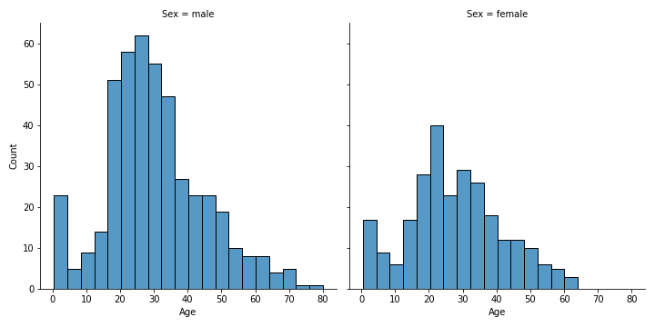
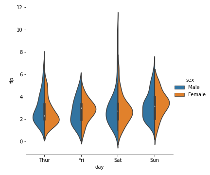

# Esercitazione 4 - Visualizzazione dei dati in Python

## Esercizio 4.1

Visualizziamo la distribuzione dell'età dei diversi passeggeri del Titanic in base al loro genere. Visualizziamo inoltre il rapporto tra età e numero di familiari in base al genere del passeggero.

**Soluzione**

Per prima cosa, leggiamo il dataframe:

```py
df = pd.read_csv('titanic.csv')
```

Per visualizzare la distribuzione dell'età dei diversi passeggeri del Titanic in base al loro genere usiamo un `displot()`:

```py
sns.displot(
    data=df,
    x='Age',
    col='Sex')
```

<figure markdown>
  { width="450" }
  <figcaption>Figura 1 - Un semplice plot in Matplotlib</figcaption>
</figure>

Per visualizzare inoltre il rapporto tra età e numero di fratelli/sorelle/coniugi in base al genere del passeggero usiamo un `catplot()`:

```py
sns.catplot(
    data=df,
    kind='violin',
    x='SibSp',
    y='Age',
    hue='Sex',
    split=True)
```

<figure markdown>
  { width="450" }
  <figcaption>Figura 1 - Un semplice plot in Matplotlib</figcaption>
</figure>

## Esercizio 4.2

Effettuiamo un'*analisi esplorativa* del dataset Titanic. In particolare, sfruttiamo Pandas e Seaborn per:

* verificare la correlazione tra le feature che riteniamo rilevanti, visualizzandola a schermo mediante una heatmap;
* analizzare la distribuzione statistica delle feature di tipo categorico e numerico;
* valutare la descrizione statistica delle diverse feature;
* dedurre empiricamente l'esistenza di eventuali relazioni tra le diverse feature;
* isolare quattro diversi tipi di soggetti (maschi adulti, femmine adulte, maschi giovani e femmine giovani), ed effettuare le precedenti analisi in maniera separata su ciascuno dei gruppi.
