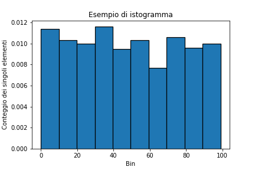

# 8.1 - Visualizzare i dati in Python

Finora ci siamo limitati a visualizzare dati e risultati ottenuti usando prima la riga di comando, e poi i metodi forniti dai notebook Jupyter. Tuttavia, è chiaro come questo modo di procedere sia limitante: cosa ne è di tutti i coloratissimi grafici che possiamo ammirare in siti ed articoli scientifici?

Nella realtà, per ottenerli dovremo necessariamente integrare il nostro ambiente di lavoro con altre librerie: ne esistono diverse, ma la più importante ed utilizzata è senza ombra di dubbio [Matplotlib](https://matplotlib.org/), cui si può affiancare [Seaborn](https://seaborn.pydata.org/).

## 8.1.1 - Installazione delle librerie

Per prima cosa, installiamo le librerie. Al solito, potrete consultare le diverse opzioni in [appendice](../../appendix/02_libraries/lecture.md); qui riportiamo l'opzione di installazione mediante `pip`:

```sh
pip install matplotlib seaborn
```

Per importare le librerie all'interno del nostro codice, usiamo degli alias:

```py
import matplotlib.pylot as plt		# import di matplotlib
import seaborn as sns				# import di seaborn
```

!!!note "L'API `pyplot`"
	Sottolineamo l'uso dell'API [`pyplot`](https://matplotlib.org/stable/tutorials/introductory/pyplot.html) per Matplotlib al posto dell'API "standard". In tal modo, avremo a disposizione una serie di funzioni per il plot che ricorda molto quella usata dal MATLAB.

## 8.1.2 - Il primo plot (con Matplotlib)

Dopo aver installato le due librerie, proviamo a creare il nostro primo plot utilizzando Matplotlib. Per farlo, possiamo usare uno script, un terminale o un notebook, ed inserire il seguente codice:


```py linenums="1"
rng = np.random.default_rng(42)
x = np.arange(1, 6)
y = rng.integers(low=0, high=10, size=5)
fig, ax = plt.subplots()
ax.plot(x, y)
plt.show()
```

Se tutto è andato per il verso giusto, dovremmo vedere a schermo questa immagine:

{: .center}

!!!tip "Suggerimento"
	Dovreste vedere a schermo *esattamente* questa immagine perché nella generazione dei numeri casuali, che avviene alla riga 1, viene usato il seed `42`. Se provate ad usarne un altro, vedrete un'altra immagine.

Cerchiamo adesso di approfondire i concetti di funzionamento di Matplotlib.

## 8.1.3 - Figure, assi ed artisti

Alla base del funzionamento di Matplotlib abbiamo quattro classi fondamentali.

Per prima cosa, ci sono le `Figure`, che rappresentano l'intera *figura* mostrata da Matplotlib. Questa, ovviamente, terrà traccia di tutto ciò che vi è al suo interno, e potrà contenere un numero arbitrario degli elementi che vedremo a breve.

Abbiamo poi gli `Axes`, oggetti che rappresentano il plot vero e proprio, ovvero la regione dell'immagine all'interno del quale vengono "disegnati" i dati. La relazione tra `Figure` ed `Axes` è strettamente gerarchica: una `Figure` può avere diversi `Axes`, ma ogni `Axes` appartiene esclusivamente ad una `Figure`.

All'interno di un oggetto `Axes` troviamo poi due o tre oggetti di tipo `Axis`, ognuno dei quali rappresenta l'asse vero e proprio (in altri termini, $x$, $y$ e, per le figure tridimensionali, $z$). Gli oggetti `Axis` ci permettono quindi di definire gli intervalli dati, l'eventuale griglia, e via discorrendo.

!!!warning "Attenzione"
	Fate attenzione a non confondere gli `Axes` con gli `Axis`, nonostante l'infelice scelta dei nomi!

In ultimo, abbiamo gli *artist*, che rappresentano *tutto* quello che è possibile visualizzare su una figura, incluso testo, label, plot, numeri, e via discorrendo.

Torniamo brevemente al precedente snippet. Dopo aver importato i package necessari, ed aver creato un vettore di numeri interi casuali, abbiamo creato una `Figure` ed un `Axes` usando la funzione `subplots()`:

```py
fig, ax = plt.subplots()
```

A quel punto, abbiamo effettuato il plot dei valori di `x` ed `y` su nostro oggetto `Axes`:

```py
ax.plot(x, y)
```

In ultimo, abbiamo mostrato a schermo la figura usando la funzione `plt.show()`.

Vediamo adesso qualche esempio maggiormente "corposo".

## 8.1.4 - Esempi con Matplotlib

### 8.1.4.1: Plot di più funzioni

In questo esempio, vogliamo mostrare sullo stesso `Axes` il plot di due diverse funzioni, in particolare una retta ed un seno. Ricordiamo che questo è possibile grazie al fatto che i plot vengono considerati degli artist, e quindi è possibile inserirne un numero arbitrario.

Vediamo come fare. Per prima cosa, definiamo i nostri dati:

```py
x = np.arange(0., 10., 0.01)
y_1 = 1 + 2 * x
y_2 = np.sin(x)
```

Notiamo che stiamo usando un unico vettore per le ascisse, di modo da fornire una base comune al nostro plot. Adesso, creiamo la nostra `Figure` con relativo `Axes`, ed effettuiamo il plot di entrambe le funzioni.

```py
fig, ax = plt.subplots()
ax.plot(x, y_1, label='Retta')
ax.plot(x, y_2, label='Funzione sinusoidale')
```

Notiamo che abbiamo impostato un parametro `label` che indica l'etichetta assegnata ai due plot; questa sarà utilizzata più tardi per generare la legenda. Passiamo adesso ad impostare il titolo e le label sugli assi $x$ ed $y$ usando rispettivamente le funzioni `set_title`, `set_xlabel` e `set_ylabel`:

```py
ax.set_title('Plot di due funzioni matematiche')
ax.set_xlabel('Asse x')
ax.set_ylabel('Asse y')
```

Usiamo adesso la funzione `grid()` per mostrare una griglia sulla figura, e la funzione `legend()` per far apparire la legenda che descrive le funzioni visualizzate.

```py
ax.legend()
ax.grid()
```

In ultimo, mostriamo a schermo la figura con la funzione `show()`:

```py
plt.show()
```

Il risultato ottenuto è mostrato in figura.

{: .center}

### 8.1.4.2: Subplot

Abbiamo detto che possiamo definire più `Axes` per un'unica `Figure`; per farlo, possiamo parametrizzare la funzione `subplots(i, j)`, in maniera tale che vengano creati $i \times j$ plot all'interno della stessa figura.

Per creare 2 subplot in "riga", ad esempio, usiamo questa istruzione:

```py
fig, (ax_1, ax_2) = plt.subplots(2, 1)
```

Possiamo poi usare la funzione `suptitle()` per dare un titolo all'intera figura:

```py
fig.suptitle('Due subplot di più funzioni matematiche')
```

A questo punto, procediamo ad effettuare i plot sui relativi assi nella solita maniera:

```py
# Primo subplot
ax_1.plot(x, y_1, label='Retta')
ax_1.set_ylabel('Asse y')
ax_1.legend()
ax_1.grid()
# Secondo subplot
ax_2.plot(x, y_2, label='Funzione sinusoidale')
ax_2.set_xlabel('Asse x')
ax_2.set_ylabel('Asse y')
ax_2.legend()
ax_2.grid()
# Mostro la figura
plt.show()
```

Il risultato sarà simile a quello mostrato in figura:

{: .center}

### 8.1.4.3: Rappresentazione di un istogramma

Abbiamo già parlato degli istogrammi in precedenza. Tuttavia, la loro vera potenza sta nella rappresentazione visiva che offrono, ed in tal senso Matplotlib ci viene in soccorso offrendoci la funzione `hist`.

Per prima cosa, creiamo un vettore di interi.

```py
x = rng.integers(low=0, high=100, size=1000)
```

Al solito, creiamo la nostra figura, ed usiamo la funzione `hist` passandogli il vettore `x` creato in precedenza ed il parametro `density`, che ci permetterà di normalizzare l'istogramma (ovvero, fare in modo tale che la sommatoria dei singoli bin sia esattamente pari ad 1).

```py
fig, ax = plt.subplots()
ax.hist(x, edgecolor='black', linewidth=1.2, density=True)
```

Notiamo anche l'uso dei parametri `edgecolor`, che permette di impostare il colore del bordo di ciascuna barra dell'istogramma, e `linewidth`, che consente di specificarne lo spessore.

Al solito, usiamo i metodi opportuni per impostare titolo e label degli assi, e mostriamo la figura.

```py
ax.set_xlabel('Bin')
ax.set_ylabel('Conteggio dei singoli elementi')
ax.set_title('Esempio di istogramma')

plt.show()
```

Il risultato sarà simile a quello mostrato nella figura successiva.

{: .center}

<!-- ### 8.1.4.4: Plot tridimensionale

https://jakevdp.github.io/PythonDataScienceHandbook/04.12-three-dimensional-plotting.html 

Concludiamo questa breve carrellata mostrando un esempio di plot a tre dimensioni. Questa volta, dovremo passare alla funzione `subplots` l'argomento `'projection': '3d'`, per indicargli che il plot ha tre assi al posto dei soliti due.

```py
fig, ax = plt.subplots(subplot_kw={"projection": "3d"})
```

Creiamo i nostri dati, avendo cura di usare la funzione `meshgrid()` per creare una griglia rettangolare a partire dai valori iniziali degli array `x` ed `y`, grazie a cui potremo poi creare la figura tridimensionale vera e propria.

```py
x = np.arange(-10, 10, 0.25)
y = np.arange(-5, 15, 0.25)
x, y = np.meshgrid(z, y)
z = np.cos(np.sqrt(x**2 + y**2))
```

A questo punto, usiamo la funzione `plot_surface()` per plottare i tre assi, impostiamone il titolo e mostriamo l'immagine a schermo.

```py
ax.plot_surface(x, y, z)
ax.set_title('Un esempio di plot tridimensionale')
plt.show()
```

Il risultato che otterremo sarà simile a questo.

{: .center} -->
