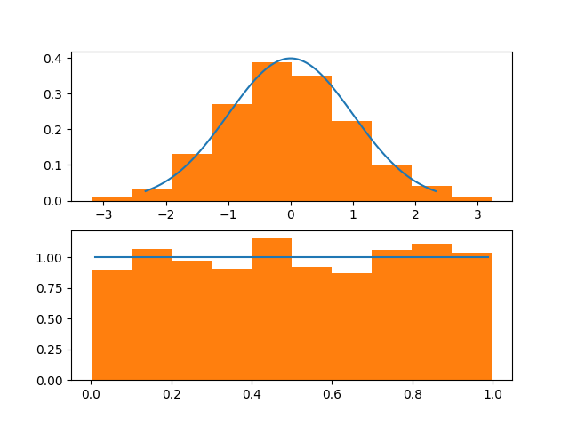
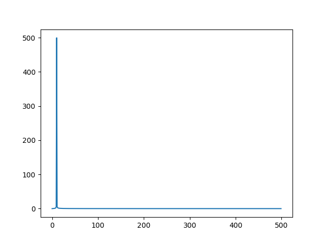
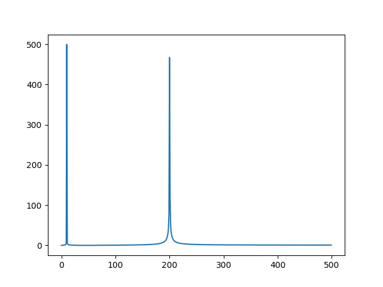
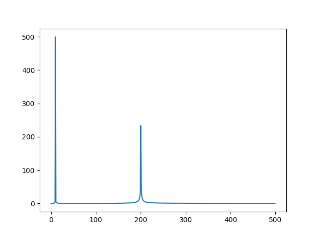

# L'ecosistema SciPy

Finora abbiamo parlato prevalentemente di NumPy e (soltanto in piccola parte) di Matplotlib. Tuttavia, entrambe queste librerie fanno parte di un ecosistema più ampio per il calcolo scientifico, comprendente anche le librerie *SciPy*, *iPython*, *Pandas* e *SimPy*. Questo ecosistema è, per l'appunto, chiamato come una delle librerie che lo compongono, che è anche quella di cui tratteremo (giocoforza limitatamente) in questa lezione, ovvero *SciPy*.

## La *libreria* SciPy

La libreria SciPy rappresenta un insieme di algoritmi e funzioni matematiche costruite a partire da NumPy. Tuttavia, come è possibile vedere dalla [reference](https://docs.scipy.org/doc/scipy/reference/), il numero e la varietà delle funzioni offerte è notevolmente maggiore rispetto a NumPy.

Per iniziare, quindi, procediamo installandola nel nostro ambiente di sviluppo.

==="Pip" 
	```sh
	pip install scipy
	```
==="Pipenv"
	```sh
	pipenv install scipy
	```

Nel prosieguo, presupporremo che siano stati già importati NumPy e Matplotlib.

```py
import numpy as np
import matplotlib as mpl
import matplotlib.pyplot as plt
```

## Esempio 1: Distribuzione di probabilità

Vediamo come comparare visivamente il valore teorico assunto da due distribuzioni di probabilità "standard" (ovvero la uniforme e la normale) e l'istogramma ottenuto a partire da un elevato numero di elementi generati casualmente ma appartenenti a quella distribuzione.

Useremo questo codice:

```py linenums="1"
from scipy.stats import norm, uniform

x_1 = np.linspace(norm.ppf(0.01), norm.ppf(0.99), 100)
x_2 = np.linspace(uniform.ppf(0.01), uniform.ppf(0.99), 100)

r_1 = norm.rvs(size=1000)
r_2 = uniform.rvs(size=1000)

fig, (ax_1, ax_2) = plt.subplots(2, 1)

ax_1.plot(x_1, norm.pdf(x_1))
ax_1.hist(r_1, density=True)

ax_2.plot(x_2, uniform.pdf(x_2))
ax_2.hist(r_2, density=True)

plt.show()
```

In primis, importiamo i moduli `norm` ed `uniform` del package `scipy.stats`, che contengono tutto quello di cui abbiamo bisogno per la modellazione delle distribuzioni normali (`norm`) ed uniformi (`uniform`).

Successivamente, usiamo la funzione `linspace` di NumPy, il cui funzionamento è molto simile a `range` ed `arange`, ma che restituisce risultati consistenti anche nel caso di uso di step non interi (il che non è sempre garantito con `arange`). In particolare, genereremo 100 campioni equidistanziati e compresi tra l'1 ed il 99 percentile delle funzioni; per individuare questi valori, usiamo la funzione `ppf(p)`:

```py
x_1 = np.linspace(norm.ppf(0.01), norm.ppf(0.99), 100)
x_2 = np.linspace(uniform.ppf(0.01), uniform.ppf(0.99), 100)
```

!!!note "Nota"
	Intuitivamente, individuare 100 valori compresi tra l'1 ed il 99 percentile significa in pratica modellare la maggior parte dell'intervallo dei valori assunti "normalmente" dalla funzione.

A questo punto, calcoliamo 1000 valori generati casualmente seguendo entrambe le distribuzioni mediante la funzione `rvs()`:

```py
r_1 = norm.rvs(size=1000)
r_2 = uniform.rvs(size=1000)
```

Per terminare, generemo due subplot, uno relativo alla funzione densità di probabilità normale, ed uno relativo alla funzione densità di probabilità uniforme. Nei subplot, compareremo i valori equispaziati generati in precedenza (`x_1` ed `x_2`) con l'istogramma dei 1000 valori generati casualmente (`r_1` ed `r_2`); ovviamente, ricordiamo di inserire il valore `density=True` per normalizzare l'istogramma.

Il risultato dovrebbe essere simile a quello mostrato in figura:

{: .center}

## Esempio 2: calcolo del determinante e dell'inversa

Un altro esempio delle potenzialità offerte da SciPy sta nel calcolo algebrico, che offre molte più funzioni rispetto a quelle presenti in NumPy, specialmente per quello che riguarda la fattorizzazione di matrici.

Per fare un rapido esempio, vediamo come è possibile calcolare il determinante e l'inversa di una matrice.

```py
from scipy import linalg

# ... matrice mat creata sotto forma di array NumPy

# Determinante
d = linalg.det(mat)
# Inversa
i = linalg.inv(mat)
```

!!!note "Nota"
	E' molto semplice otare come la sintassi richiami quella di NumPy e, in realtà, anche il funzionamento sia il medesimo, per cui è possibile usare indifferentemente entrambe le librerie. Dove SciPy "spicca" è in tutte quelle funzioni che non sono presenti in NumPy.

## Esempio 3: Trasformata di Fourier

SciPy non è limitato al calcolo algebrico e matriciale, e può essere usato, come dicevamo, in molti altri ambiti, come ad esempio il signal processing. Ad esempio, possiamo sfruttarlo per calcolare la trasformata di Fourier di un segnale sinusoidale:

```py
from scipy.fft import fft

x = np.linspace(0., 10, 1000)
y = np.sin(2.0 * np.pi * x)
yf = fft(y)

fig, ax = plt.subplots()

ax.plot(np.abs(yf[0:500]))
plt.show()
```

Nell'esempio precedente, generiamo 1000 campioni equidistanziati tra 0 e 10, e quindi creiamo il vettore `y` la cui formula sarà associata a $f(x) = 2\pi x$. A quel punto, calcoliamo la trasformata di Fourier di `y`, e ne visualizziamo a schermo il modulo.

{: .center}

!!!warning "Attenzione"
	Ricordiamo che la trasformata di Fourier è simmetrica. Per questo, visualizzeremo soltanto la prima metà dei valori estratti per il modulo.

Possiamo estendere il precedente esperimento vedendo cosa accade per una somma di seni:

```py
y_tr = np.sin(2.0 * np.pi * x) + np.sin(20 * 2.0 * np.pi * x)
y_trf = fft(y_tr)
ax.plot(np.abs(y_trf[0:500]))
```

Come si deve dalla figura, avremo come risultato due impulsi:

{: .center}

In ultimo, possiamo valutare anche cosa accade riducendo l'ampiezza di una delle due sinusoidi:

```py
y_tr = np.sin(2.0 * np.pi * x) + 0.5 * np.sin(20 * 2.0 * np.pi * x)
y_trf = fft(y_tr)
ax.plot(np.abs(y_trf[0:500]))
```

{: .center}

## Conclusioni

In questa lezione, abbiamo dato una breve panoramica sulle possibilità offerte da SciPy. Nelle prossime, vedremo come funzionano altre due librerie, ovvero *iPython* e *Pandas*.
