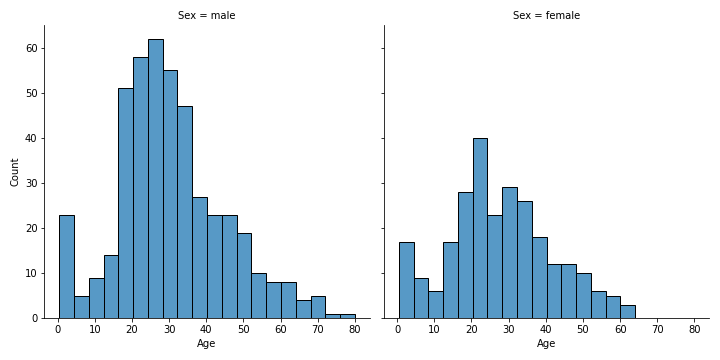

# E10 - Visualizzazione dei dati in Seaborn

## Esercizio E10.1

Visualizzare la distribuzione dell'età dei diversi passeggeri del Titanic in base al loro genere.

Visualizzare inoltre il rapporto tra età e numero di fratelli/sorelle/coniugi in base al genere del passeggero.

### Soluzione S10.1

Per prima cosa, leggiamo il dataframe:

```py
df = pd.read_csv('titanic.csv')
```

Per visualizzare la distribuzione dell'età dei diversi passeggeri del Titanic in base al loro genere usiamo un `displot()`:

```py
sns.displot(
    data=df,
    x='Age',
    col='Sex')
```

{: .center}

Per visualizzare inoltre il rapporto tra età e numero di fratelli/sorelle/coniugi in base al genere del passeggero usiamo un `catplot()`:

```py
sns.catplot(
    data=df,
    kind='violin',
    x='SibSp',
    y='Age',
    hue='Sex',
    split=True)
```

{: .center}
