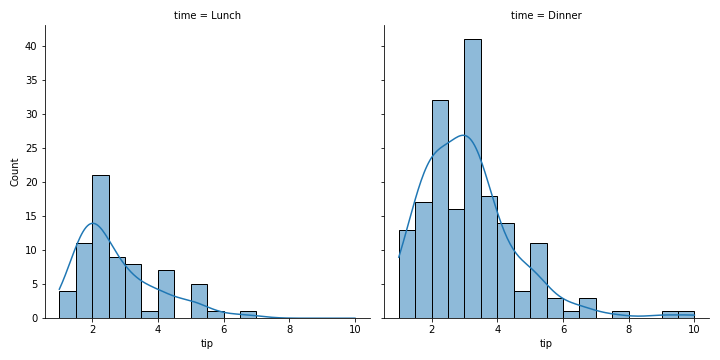
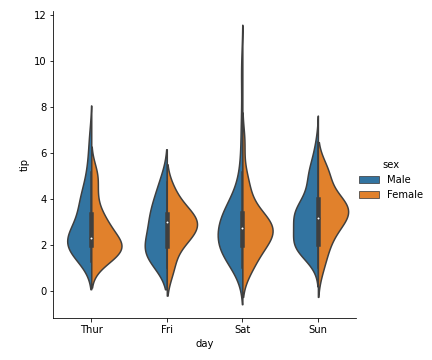

# 10 - Visualizzazione di dati in Seaborn

*Seaborn* è una libreria che estende [Matplotlib](../08_matplotlib/lecture.md) aggiungendone diverse funzionalità, tutte nell'ottica della data analysis, e sulla scia di quello che abbiamo presentato in Pandas nella lezione precedente. Ciò permette quindi di mantenere un'interfaccia molto simile a quella di Matplotlib, estendendone al contempo le possibilità. Vediamo qualche esempio.

## 10.1 - Installazione della libreria

Come in ogni altro caso, partiamo dall'installazione della libreria:

```sh
pip install seaborn
```

Una volta installata, potremo importarla utilizzando un alias:

```py
import seaborn as sns
```

## 10.1 - Lettura dei dati

Abbiamo detto che Seaborn è utile specialmente nel momento in cui si vogliono valutare visiamente le relazioni che intercorrono tra diverse feature presenti all'interno di un dataset.

In tal senso, proviamo innanzitutto a caricare un insieme di dati, affidandoci al metodo `load_dataset()`, che estrae uno dei dataset già presenti nella libreria. Ad esempio:

```py
tips = load_dataset('tips')
```

!!!note "I dataset"
    L'elenco dei dataset supportati da Seaborn è presente a [questo indirizzo](https://github.com/mwaskom/seaborn-data).

Ispezionando il tipo di `tips` possiamo scoprire che si tratta di un dataframe; di conseguenza, possiamo esplorarne liberamente la struttura utilizzando Pandas. In particolare, vediamo che questi sono organizzati secondo la seguente tabella:

```py
>>> tips.head()
  total_bill   tip     sex smoker  day    time  size
0       16.99  1.01  Female     No  Sun  Dinner     2
1       10.34  1.66    Male     No  Sun  Dinner     3
2       21.01  3.50    Male     No  Sun  Dinner     3
3       23.68  3.31    Male     No  Sun  Dinner     2
4       24.59  3.61  Female     No  Sun  Dinner     4
```

La struttura della tabella è la seguente:

* ogni riga è associata ad una specifica ordinazione;
* le colonne sono associate rispettivamente a conto (`total_bill`), mancia (`tip`), genere (`sex`), fumatore (smoker), giorno (`day`), orario (`time`) e numero di attendenti (`size`).

### 10.1.1 - Visualizzare le relazioni tra dati

Seaborn ci offre la funzione `relplot()` che ci permette di analizzare velocemente diversi aspetti inclusi del dataset. Ad esempio, potremmo vedere come cambiano contro e mancia al variare della giornata:

```py
sns.relplot(
    data=tips,
    x='total_bill',
    y='tip',
    col='day'
)
```

Notiamo che abbiamo passato al parametro `data` il valore `tips`, indicando quindi la sorgente dei dati. Metteremo poi sull'asse delle ascisse il conto totale, mentre su quello delle ascisse la mancia ricevuta. In ultimo, il parametro `col` ci permette di generare tanti grafici quanti sono i diversi valori presenti nella tabella `day`, ognuno dei quali rappresenterà ovviamente l'andamento dei conti e delle mance per quello specifico giorno.

{: .center}

Un altro esperimento è quello che vede valutare la differenza tra conto e mance pagati da uomini e donne. In questo caso, inoltre, andiamo ad aumentare la dimensione del punto in maniera direttamente proporzionale alla mancia percepita.

```py
sns.relplot(
    data=tips,
    x='total_bill',
    y='tip',
    col='sex',
    size='tip')
```

{: .center}

Una funzione simile alla `relplot()` è la `lmplot()`, che permette anche di mostrare un'approssimazione ai minimi quadrati dei dati. Ad esempio:

```py
sns.lmplot(
    data=tips,
    x='total_bill',
    y='tip',
    col='time',
    hue='day')
```

{: .center}

## 10.2 - Analisi della distribuzione dati

Possiamo anche effettuare un'analisi della distribuzione delle variabili all'interno del nostro dataset. In tal senso, la funzione `displot()` ci permette di vedere come si vanno a distribuire i dati in base a determinate condizioni mediante l'uso di un istogramma.

Ad esempio, potremmo visualizzare la distribuzione dei clienti in base al loro genere ed al momento della giornata in cui effettuano la consumazione:

```py
sns.displot(
    data=tips,
    x='sex',
    col='time',
    kde=True)
```


Specificando il parametro `kde`, è possibile ottenere un'approssimazione della distribuzione mediante kernel density estimation, come mostrato nella figura seguente.



## 10.3 - Plot di dati categorici

Seaborn offre anche dei plot specializzati per la creazione e visualizzazione di dati (o feature) di tipo *categorico*, ovvero dati appartenenti ad una tra diverse possibili categorie. In tal senso, un esempio di feature categorica è il genere dei clienti del ristorante, che nel dataset sono soltanto uomini o donne.

I plot di questo tipo possono essere generati mediante la funzione [`catplot()`](https://seaborn.pydata.org/generated/seaborn.catplot.html), delegata alla definizione di plot a diversi livelli di granularità, come ad esempio i *violin plot*.

```py
sns.catplot(
    data=tips,
    kind='violin',
    x='day',
    y='tip',
    hue='sex',
    split=True)
```



In particolare, il grafico mostrato in figura descrive la distribuzione delle mance giorno per giorno al variare del genere del cliente.

!!!tip "Catplot con dati non categorici"
    In realtà, è possibile usare la `catplot()` con dati non categorici, come numeri interi. Tuttavia, vi è il rischio (o meglio, la *certezza*) che il risultato sia *non interpretabile*, in quanto la funzione assegnerà una categoria ad ogni possibile valore assunto dalla feature di riferimento, il che ovviamente comporterà l'illeggibilità del grafico nel caso di valori reali.

## 10.4 - Heatmap

Un'ultima funzione che vale la pena menzionare è quella che ci permette di visualizzare le *heatmap*, ovvero delle strutture grafiche che ci permettono di visualizzare rapidamente gli intervalli in cui ricadono i valori di diversi tipi di matrici. Questa funzione è, per l'appunto, chiamata [`heatmap()`](https://seaborn.pydata.org/generated/seaborn.heatmap.html), e richiede in ingresso almeno il parametro relativo alla matrice da cui sarà estratta la figura. Ad esempio:

```py
ar = np.array([[5, 12], [4, 3]])
sns.heatmap(
    ar,
    cmap='jet',
    annot=True,
    xticklabels=False,
    yticklabels=False)
```

Nella precedente invocazione della funzione `heatmap()` specifichiamo i parametri indicati in modo da passare un array (o similari) come primo argomento, seguito da una *colormap*, ovvero i colori da utilizzare. Specifichiamo inoltre che vogliamo inserire i valori dell'array su ciascuna delle celle dell'heatmap (mediante il parametro `annot`) e che non vogliamo visualizzare i label sugli assi $x$ e $y$ (`xticklabels` ed `yticklabels` rispettivamente). Otterremo questo risultato:

{: .center}
