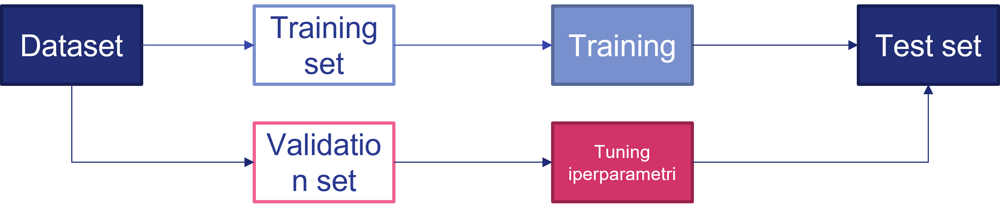

# 3.1.6 - Iperparametri

Molti algoritmi di machine learning hanno degli **iperparametri**, ovvero delle "impostazioni" che possiamo utilizzare per controllare il comportamento del modello. A differenza dei parametri, gli iperparametri non sono *automaticamente* adattati durante l'addestramento.

!!!tip "Apprendimento degli iperparametri"
    Vedremo come esistono algoritmi che permettono di definire la miglior combinazione possibile per gli iperparametri di un modello dato un certo dataset.

Alle volte, un iperparametro è definito come tale perché è difficile da ottimizzare; tuttavia, capita più spesso che detti valori non devono essere appresi soltanto sul training set, ma devono avere valenza generale, allo scopo di evitare underfitting ed overfitting. Ciò ci riconduce al concetto di *generalizzazione* visto nella [lezione precedente](05_generalization.md).

Abbiamo visto come la stima dell'errore di generalizzazione una volta completato l'addestramento avvenga su un test set: in tal senso, è importante che i campioni del test set non siano in alcun modo usati per condizionare l'addestramento del modello. Di conseguenza, andremo a selezionare un **set di validazione** a partire dal training set: questo sarà usato per stimare l'errore di generalizzazione durante o immediatamente dopo l'addestramento, permettendo l'addestramento degli iperparametri. Normalmente, il dataset iniziale viene suddiviso in percentuali pari all'$80\%$ per i dati di training ed il $20\%$ per i dati di validazione.

!!!note "Errore sul set di validazione"
    Dato che il set di validazione è preso dal set di training, l'errore di generalizzazione calcolato su di esso sarà inferiore rispetto a quello calcolato sul set di test.

<figure markdown>
  
  <figcaption>Figura 1 - Un esempio del processo di training con minimizzazione di errore di training e test, oltre che ottimizzazione degli iperparametri sult est di validazione.</figcaption>
</figure>
