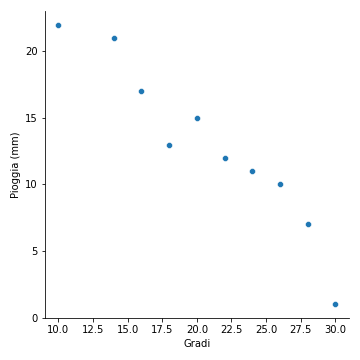
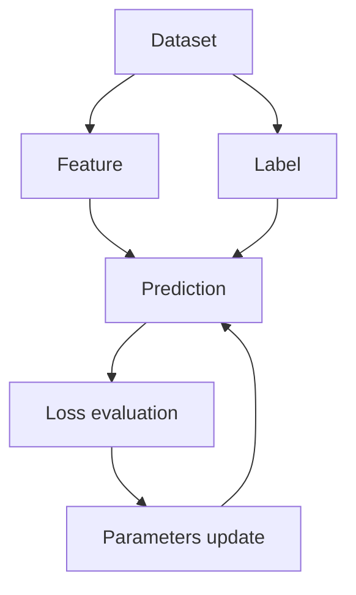

# 3.2 - La regressione lineare

Nelle [lezioni precedenti](../01_intro/01_intro.md) abbiamo visto come esistano fondamentalmente due tipi di tecniche di apprendimento supervisionato, ovvero *regressione* e *classificazione*. In questa lezione, approfondiremo il caso più semplice di regressione, ovvero quello lineare.

## Cosa è la regressione?

Non occorre essere esperti di meteorologia per sapere che i millimetri di pioggia caduti durante una precipitazione sono correlata a fattori quali temperatura, venti, umidità, posizione geografica, ed altri ancora. Immaginiamo quindi di avere un insieme di dati che, al loro interno, descrivano la condizione meteorologica ad un dato istante di tempo (supponiamo, per semplicità, giornaliero), oltre che i millimetri di pioggia caduti nello stesso periodo. Supponiamo di effettuare un'analisi esplorativa dei dati, i cui risultati sono (parzialmente) riportati in figura 1.

<figure markdown>
  
  <figcaption>Figura 1 - Relazione tra millimetri di pioggia (sulle ordinate) e temperatura in gradi (sulle ascisse).</figcaption>
</figure>

La nostra analisi esplorativa ci porta subito ad intuire l'esistenza di una relazione tra la quantità di pioggia caduta e la temperatura: in particolare, a valor di temperatura più elevati corrisponde una minore quantità di pioggia, e viceversa.

Proviamo adesso a tracciare la retta ai minimi quadrati, ovvero quella che minimizza la somma quadratica dello scarto tra il valore $(\hat{x}_i, \hat{y}_i)$ da essa "attraversato" ed il valore $(x_i, y_i)$ "vero" associato ai dati, per ciascun punto $i$ nell'insieme considerato. Il risultato è mostrato in figura 2.

<figure markdown>
  
  <figcaption>Figura 2 - Retta ai minimi quadrati relativa al rapporto tra precipitazioni e gradi.</figcaption>
</figure>

## Rappresentazione analitica del modello

Come già detto, notiamo come i millimetri di pioggia attesi diminuiscano all'aumentare della temperatura, secondo una relazione (più o meno) lineare, riconducibile ad una forma del tipo:

$$
y = mx + b
$$

dove:

* $y$ sono i millimetri di pioggia medi caduti nell'arco di tutte le giornate con un dato valore medio di temperatura;
* $x$ è il valore medio di temperatura;
* $m$ è il coefficiente angolare della retta di regressione;
* $b$ è l'incercetta della retta di regressione.

!!!note "Nota"
    Ovviamente, la retta di regressione *non* tocca tutti i punti, ma approssima l'andamento di $x$ in funzione di $y$.

Possiamo riscrivere l'equazione precedente come segue:

$$
\hat{y} = b + w_1 x_1
$$

dove:

* $\hat{y}$ è l'output predetto dal modello, detto anche *variabile dipendente*;
* $b$ è il *bias*, equivalente al concetto analitico di intercetta;
* $w_1$ è il peso della prima feature, equivalente al concetto analitico di coefficiente angolare;
* $x_1$ è il valore di ingresso assunto dalla prima ed unica feature considerata, detta anche *variabile indipendente*.

Per *inferire* un nuovo valore di $\hat{y}$ ci basterà quindi cambiare il valore assunto da $x_1$. In pratica, proprio come accade per una retta, se poniamo $x_1 = 8$ (ovvero assumendo un valore di temperatura di 8 gradi), avremo un corrispondente valore per le precipitazioni pari ad $\hat{y} = 25$ mm, mentre se $x_1 = 32$ il valore predetto per i millimetri di pioggia sarà $\hat{y}=0$.

!!!tip "Regressione multivariata"
    In questo caso, abbiamo presupposto che vi sia un'unica variabile indipendente a determinare il valore di un'unica variabile dipendente. Esistono ovviamente casi più complessi, con diverse variabili dipendenti il cui valore è determinato da più feature secondo formule del tipo $b + w_1 x_1 + \ldots + w_n x_n$.

## Addestramento e funzione di costo

Addestrare un modello significa determinarne i valori ottimali per pesi e bias a partire dai dati che, nel caso della regressione, sono etichettati. Per far questo, i modelli ad apprendimento supervisionato esaminano iterativamente tutti i campioni presenti nel set di addestramento alla ricerca di un modo per minimizzare un *costo* (o, in inglese, *loss*) direttamente proporzionale alla differenza intercorrente tra la predizione del modello ed il valore vero. In altri termini, *la loss è una misura dell'errore delle predizioni effettuate dal modello*.

##### Interpretazione grafica della funzione di costo

Nel caso ideale, la loss sarebbe pari a $0$. Ovviamente, nel caso reale, la loss è sempre maggiore di questo valore, e sarà tanto maggiore quanto più il valore predetto divergerà da quello atteso. Proviamo ad interpretare al meglio questo concetto aiutandoci con la figura 3.

<figure markdown>
  
  <figcaption>Figura 3 - Interpretazione della funzione di costo</figcaption>
</figure>

In particolare, le frecce schematizzano l'entità della differenza intercorrente tra il valore vero $y$ ed il valore predetto $\hat{y}$. Come evidente, la loss complessiva è maggiore nella situazione a sinistra; ciò significa che l'addestramento dovrà necessariamente prediligere una retta di regressione come quella mostrata a destra.

##### Calcolo della funzione di costo

Per calcolare la loss complessiva del modello a partire da un dato insieme di campioni dobbiamo utilizzare una *funzione di costo*, o *loss function*. Ne esistono molteplici esempi, alcuni dei quali saranno approfonditi nel prosieguo. Tuttavia, uno dei più semplici è dato dall'*errore quadratico medio*, o *mean squared error* (*MSE*), rappresentabile secondo la seguente formula:

$$
MSE = \frac{1}{N} \sum_{(x, y) \in D} (y - \hat{y})^2
$$

In particolare:

* $(x, y)$ rappresenta l'insieme di feature $x$ con la corrispondente label $y$;
* $\hat{y}$ è il valore predetto della label a partire dall'applicazione del modello;
* $D$ è il nostro dataset etichettato;
* $N$ è il numero di campioni prensenti in $D$.

In pratica, l'MSE è dato dalla media delle differenze tra il valore predetto dal modello e quello vero calcolata sull'intero dataset. Come prevedibile, l'errore sarà tanto più alto quanto maggiore è la distanza complessiva tra le label e le predizioni; nell'esempio visto in figura 3, appare chiaro come l'MSE sia maggiore per la prima approssimazione rispetto alla seconda.

!!!tip "Perché quadratico?"
    I più attenti avranno notato che stiamo utilizzando il *quadrato* dell'errore. Se non lo facessimo, gli errori "positivi" annullerebbero i "negativi", il che ovviamente non è il nostro obiettivo, in quanto ci interessa soltanto il *modulo* dello scarto quadratico.

## Addestramento iterativo

Gli algoritmi di machine learning sono normalmente addestrati seguendo un approccio iterativo che prevede, al termine di ogni singola iterazione, l'*aggiornamento* del valore dei pesi, allo scopo di ridurre il costo complessivo associato alle predizioni dell'algoritmo. Possiamo riassumere questo comportamento mediante il seguente schema:

Nella pratica, alla prima iterazione, il modello stabilisce in maniera casuale i valori dei parametri da utilizzare per la predizione; nel caso della regressione lineare, abbiamo visto come questi siano $w_1$ e $b$. A questo punto, viene calcolato il valore predetto $\hat{y}$

Nella pratica, ad ogni iterazione, il modello effettua una predizione a partire dai campioni a disposizione. Il risultato viene comparato con la label, ed il costo complessivo calcolato secondo la funzione scelta. I pesi sono quindi aggiornati seguendo una certa regola di ottimizzazione, ed il ciclo si ripete.

!!!note "Quante iterazioni?"
    Le iterazioni non sono *infinite*: normalmente, si imposta un numero preciso di *epoche di training*, oppure si aspetta che l'algoritmo arrivi ad una sorta di "convergenza", nella quale il valore della loss non decresce ulteriormente.

!!!note "Quanti dati?"
    Come vedremo anche nel seguito, il calcolo della loss non avviene considerando il dataset nella sua interezza, ma soltanto dei sottoinsiemi di dati per ogni iterazione.

## Ottimizzazione della funzione di costo

Come già accennato, l'aggiornamento dei pesi segue una ben precisa regola di ottimizzazione, volta a minimizzare il valore complessivo assunto dal costo. In altre parole, durante l'addestramento, l'algoritmo cerca di trovare quella combinazione di pesi per la quale il costo legato all'approssimazione dei valori predetti ai valori veri è minimo.

Esistono diversi tipi di algoritmi di ottimizzazione, ma la maggior parte si rifà al concetto di *discesa del gradiente*, schematizzto in figura 4.

<figure markdown>
  
  <figcaption>Figura 4 - La discesa di gradiente</figcaption>
</figure>

In questa sede, daremo un'interpretazione puramente qualitativa dei concetti alla base dell'algoritmo, che andremo poi ad approfondire in un'altra lezione. Per farlo, osserviamo brevemente cosa accade in figura 4, guardando da sinistra verso destra.

Per prima cosa, dobbiamo immaginare che la funzione che modella la nostra loss sia una sorta di paraboloide, dotato di un valore minimo (sull'asse delle ordinate) che viene raggiunto in corrispondenza di una determinata combinazione dei pesi (mostrata sull'asse delle ascisse). Nel nostro esempio, presupponiamo un unico peso; tuttavia, nei casi reali, il numero dei pesi è molto più elevato, per cui lo spazio considerato sarà $n$ dimensionale, con $n$ numero dei pesi da ottimizzare.

L'immagine più a sinistra rappresenta la situazione iniziale: abbiamo dei pesi nel ramo sinistro del paraboloide e, conseguentemente, l'obiettivo sarà quello di spostarci verso il minimo globale assunto dalla funzione (ovvero, verso destra). Per farlo, possiamo utilizzare la *derivata* o, nel caso di funzioni $n$-dimensionali, il *gradiente* della funzione di costo, aggiornando i pesi in maniera che questo assuma, all'iterazione successiva, un valore inferiore. Questo ci porta alla figura centrale, in cui notiamo che il gradiente si muove dal punto rosso a quello blu; a seguito di questo spostamento, dovremo ancora *aumentare* il valore dei pesi, allo scopo di far diminuire la loss, portandoci quindi nella situazione raffigurata nella figura a destra.

In quest'ultima situazione, vedremo che il segno del gradiente sarà diventato positivo, in quanto ci troveremo nella parte ascendente del paraboloide. Di conseguenza, la convergenza dell'algoritmo si otterrà *diminuendo* il valore assunto dai pesi.

!!!note "Learning rate"
    Il "quantitativo" di cui sono aggiornati i pesi è spesso denotato come *learning rate*. Un learning rate troppo basso porta ad una convergenza molto lenta dell'algoritmo, che potrebbe "esaurire" le iterazioni prima di arrivare al minimo della funzione di costo. Un learning rate eccessivamente altro potrebbe invece fare in modo che l'algoritmo "salti" da una parte all'altra del minimo, non arrivando neanche in questo caso a convergenza.

!!!note "Minimi locali"
    Il nostro banale esempio presuppone che la funzione di costo non abbia alcun minimo locale. Ciò non è ovviamente vero, e delle scelte sbagliate in termini di punto di partenza o learning rate potrebbero farci finire all'interno di un minimo locale, impedendoci di arrivare a convergenza.

## Overfitting e regolarizzazione

Alle volte, accade che il nostro modello sia in grado di arrivare ad una loss estremamente bassa sui dati di training, ma che tuttavia inizia ad aumentare sui dati di validazione, un po' come mostrato in figura 5:

<figure markdown>
  
  <figcaption>Figura 5 - Andamento della funzione di costo in training e validazione</figcaption>
</figure>

Ciò può accadere per diversi motivi, come errori nei parametri di addestramento o dati non ben bilanciati. Ad ogni modo, questo fenomeno prende il nome di *overfitting*, e comporta che il modello, che si comporta molto bene sui dati di training, non riesca a *generalizzare*, comportandosi in maniera meno egregia su quelli di validazione. L'overfitting si manifesta all'aumentare delle epoche di training, quando il nostro modello diventa sempre più "complesso", ed apprende sempre meglio a caratterizzare relazioni di complessità crescente intercorrenti tra feature e label.

Per arginare il fenomeno dell'overfitting, oltre ad agire sui dati e sui parametri del modello, si inserisce spesso un termine di *regolarizzazione*, che tende a penalizzare un modello in grado di caratterizzare relazioni eccessivamente complesse. Il termine di regolarizzazione interviene direttamente sul valore trattato dall'ottimizzatore, che non avrà più come unico obiettivo quello di minimizzare la loss, ma quello di *minimizzare congiuntamente la loss e la complessità del modello ottenuto*.

Una funzione di regolarizzazione molto usata è la *regolarizzazione $L_2$*, definita come la somma dei quadrati dei pesi associati alle feature:

$$
L_2 = ||w||_2^2 = w_1^2 + w_2^2 + \ldots + w_n^2
$$

Minimizzare questo termine significa dare meno "importanza" ad alcuni pesi che inficiano la complessità totale del modello. Se, ad esempio, avessimo i seguenti pesi:

$$
\begin{aligned}
& w_1 = 0.1 \\
& w_2 = 0.025 \\
& w_3 = 0.4 \\
& w_4 = 10
\end{aligned}
$$

il termine di regolarizzazione $L_2$ diverrebbe pari a:

$$
L_2 = 0.01 + 0,000625 + 0.16 + 100 \sim 100.17
$$

E' evidente come la maggior parte del contributo sia data dal quarto peso, per cui risulta essere necessario diminuirne l'influenza nel modello allo scopo di bilanciare l'overfitting.
