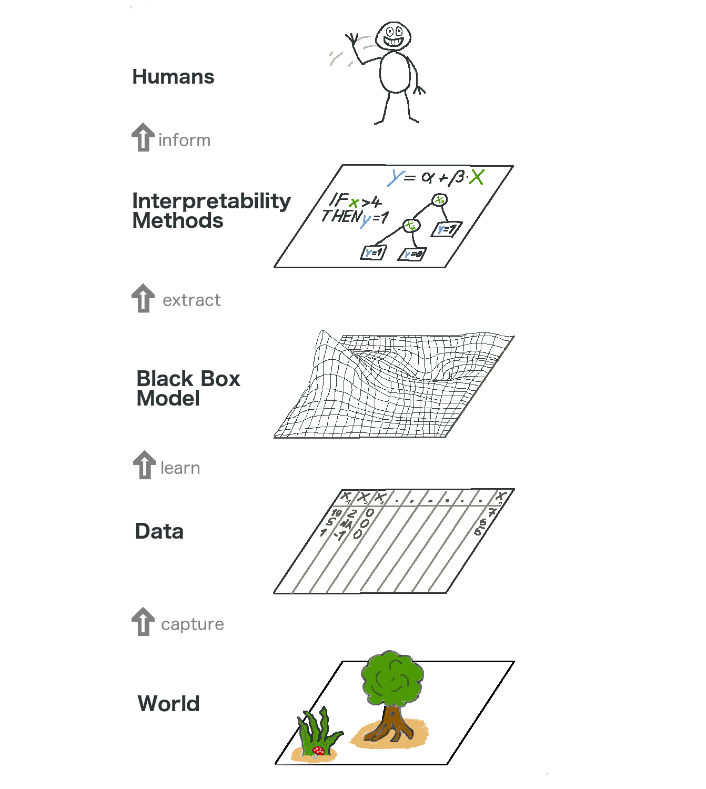

Separare le spiegazioni dal modello di machine learning (ovvero *model-agnostic interpretation methods*) ha diversi vantaggi. Il più grande vantaggio di queto metodo rispetto a quelo per modelli speicific sta nela loro flessibilità Gli sviluppatori sono liberi di usare ogni modello di machine learning che vogliono quando il metodo di interpretazione può essere applicato ad un qualsiasi modelo. Ogni cosa che si basa su un'interpretazione di un modello di machine learning, come un'interfaccia utente o una grafica, diventa anche indipendente dal modello di machine learnign sottostante. Tipicamente, non solo uno, ma molti tipi di modelli di machine learning vengono valutati per risolvere un task, e quando si comparano in termini di interpertabilità, è più facile lavorare con spiegazioni indiepndnti dal modello, perché lo stesso metodo può essere usato per un qualsiasit ipo di modello.

Un'alternativa ai metodi di itnerpretazione agnostici è quello di usare soltanto modelli intepretabili, che spesso hanno in grosso svnataggio che le performance predittive sono perse se comparate ad altri modelli di machine learning, e che inoltre ci si limita soltnato ad un tipo di modello. L'altra alternativa è usare dei meotdi di interpretazione model-specific. Lo svnataggio di questo è che ci vincola ad un tipo di modello e sarà difficile passare a qualcos'altro.

Aspetti desiderabili di un sistema di spiegazioni agnostico sono:

* flessiblità del modello: il metodo di interpretazione può lavorare con un qualsisasi modello di machine learning, come le random forest e le deep neural networks
* flessibilità di spiegazione: non siamo limmitati a certe forme di spiegazioni. in alcuni casi potrebbe essere utile avere una formulalineare, in altri casi una grafica con le feature importance.
* flessibilità di rappresentazione: il sistema di spiegazione dovrebbe essere in grado di usare una diversa rappresentazione sotto forma di feature man mano che il modello viene spiegato. per un classificatore testuale che usa ad esempio degli abstract word embedding vectors, potrebbe esere preferibile usare la presenza di singole parole per le spiegazioni.

## the bigger picture

veiamo com avviene l'interpretabilità model-agnostica. catturiamo il mondo collezionando dati, e lo astraiamo imparando a predire i dati (per il task) mediante un mdoello di machine learning. L'interpretabilità è soltanto un altro layer che ci permette di capire meglio.

