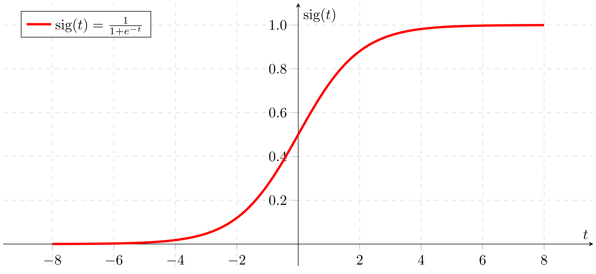

# 3.3 - La regressione logistica

Nella [lezione precedente](../02_lin_reg/lecture.md) abbiamo introdotto l'algoritmo di *regressione lineare*, il cui comito è quello di "tracciare" la relazione intercorrente tra una serie di variabili indipendenti (le feature) ed una variabile dipendente che, come abbiamo visto, è continua e di tipo numerico. La *regressione logistica*, invece, ed a discapito del nome, è il più semplice dei classificatori, e viene usata quando abbiamo a che fare con variabili di tipo categorico.

A scopo di esempio, supponiamo di creare un modello che predica la probabilità che una mail ricevuta da un mittente a noi sconosciuto rappresenti uno spam. Indicheremo questa probabilità come $p(mail|unknown)$.

In pratica, se il modello afferma che $p(mail|unknown) = 0.05$, allora, in media, su $100$ mail ricevute da indirizzi sconosciuti, $5$ saranno di spam:

$$
\begin{align}
spam &= p(mail|unknown) \cdot mail_{rec} \\
&= 0.05 * 100 \\
&= 5
\end{align}
$$

Questo è un esempio di utilizzo della probabilità *as is*. In molti casi, tuttavia, mapperemo l'output della soluzione su un problema di classificazione binario, nel quale l'obiettivo è predire correttamente uno di due possibili label (in questo caso, *spam* o *non spam*).

## La funzione sigmoidale

Ci si potrebbe chiedere come un modello per la regressione logistica sia in grado di asicurarsi che l'uscita ricada sempre nell'intervallo tra $0$ ed $1$. In tal senso, questo è assicurato dall'uso della *funzione sigmoidale*, definita come segue:

$$
y = \frac{1}{1+e^{-z}}
$$

la cui formulazione grafica è la seguente:

<figure markdown>
  
  <figcaption>Figura 1 - Interprete Python</figcaption>
</figure>

Nell'espressione precedente, notiamo che:

* $y$ è l'uscita della regressione logistica;
* $z$ è pari, per un generico modello lineare, a $b + w_1 x_1 + \ldots + w_N z_N$.

## Funzione di costo

La funzione di costo per la funzione logistica è chiamata *log loss*, ed è espressa come:

$$
LogLoss = \sum_{(x, y) \in D} -y log(y') - (1 - y) log (1 - y')
$$

dove:

* $(x, y)$ sono le coppie date da feature e label nel dataset $D$;
* $y$ è la label vera per un dato insieme di feature;
* $y'$ è il valore predetto.

## Soglia di decisione

La regressione logistica restituisce quindi una *probabilità*, la quale dovrà essere in qualche modo "convertita" in un valore relativo ad una classe.

Tornando al nostro esempio, un modello che restituisce una probabilità $p$ pari a $0.999$ ci dice che, molto probabilmente, il messaggio elaborato è di spam. Di converso, nel caso il modello restituisca una probabilità $p$ pari a $0.003$, allora è molto probabile che il messaggio non sia spam. Cosa accade, però, quando $p$ è pari a $0.495$?

Essendo il nostro modello deterministico, è necessario passare da un valore puramente numerico (ovvero, la probabilità) ad una classe che, nel caso specifico, può essere positiva (messaggio di spam, con $p$ genericamente "alto") o negativa (messaggio non di spam, con $p$ genericamente "basso"). Di conseguenza, dovremo definire una *soglia* decisionale, in base alla quale decideremo che i messaggi con probabilità sopra-soglia sono spam, mentre quelli con probabilità sotto-soglia sono legittimi. Di default, questo valore viene impostato a $\rho=0.5$; tuttavia, potrebbe essere necessario ridefinirlo sulla base dello specifico problema sotto esame. Ne parleremo più approfonditamente nella [lezione dedicata alle metriche](../06_metrics/01_classification.md).

