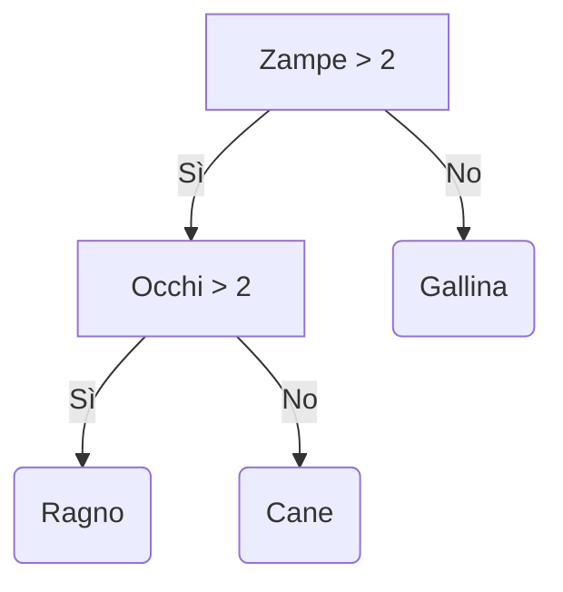
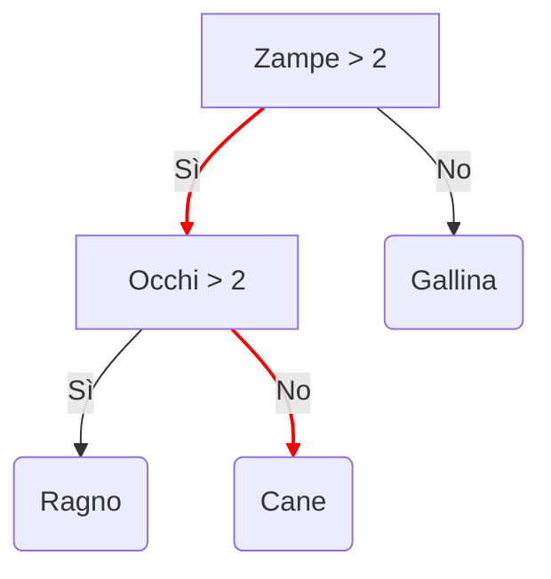
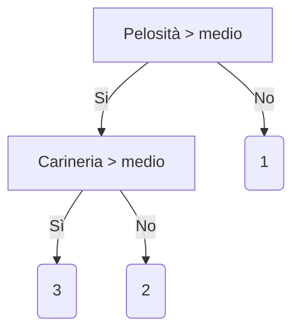
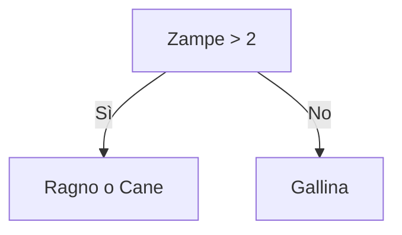
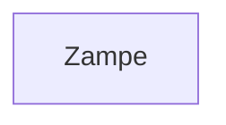
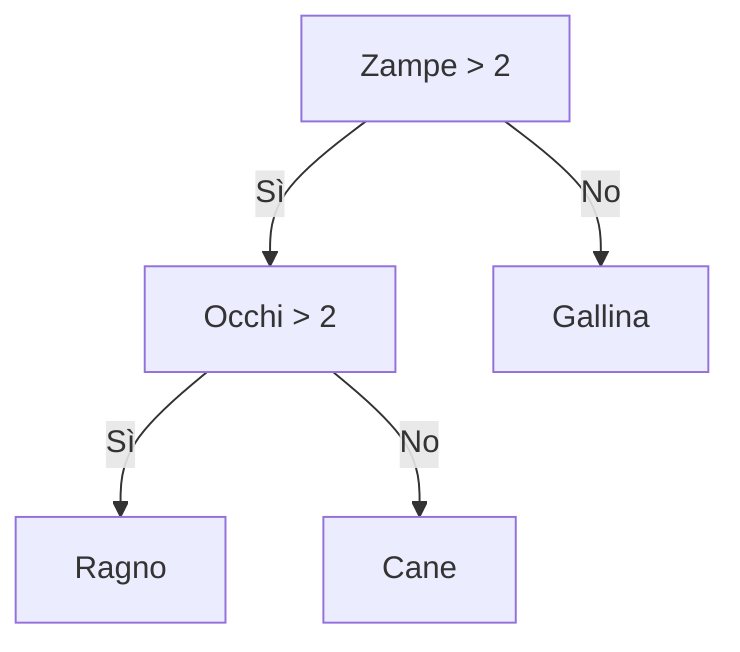

# 3.4.1 - Gli alberi decisionali

Gli *alberi decisionali* sono una tra le famiglie di modelli maggiormente utilizzate per l'apprendimento supervisionato, e sono in grado di risolvere sia problemi di classificazione, sia di regressione. In particolare, gli alberi decisionali offrono alcuni benefici rispetto ad altri tipi di modello, tra cui:

* **semplicità di configurazione**, grazie alla presenza di un numero limitato di parametri, la cui modifica influenza in maniera abbastanza limitata il risultato finale;
* **gestione di feature di diverso tipo**, ovvero sia numeriche, sia categoriche, con l'ovvia conseguenza di richiedere un preprocessing limitato rispetto ad altri modelli;
* **efficienza con dataset di piccole dimensioni**.

In pratica, gli alberi decisionali sono spesso in grado di fornire una buona accuratezza, sono semplici da configurare, robusti a rumore e feature mancanti, non richiedono preprocessing, ed i risultati ottenuti sono facilmente interpretabili. 

Gli alberi decisionali sono molto efficaci quando si usano dei dataset di tipo tabellare, normalmente contenuti in file CSV o tabelle di database, come ad esempio il dataset Titanic. Tuttavia, risultano inadeguati quando il tipo di dato utilizzato non è strutturato: in pratica, non possiamo efficacemente utilizzarli su immagini o testo.

Un altro punto di forza è che un albero decisionale è efficace anche su dataset di dimensioni ridotte, ovverosia quelli nei quali il rapporto tra feature e numero di campioni è di poco superiore ad uno; si parla, in questo caso, di *sample efficiency*.

!!!tip "Alberi e dati"
    Anche se gli alberi decisionali sono *sample efficient*, il loro funzionamento risulta comunque migliore nel caso di disponibilità di grosse quantità di dati.

## Funzionamento degli alberi decisionali

Un albero decisionale è un modello creato a partire da una serie di *condizioni*, che potremmo interpretare come delle "domande", organizzate in maniera gerarchica a ricalcare, per l'appunto, un albero. Ognuna delle foglie dell'albero contiene il valore predetto, che può essere sia una classe, sia un valore numerico; i restanti nodi, invece, descrivono una certa condizione. Un semplice esempio è mostrato nel seguente schema.

L'abero decisionale determina il valore predetto seguendo il percorso che va dalla radice fino ad una delle foglie, a seconda dei valori assunti dalle diverse feature. Questo cammino è detto *percorso di inferenza*. Nel nostro caso, alla radice dell'albero viene valutata la feature *Zampe*. In particolare, se questo valore è maggiore di $2$ andremo a valutare il valore della feature *Occhi*; in caso contrario, il percorso di inferenza ci porta direttamente a predire come *Gallina* l'animale caratterizzato.

Per quello che riguarda il nostro esempio, immaginiamo di avere un campione con i seguenti valori per le feature:

* Zampe: 4
* Occhi: 2

Dato che le zampe sono $4$, alla prima domanda si risponderà ovviamente con un *No*. Andando quindi a valutare la seconda condizione (il numero di occhi), avremo in questo caso un valore pari a $2$, per cui il risultato della predizione sarà un cane.

Nell'esempio appena visto, il valore predetto è categorico, e le feature numeriche. Facciamo un esempio per dimostrare la versatilità degli alberi decisionali, predicendo la tenerezza di un animale a partire dalle categorizzazioni delle feature *Pelosità* e *Carineria*.

Questo problema è caratterizzabile come un problema di regressione: infatti, a partire da feature di tipo categorico, il risultato predetto è numerico.

!!!tip "Risultati della regressione"
    Dall'esempio precedente, è evidente come cani, gatti e pulcini siano gli animali che ispirano più tenerezza nell'essere umano. D'altro canto, aracnidi, insetti e serpenti appaiono spesso molto meno teneri ed affettuosi.

Per andare avanti nella nostra discussione, dobbiamo adesso distinguere tra i diversi tipi di condizione descrivibili da un albero decisionale.

## Condizioni in un albero decisionale

Esistono due categorizzazioni possibili per le condizioni in un albero decisionale.

##### Axis-aligned vs. oblique

La prima categorizzazione possibile per le condizioni in un albero decisionale riguarda il fatto che queste interessino una o più feature. In particolare, una condizione che interessa un'unica feature è detta *axis-aligned*, mentre una condizione *oblique* riguarda diverse feature.

Tornando all'esempio precedente, la condizione $Zampe > 2$ è chiaramente *axis-aligned*, in quanto prevede la valutazione esclusiva del numero di zampe dell'animale. Se per qualche motivo la condizione fosse del tipo $Zampe < Occhi$, allora avremmo a che fare con una condizione *oblique*.

!!!tip "Cosa accade nella pratica?"
    Spesso gli alberi decisionali contengono soltanto condizioni axis-aligned, soprattutto a causa del fatto che può essere saggio eliminare feature interdipendenti prima di effettuare l'addestramento. Le condizioni oblique restano comunque potenzialmente molto potenti, in quanto in grado di modellare relazioni complesse, anche se, nella pratica, l'uso (ed abuso) di queste condizioni non garantisce necessariamente migliori performance.

##### Binarie vs. non binarie

La seconda distinzione che è possibile fare tra diversi tipi di condizione riguarda quelle *binarie*, ovvero quelle che hanno soltanto due possibili esiti, e *non binarie* che, prevedibilmente, hanno più di due possibili esiti. Prevedibilmente, un albero decisionale contenente esclusivamente delle condizioni binarie è detto *binario*, mentre uno contenente anche condizioni non binarie è detto *non binario*.

## Addestramento degli alberi decisionali

Come per tutti i modelli di apprendimento supervisionato, gli alberi decisionali sono addestrati a spiegare al meglio un insieme di esempi di training. Gli algoritmi utilizzati nell'addestramento usano spesso un approccio di tipo *divide-et-impera*. Infatti, l'algoritmo inizia creando un singolo nodo, ovvero la radice, e quindi va ad aumentare le dimensioni dell'albero in maniera ricorsiva usando un approccio *greedy*.

!!!tip "Approccio greedy"
    Per approccio *greedy* si intende il metodo secondo il quale l'algoritmo va a scegliere la migliore opzione possibile al momento, senza considerare quello che accadrà negli istanti successivi.

In particolare, l'addestramento valuta, per ogni nodo, tutte le possibili condizioni, scegliendo quella con il punteggio più alto, in modo da massimizzare il valore della metrica.

Ad esempio, nel nostro dataset, tutti i cani ed i ragni hanno un numero di zampe maggiore di quattro, mentre tutte le galline ne hanno due. Di conseguenza, la condizione $Zampe > 2$ ci permette di arrivare a determinare in maniera affidabile le galline, ma non riesce a discernere tra ragni e cani. Di conseguenza, al primo step, l'albero sarà in questa forma:

Successivamente, l'albero andrà ad esplorare i nodi *Ragno* e *Cane*, cercando una maniera per caratterizzarli sulla base delle feature disponibili. Se non viene individuata una condizione soddisfacente, il nodo diventa una foglia: in altre parole, senza il numero di occhi, l'albero non riuscirebbe a distinguere tra ragni e cani.

!!!tip "Ragni, cani, e zampe"
    Nella realtà, nel caso precedente, l'algoritmo andrebbe a specializzare ulteriormente il valore considerato per le zampe.

Vediamo adesso più nel dettaglio i passi necessari a creare il precedente albero decisionale.

##### Step 1: Creazione del nodo radice

Al primo step l'algoritmo si occupa di creare un nodo radice. Nel nostro caso, il nodo radice si occuperà di valutare il numero di zampe.

##### Step 2: Accrescimento del nodo radice

Al secondo step, accresceremo il nodo radice. L'algoritmo verificherà, in base ai dati a sua disposizione, che tutti i campioni etichettati come "Ragno" o "Cane" hanno più di due zampe, mentre quelli etichettati con "Gallina" ne hanno soltanto due. Di conseguenza, andremo a creare due nodi figli:

##### Step 3: Accrescimento dei nodi figli

Proviamo in primis ad accrescere il nodo "Gallina". Ovviamente, dato che l'algoritmo non è in grado di suddividere tra loro i dati etichettati in questo modo, non saranno effettuate ulteriori suddivisioni, per cui il nodo diverrà una foglia.

Provando adesso ad accrescere il nodo "Ragno o Cane". In questo caso, l'algoritmo troverà la regola per la quale se il numero di occhi è pari a 2, allora siamo in presenza di un "Cane"; altrimenti, qualora il numero di occhi è superiore a 2, saremo in presenza di un Ragno. L'albero diventerà il seguente:

## Funzione di suddivisione di un nodo

Ogni albero decisionale si basa sulla routine chiamata *splitter* per individuare il miglior valore possibile per la soglia $t$ sulla feature $f_i$. 

L'efficienza dello splitter rappresenta il collo di bottiglia di un albero decisionale: a seconda del numero e del tipo di feature in input, il numero totale di possibili condizioni da verificare per un dato nodo può essere molto grande. In tal senso, è facile verificare che se la regola di split di un nodo è data da $f_i \geq t$, con $f_i$ $i$-ma feature e $t \in \mathbb{R}$, l'insieme dei possibili valori di soglia è infinito.

Nella pratica, lo splitter non fa altro che massimizzare il valore di una funzione obiettivo, usando criteri come l'[information gain](https://en.wikipedia.org/wiki/Information_gain_(decision_tree)), la [Gini impurity](https://en.wikipedia.org/wiki/Decision_tree_learning#Gini_impurity), o anche l'RMSE.

##### Information gain

Vediamo adesso un semplice esempio di come lavora uno splitter. Per farlo, ipotizziamo un classificatore binario, operante con feature puramente numeriche, e senza alcun valore mancante. Formalmente, ipotizziamo di avere un insieme di $n$ campioni caratterizzati da una feature numerica ed un label binario, il quale potrà assumere valore *arancio* o *blu*. Possiamo descrivere il dataset come:

$$
D={(x_i, y_i)}_{i \in[1, n]}
$$

dove:

* $x_i$ è il valore associato alla feature numerica, contenuto ovviamente in $\mathbb{R}$;
* $y_i$ è una valore per la label di classificazione binaria, che può valere *arancio* o *blu*.

Dovremo quindi trovare un valore di soglia $t$ che ci permetta di suddividere l'insieme $D$ ottenendo due gruppi $T$ e $F$ il quanto più possibile "simili" all'assegnazione stabilita dalle label.

Un modo per valutare questa similitudine è utilizzare l'entropia di Shannon. Questa è una misura del "disordine" presente nei nostri dati, e sarà:

* **massima** quando un gruppo è perfettamente bilanciato (ovvero, il $50\%$ dei campioni è arancione, ed il $50\%$ blu);
* **minima** quando un gruppo è puro (ovvero, contiene solo campioni blu o arancioni).

Ne consegue che l'obiettivo sarà trovare una soglia $t$ che diminuisca la sommatoria pesata dell'entropia delle distribuzioni delle label nei gruppi $T$ ed $F$. Questo valore è chiamato *information gain*, e rappresenta la differenza tra l'entropia complessiva di $D$, e quella data dall'insieme ${T, F}$. Per fare un esempio, osserviamo la figura 1. A sinistra, lo splitter seleziona una suddivisione ad alta entropia, che comporta un basso guadagno informativo. A destra, invece, lo splitter sceglie una suddivisione migliore, aumentando di conseguenza l'information gain.

<figure markdown>
  
  <figcaption>Figura 1 - Splitting di $D$</figcaption>
</figure>

Formalmente:

$$
\begin{align}
&T = {(x_i, y_i)|(x_i, y_i) \in D con x_i \geq t} \\
&F = {(x_i, y_i)|(x_i, y_i) \in D con x_i < t} \\
&R(X) = \frac{|{x|x \in X, x=pos}|}{|X|} \\
&H(X) = -p log p - (1-p) log(1-p) con p = R(X) \\
&IG(D, T, F) = H(D) - \frac{|T|}{|D|} H(T) - \frac{|F|}{|D|}H(F)
\end{align}
$$

con:

* $IG(D,T,F)$ guadagno infomrativo legato alla suddivisione di $D$ in $T$ ed $F$.
* $H(X)$ è l'entropia dell'insieme di campioni $X$.
* $|X|$ è il numero di elementi nell'insieme $|X|$.
* $t$ è il valore di soglia.
* $pos$ è il valore della label *positivo*, ad esempio, blue nell'esempio prec edfentre. Scegelier una diversa label come positiva non cambia il valore dell'entropia o dell'information gain.
* $R(X)$ è il rapporto dei valori delle label positive nei campioni $X$.
* $D$ è il dataset.

Abbiamo già sottolineato come vi siano infiniti valori possibili per la soglia $t$. Tuttavia, dato un numero finito di campioni, possiamo stimare un numero finito di divisioni di $D$ in $T$ ed $F$, per cui si può tranquillamente dire che **ha senso testare solo un numero finito di valori di $t$**.

In tal senso, un approccio possibile è ordinare i valori $x_j$ in ordine crescente $x_{s(i)}$, in modo che:

$$
x_{s(i)} \leq x_{s(i+1)}
$$

A questo punto, possiamo testare $t$ per ogni valore a metà tra due valori consecutivi di $x_{s(i)}$. Se, per esempio, supponessimo che i primi due valori possibili per una feature numerica siano $3.5$ e $3.7$, avrebbe senso testare un primo valore di soglia pari a $t_1 = 8.6$.

Formalmente, potremo considerare l'insieme dei valori $X$ candidati per $t$:

$$
X = \{\frac{x_{s(i)}+x_{s(i+1)}}{2}|x_{s(i)}  x_{s(i+1)}\}
$$

Ciò comporta che la complessità di questo algoritmo nel tempo sia un $O(n \cdot log(n))$, con $n$ il numero di campioni. Quando applicato ad un albero decisionale, l'algoritmo di splitting viene applicato ad ogni nodo ed ogni feature. Supponendo che ogni nodo analizzi circa la metà dei campioni analizzati dal nodo padre, potremo stimare la complessità per l'addestramento di un albero decisionale ricorrendo al [teorema dell'esperto](https://it.wikipedia.org/wiki/Teorema_dell%27esperto):

$$
O(m \cdot n \cdot log(n)^2)
$$

con $m$ numero di feature.

Sottolineamo come l'algoritmo sia indipendente dalla scala o dalla distribuzione dei valori delle feature: infatti, soltanto l'ordine dei valori da queste assumibili è da ritenersi importante. Per questa ragione, non è necessario normalizzare o scalare le feature numeriche prima dell'addestramento di un albero decisionale.

## Overfitting e pruning

L'algoritmo descritto nel paragrafo precedente ci permette di addestrare un albero che classifichi perfettamente i campioni del dataset, a patto che questi siano separabili. Tuttavia, nel caso il dataset contenga del rumore, l'albero potrebbe andare in overfitting, mostrando scarse capacità di generalizzazione.

Per limitare l'overfitting di un albero decisionale, quindi, andranno applicati dei criteri di regolarizzazione. In particolare, alcuni dei più diffusi sono:

* **impostare una profondità massima**, ovvero fare in modo che l'albero decisionale non vada oltre un certo numero di livelli gerarchici (generalmente $10$);
* **impostare un numero minimo di campioni per ciascuna foglia**, non considerando come valido un nuovo nodo che caratterizzi meno campioni di quelli impostati in questo valore di soglia.

Un altro modo di ridurre l'overfitting è rimuovere selettivamente alcuni rami mediante una procedura di **pruning**, che "converte" determinati nodi non-foglia in nodi foglia. 

## Interpretabilità dell'albero decisionale

Gli alberi decisionali sono molto semplici da interpretare. Per comprendere il perché, rifacciamoci all'esempio mostrato in figura 2:

<figure markdown>
  
  <figcaption>Figura 2 - Le regole stabilite da un albero decisionale</figcaption>
</figure>

Le regole di questo albero decisionale, addestrato chiaramente sul dataset Tips, ci mostrano chiaramente che il primo nodo stabilisce come criterio di splitting una prima soglia sull'entità del conto, che va in due nodi figli, il primo del quale valuta come suddivisione la mancia, ed il secondo di nuovo il conto, stavolta con una soglia differente. Componendo le diverse regole, è possibile arrivare ad una regola più o meno complessa, ma in grado di trovare le relazioni di interesse all'interno dei nostri dati.

##### Feature importance

Possiamo valutare numericamente l'impatto di ciascuna variabile sulla predizione data dall'albero mediante il concetto di *feature importance*, che associa un punteggio ad ogni feature, indicando quanto questa sia importante ai fini predittivi. Ad esempio, se per un modello con due feature $f_1, f_2$ si quantifica che la loro importanza è pari, rispettivamente, a $5.8$ e $2.5$, allora la feature $f_1$ risulterà essere più discriminativa della feature $f_2$.

Per stabilire l'importanza delle diverse feature, possiamo usare metodi agnostici come il [permutation importance](https://christophm.github.io/interpretable-ml-book/feature-importance.html), o anche criteri specificamente calcolati dall'albero, come il numero di nodi con una certa feature, o la profondità media dell'occorrenza di una determinata feature in tutti i percorsi dell'aalbeor.

Ad esempio, il numero di nodi contenenti una certa feature quantifica il modo in cui l'albero considera la stessa, il che può essere un indice della sua importanza: in pratica, il modello tende ad utilizzare molto le feature più importanti, sfruttandole per le loro capacità di generalizzazione. Idealmente, comunque, a nessuna feature dovrebbe essere data una maggiore importanza rispetto ad altre, e tutte dovrebbero influenzare egualmente la predizione.
