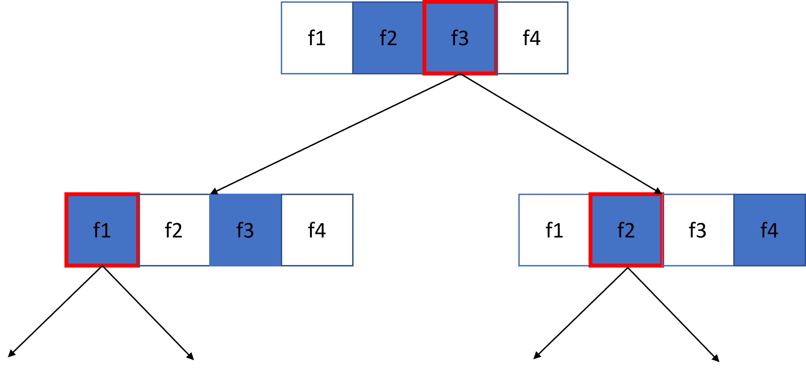

# 3.4.2 - Foreste decisionali

Introduciamo le foreste decisionali con un aneddoto.

Nel 1906, si svolse in Inghilterra una competizione in cui i partecipanti dovevano indovinare il peso di un bue, ovviamente senza l'uso di una bilancia. Al termine della competizione, l'errore *mediano* calcolato sulle predizioni di tutti i partecipanti fu di circa $17$ kg; tuttavia, la *mediana* delle predizioni era errata di circa quattro kg. Questo combacia perfettamente con il [*principio della saggezza della folla*](https://it.wikipedia.org/wiki/Saggezza_della_folla): in determinate situazioni, il giudizio fornito dall'opinione collettiva risulta essere (inaspettatamente) molto preciso. Dal punto di vista statistico, questo principio segue il [teorema centrale del limite](https://it.wikipedia.org/wiki/Teoremi_centrali_del_limite), che dice che lo scarto quadratico medio tra il valore vero $x$ e quello $\hat{x}$ derivante dalla media di $N$ stime (rumorose) di $x$ tende a zero con un fattore pari ad $\frac{1}{n}$. In pratica, quanti più "giudizi" abbiamo, tanto più sarà preciso il "giudizio collettivo".

Basandoci su queste considerazioni, definiamo come *foresta decisionale* un modello composto da un insieme di [alberi decisionali](01_decision_trees.md), organizzati per dare un "giudizio collettivo" a riguardo di un dato problema. Il modo in cui i diversi alberi si aggregano dipende dallo specifico problema: ad esempio, nel caso di un problema multiclasse, ogni albero potrebbe dare il suo "voto" ad una certa classe, e la predizione globale sarebbe la classe più votata. In un'altra implementazione, invece, ogni albero potrebbe dare in output un valore compreso tra zero ed uno, ed il valore predetto sarebbe quello dato dalla somma normalizzata dei valori predetti da ciascun albero. Tuttavia, l'approccio probabilmente più noto ed utilizzato alle foreste decisionali è quello chiamato *random forest*, per parlare delle quali dobbiamo introdurre il concetto di *metodo ensemble*.

## Metodi ensemble

Un *metodo ensemble* è un algoritmo in cui le predizioni di un insieme di modelli sono tra loro mediate. Il vantaggio principale di un ensemble è che, posto che i singoli modelli risultino essere adeguatamente performanti, la qualità complessiva dell'ensemble è generalmente più alta della qualità dei modelli individuali; ovviamente, le maggiori performance comportano un maggior costo computazionale per l'addestramento e l'inferenza del modello.

Ovviamente, affinché un metodo ensemble garantisca le performance migliori, i singoli modelli devono avere un certo grado di indipendenza reciproca. Infatti, se da un lato un ensemble composto da dieci modelli identici non potrà mai avere performance migliori del singolo modello, dall'altro avere dieci modelli *forzosamente* indipendenti può peggiorarne le performance. Di conseguenza, un ensembling efficace richiede di individuare un giusto bilanciamento tra indipendenza e qualità dei singoli modelli.

## Random forest

Dopo aver brevemente introdotto il concetto di ensemble, possiamo introdurre quello di random forest. In particolare, le random forest sono un *ensemble di alberi decisionali*, nel quale ciascun albero è addestrato introducendo un certo quantitativo di rumore casuale.

Esistono diverse tecniche per creare in maniera efficace una random forest; vediamone alcune.

##### Bagging

La tecnica del *bagging* (*bootstrap aggregating*) prevede che ogni albero decisionale sia addestrato su un sottoinsieme casuale dei campioni presenti nell'insieme di addestramento.

In particolare, ogni albero decisionale viene addestrato su un numero di campioni pari a quello del dataset iniziale mediante la tecnica chiamata *replacement training*, che prevede che *i valori* utilizzati per l'addestramento del singolo albero siano il $67\%$ di quelli originari, scelti ovviamente in maniera casuale. Per esempio, se il dataset originario contiene $60$ campioni, ogni albero sarà addestrato usando $40$ valori, scelti in maniera casuale. Ovviamente, alcuni dei campioni scelti dovranno essere replicati per rispettare il vincolo che vi siano comunque $60$ dati di training.

Facciamo un esempio con sei campioni e tre alberi decisionali, mostrandolo nella tabella successiva.

<table>
<thead>
  <tr>
    <th></th>
    <th colspan="6">Campioni di training</th>
  </tr>
</thead>
<tbody>
  <tr>
    <td></td>
    <td>1</td>
    <td>2</td>
    <td>3</td>
    <td>4</td>
    <td>5</td>
    <td>6</td>
  </tr>
  <tr>
    <td>D</td>
    <td>1</td>
    <td>1</td>
    <td>1</td>
    <td>1</td>
    <td>1</td>
    <td>1</td>
  </tr>
  <tr>
    <td>AD1</td>
    <td>1</td>
    <td>0</td>
    <td>2</td>
    <td>0</td>
    <td>2</td>
    <td>1</td>
  </tr>
  <tr>
    <td>AD2</td>
    <td>2</td>
    <td>2</td>
    <td>0</td>
    <td>1</td>
    <td>0</td>
    <td>1</td>
  </tr>
  <tr>
    <td>AD3</td>
    <td>2</td>
    <td>1</td>
    <td>2</td>
    <td>0</td>
    <td>0</td>
    <td>1</td>
  </tr>
</tbody>
</table>

In particolare, nella tabella precedente:

* $D$ è il dataset iniziale, composto da sei diversi campioni;
* sulle colonne, abbiamo il numero di volte in cui ogni campione è usato per addestrare ogni albero;
* sulle righe, abbiamo i diversi alberi decisionali ($AD_1$, $AD_2$, ed $AD_3$).

Notiamo che:

* ogni albero decisionale è addestrato su un totale di sei campioni;
* l'insieme di addestramento contiene sempre il $67\%$ dei possibili valori originari (ovvero quattro), alcuni dei quali vengono riutilizzati più volte.

Questa scelta, motivata nel [paper originale](https://www.stat.berkeley.edu/~breiman/randomforest2001.pdf), fa in modo che le performance ottenute siano le migliori possibili. Tuttavia, è anche possibile utilizzare una tecnica di training *senza replacement*: in altri termini, ogni campione *non* può essere presente più di una volta nel set di training di un singolo albero, per cui ciascuno dei modelli sarebbe addestrato su un sottoinsieme casuale di quattro diversi campioni.

##### Attribute sampling

A differenza del bagging, che prevede che l'albero sia addestrato su un sottoinsieme di campioni, l'*attribute sampling* fa in modo che ogni albero sia addestrato su un sottoinsieme casuale di *feature*. Un esempio di attribute sampling è mostrato in figura 1.

<figure markdown>
  
  <figcaption>Figura 1 - Un esempio di attribute sampling</figcaption>
</figure>

Nella figura precedente, l'albero viene addestrato su $4$ diverse feature: quelle in blu sono quelle testate nello specifico nodo, mentre quelle in bianco non sono testate. La regola dell'albero viene costruita a partire dalla feature maggiormente discriminativa, rappresentata mediante un contorno rosso.

Il rapporto tra feature testate e feature totali è un iperparametro molto importante a scopo di regolarizzazione. Nel nostro esempio, stiamo usando un rapporto del $50\%$; tuttavia, in molte implementazioni, questo rapporto è pari ad $\frac{F}{3}$ in caso di regressione, e di $\sqrt{F}$ in caso di classificazione, con $F$ numero di feature.

##### Assenza di pruning

Gli alberi in una random forest sono addestrati *senza* usare la tecnica di pruning. Ciò aumenta significativamente la varianza delle predizioni, riducendo il bias legato al singolo albero. In altri termini, l'assenza di pruning fa sì che il singolo possa andare in overfitting, ma la presenza di numerosi alberi fa in modo che il loro ensemble non sia affetto da questo fenomeno.

Considerata l'assenza di pruning, è possibile addestrare un random forest *senza* un dataset di validazione.

##### Setting degli iperparametri

Teoricamente, un random forest può essere addestrato senza impostare una profondità massima o un numero minimo di osservazioni per foglia. Nella pratica, tuttavia, impostare questi iperparametri comporta un beneficio, proprio come nel caso degli alberi decisionali. Due valori che sono spesso usati sono $16$ per la massima profondità, e $5$ osservazioni minime per foglia.

Un altro iperparametro che è possibile impostare è il numero di alberi decisionali presenti nell'ensemble. Per quello che abbiamo visto in precedenza, un numero più elevato di alberi non fa altro se non "rafforzare" il voto raggiunto dalla "massa", per cui la qualità delle predizioni è direttamente proporzionale all'entità di questo parametro. Va tuttavia sottolineato come, oltre un certo numero di alberi, dipendente dal problema sotto analisi, non vi siano miglioramenti significativi.

##### Out-of-bag evaluation

Abbiamo in precedenza accennato al fatto che il random forest non richieda un dataset per la validazione. In tal senso, molte implementazioni dell'algoritmo utilizzano una valutazione chiamata *out-of-bag* (*OOB*) per la valutazione delle performance, che prevede che il training set sia trattato come il test set in caso di cross-validazione.

Come già detto, il singolo albero in un random forest è tipicamente addestrato su circa il $67\%$ dei campioni disponibili; di conseguenza, il singolo albero non "vede" circa il $33\%$ dei restanti esempi. L'idea alla base della valutazione OOB è, dato un random forest addestrato sull'intero dataset, valutare il singolo albero *soltanto sui campioni non visti in fase di addestramento*.

Ad esempio, nel caso illustrato nella tabella precedente:

<table>
<thead>
  <tr>
    <th></th>
    <th colspan="6">Campioni di training</th>
    <th>Campioni per la valutazione OOB</th>
  </tr>
</thead>
<tbody>
  <tr>
    <td></td>
    <td>1</td>
    <td>2</td>
    <td>3</td>
    <td>4</td>
    <td>5</td>
    <td>6</td>
    <td></td>
  </tr>
  <tr>
    <td>D</td>
    <td>1</td>
    <td>1</td>
    <td>1</td>
    <td>1</td>
    <td>1</td>
    <td>1</td>
    <td></td>
  </tr>
  <tr>
    <td>AD1</td>
    <td>1</td>
    <td>0</td>
    <td>2</td>
    <td>0</td>
    <td>2</td>
    <td>1</td>
    <td>2, 4</td>
  </tr>
  <tr>
    <td>AD2</td>
    <td>2</td>
    <td>2</td>
    <td>0</td>
    <td>1</td>
    <td>0</td>
    <td>1</td>
    <td>3, 5</td>
  </tr>
  <tr>
    <td>AD3</td>
    <td>2</td>
    <td>1</td>
    <td>2</td>
    <td>0</td>
    <td>0</td>
    <td>1</td>
    <td>4, 5</td>
  </tr>
</tbody>
</table>

Ad esempio:

* i campioni $2$ e $4$ saranno usati per validare l'albero $AD_1$;
* i campioni $3$ e $5$ saranno usati per validare l'albero $AD_2$;
* i campioni $4$ e $5$ saranno usati per validare l'albero $AD_3$.

!!!note "Dimensioni del dataset ed OOB"
    In questo caso, la dimensione del dataset limita fortemente l'efficacia della valutazione OOB. Nei casi reali, dato un dataset con dimensioni ragionevoli, tutti gli alberi avranno almeno un insieme di predizioni OOB.

##### Interpretabilità del random forest

Data la loro natura di *insieme* di modelli, un random forest è più complesso da interpretare rispetto ad un singolo albero decisionale. Tuttavia, ciò è comunque possibile usando metodi indipendenti dal singolo algoritmo, come SHAP.
