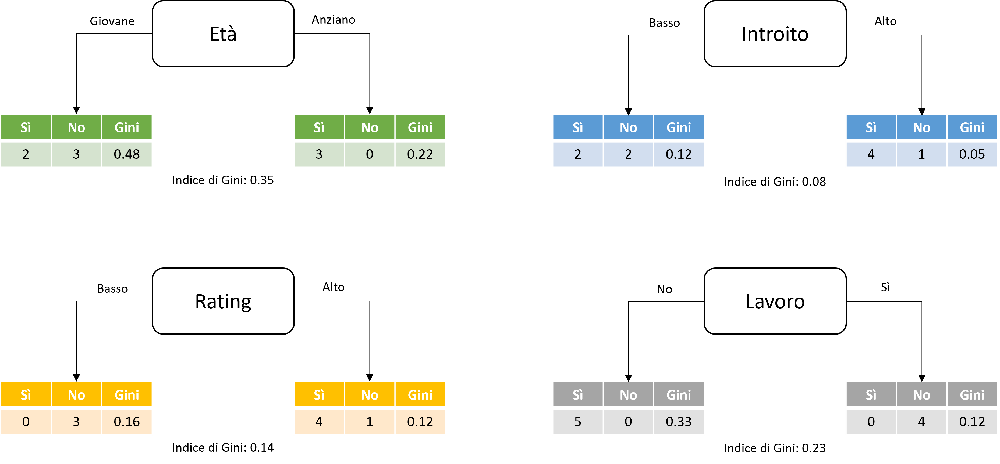

# Gini Impurity

La **Gini impurity**, chiamata anche **indice di Gini**, è una misura usata durante l'addestramento di un albero decisionale che permette di determinare il ruolo delle feature del dataset sotto analisi nella creazione dei singoli nodi. In particolare, l'indice di Gini è un numero compreso tra $0$ e $0.5$ indicante la probabilità che a seguito di una label casuale $y_i \in Y$, con $Y$ insieme delle possibili label, un campione $x_j\in X$, con $X$ dataset sotto analisi, venga mal classificato.

Facciamo un esempio pratico. Supponiamo di voler costruire un albero decisionale che ci permetta di determinare se il cliente *Guido van Rossum* della banca *Credito Python per il Sociale* riuscirà o meno a pagare i debiti accumulati sulla sua carta di credito. Per farlo, considereremo le seguenti feature:

| Identificativo | Descrizione |
| :--------------: | ----------- |
| $y_1$ | Età anagrafica |
| $y_2$ | Introito netto annuo |
| $y_3$ | Rating del credito |
| $y_4$ | Lavoro |

Iniziamo ad addestrare il nostro albero: per farlo, usiamo diverse regole, considerando ciascuna delle precedenti feature, e valutiamo quanto "male" la singola feature ha suddiviso i dati nella classe corretta (ovvero, solvenza o insolvenza). In questa maniera, stiamo calcolando l'*impurità* della suddivisione e, di conseguenza, la feature con l'impurità più bassa sarà quella da scegliere la suddivisione del nodo attuale. Reiterando questo processo per le rimanenti feature, otterremo il nostro albero complessivo.

<figure markdown>
  
  <figcaption>Figura 1 - Un esempio di scelta della feature per lo split sulla base dell'indice di Gini. In questo caso, la feature scelta è l'introito.</figcaption>
</figure>

## Definizione matematica

Consideriamo un dataset $D$ composto da campioni estratti da $k$ classi differenti. La probabilità che un campione appartenga alla classe $i$ è indicata con $p_i$. L'indice di Gini di $D$ è dato da:

$$
Gini(D) = 1 - \sum_{i=1}^k p_i^2
$$

Dalla formula precedente, un nodo avente una distribuzione di classe uniforme avrà l'impurità più alta, mentre il valore minimo dell'indice sarà ottenuto qunado tutti i campioni appartengono alla stessa classe. Ad esempio, considerando un dataset $D$ con $10$ campioni appartenenti a due classi, possiamo ipotizzare tre diverse situazioni:

| Nodo | $n_1$ | $n_2$ | $p_1$ | $p_2$ | $Gini$ |
| :-:  | :-:   | :-:   | :---: | :---: | ------------- |
| A | $0$ | $10$ | $0$ | $1$ | $1 - 0 \cdot 0 - 1 \cdot 1 = 0$ |
| B | $3$ | $7$ | $0.3$ | $0.7$ | $1 - 0.3 \cdot 0.3 - 0.7 \cdot 0.7 = 0.42$ |
| C | $5$ | $5$ | $0.5$ | $0.5$ | $1 - 0.5 \cdot 0.5 - 0.5 \cdot 0.5 = 0.5$ | 

Nella tabella precedente, $n_1$ è il numero di campioni che il nodo assegna alla prima classe, mentre $n_2$ è il numero di campioni assegnati alla seconda classe. Appare evidente come l'indice di Gini assuma valore massimo nel caso vi sia un'equa ripartizione dei campioni tra le due classi, mentre sia minimo quando tutti i campioni sono assegnati ad una singola classe.

Nelle iterazioni successive, considerando una suddivisione sulla base della feature $k_i$ del dataset $D$ nei due sottoinsiemi $D_1$ e $D_2$ con dimensioni $n_1$ ed $n_2$, rispettivamente, l'indice di Gini sarà definito come:

$$
Gini_{k_i} (D) = \frac{n_1}{n} Gini (D_1) + \frac{n_2}{n} Gini (D_2)
$$

!!!note "Contributo informativo della singola feature"
    Per ottenere il contributo informativo di un singolo attributo, detto anche *information gain*, possiamo sottrarre l'impurità ottenuta a valle dello split a quella originaria. In altre parole:
    > $$
    \Delta Gini_{k_i}(D) = Gini(D) - Gini_{k_i} (D)
    $$
