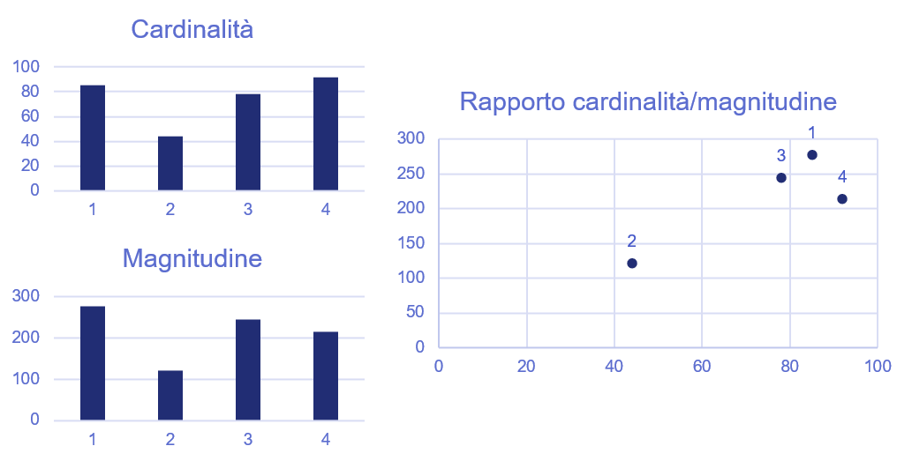
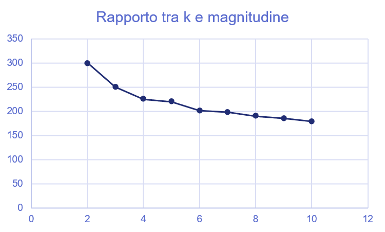

# 3.5 - Algoritmi di clustering

Gli algoritmi di clustering hanno come obiettivo la suddivisione non supervisionata dei campioni presenti in un dataset. Di conseguenza, questo tipo di algoritmi opera *senza* una label determinata a priori, ed agendo quindi direttamente sui dati.

Facciamo un esempio. Immaginiamo di voler fare un po' di pulizia nei nostri album musicali, lasciando soltanto quelli che sono più vicini ai gusti che abbiamo maturato nel corso degli anni, e vendendo gli altri. La suddivisione degli album non avverrà quindi in base ad una determinata label come, ad esempio, anno di produzione, artista, o genere musicale; sarà invece seguito un criterimo molto più empirico, legato alla *vicinanza* delle canzoni contenute nel disco ai nostri gusti musicali. Una volta suddivisi gli album, dovremo assegnare ad ogni gruppo, o *cluster*, un identificativo che, in qualche modo, *riassuma* le informazioni associate al cluster: banalmente, in questo caso potremo usare gli identificativi *buono* e *non buono*.

Gli algoritmi di clustering sono usati in numerosi ambiti ed applicazioni. Per fare un paio di esempi, in un'analisi di mercato, potremmo suddividere i potenziali clienti sulla base di profili "vicini", oppure ancora raggruppare zone di un'immagine di colore simile. Diamone quindi una descrizione più dettagliata.

## Tipologie di clustering

Un algoritmo di clustering deve essere scelto sulla base di diversi fattori, tra cui uno dei maggiormente influenti riguarda la complessità e, di conseguenza, la *scalabilità* dell'approccio. Ad esempio, alcuni algoritmi confrontano *ogni possibile coppia di dati*, il che porta ad una complessità $O(n^2)$, con $n$ numero complessivo di campioni; altri invece, come il K-Means, effettuano un numero molto più limitato di operazioni, con una complessità nell'ordine di un $O(n)$. Va da sè che l'effetto legato alla diversa complessità computazionale è visibile soprattutto in caso $n$ sia molto maggiore di $1$. Ovviamente, oltre alla complessità, ogni algoritmo presenta tutta una serie di vantaggi e svantaggi, che potranno orientare la nostra scelta.

In generale, comunque, esistono quattro diverse categorie di algoritmo.

1. Nel *centroid-based clustering*, i dati sono organizzati secondo la loro distanza dai *centroidi*, ovvero dei campioni considerati come "base" per ciascun cluster. Questo tipo di algoritmi risulta essere mediamente efficace, ma è sensibile alle condizioni iniziali ed alla presenza di eventuali outliers.
2. Nel *density-based clustering*, i dati sono organizzati in aree ad alta densità. Ciò permette la connessione di cluster di forma arbitraria, e facilita inoltre l'individuazione di outlier, che per definizione sono nelle zone a minore densità di campioni. Possono però essere sensibili a dataset con densità variabile ed alta dimensionalità.
3. Nel *distribution-based clustering* si suppone che i dati abbiano distribuzione gaussiana, e siano quindi suddivisibili come tali. Questo tipo di algoritmi non è efficiente se non si conosce a priori il tipo di distribuzione dei dati.
4. Nello *hierarchical clustering* viene creato un albero a partire dai dati. Questo tipo di clustering è particolarmente efficace nel caso si trattino certi tipi di dati, come ad esempio le tassonomie, e prevede che possa essere selezionato un numero ridotto di cluster tagliando l'albero al giusto livello.

## Funzionamento generale di un algoritmo di clustering

Ogni algoritmo di clustering prevede tre step fondamentali.

1. Il primo step prevede la *preparazione dei dati* mediante opportune operazioni di normalizzazione e riduzione della dimensionalità.
2. Il secondo step prevede l'individuazione di una serie di feature cui applicare una *metrica di distanza*, determinando la "vicinanza" di una coppia di campioni.
3. Il terzo step prevederà l'esecuzione vera e propria dell'algoritmo.

### Feature e metrica di distanza

Concentriamoci brevemente sul secondo step. Definire la similarità di due campioni implica stabilire un modo per valutare quanto questi risultino essere tra affini sulla base delle loro caratteristiche. Possiamo quindi operare in due modi:

* la similarità può essere calcolata a partire da feature scelte *manualmente* da un esperto di dominio;
* in alternativa, le feature possono essere scelte in maniera *automatica* partendo da un *embedding*, ovvero da una rappresentazione a dimensionalità ridotta del dato iniziale.

Nel primo caso, la scelta avviene basandosi su una valutazione preliminare dei dati fatta da un esperto di dominio. Tornando agli album musicali, potremmo considerare come feature *anno di produzione* e *genere di appartenenza*, ed usare una metrica di distanza, come ad esempio la distanza euclidea, per rappresentare la "quantità di spazio" che separa due campioni. 

Tuttavia, questo approccio non è efficace nel caso in cui ci sia un elevato numero di dimensioni. Questo è legato essenzialmente ad un fattore, che approfondiamo di seguito.

##### Distanza euclidea e dimensionalità elevata

In caso di spazio con un elevato numero di feature (e, quindi, a *dimensionalità elevata*), assistiamo ad una serie di fenomeni controintuitivi, magistralmente descritti da Pedro Domingos della University of Washington in [questo articolo](https://homes.cs.washington.edu/~pedrod/papers/cacm12.pdf).

In particolare, Domingos afferma che è proprio il nostro modo di percepire il mondo a limitare la nostra comprensione del funzionamento della distanza euclidea. Consideriamo ad esempio una distribuzione gaussiana in uno spazio a due o tre dimensioni: la nostra esperienza ci dice che la maggior parte dei dati è concentrata attorno alla media, e questo ci porta a pensare che ciò valga in ogni caso. Ciò però non è necessariamente vero nel caso ci sia un numero elevato di dimensioni: ad esempio, si può verificare che la maggior parte del volume di un'arancia ad elevata dimensionalità non sia concentrata nella polpa, ma sulla sua buccia e, in altre parole, non valgono le regole di approssimazione e distanza a cui siamo abituati a sottostare negli spazi a noi "comprensibili".

Tornando alla distanza euclidea, nelle alte dimensionalità si assiste ad un fenomeno abbastanza peculiare: in pratica, i punti diventano praticamente equidistanti l'uno dall'altro. Questo fenomeno, magistralmente descritto in [questo articolo](https://bib.dbvis.de/uploadedFiles/155.pdf), comporta l'inutilizzabilità delle metriche di distanza tradizionali, con particolare riferimento a quella Euclidea, negli spazi ad elevata dimensionalità.

Di conseguenza, nel momento in cui si considerano dei campioni con un numero elevato di feature, è necessario estrarre rappresentazioni *compatte* degli stessi, utilizzando tecniche di *dimensionality reduction* o *feature selection*, che tratteremo in una delle prossime lezioni.

## Applicazione di un algoritmo di clustering: il K-Means

Concentriamoci adesso sui casi ppiù semplici, e vediamo come usare il più noto tra gli algoritmi di clustering, ovvero il *K-Means*.

Il K-Means è un algoritmo centroid-based che distribuisce i campioni tra $k$ diversi cluster in base alla distanza tra il campione ed i centroidi dei diversi cluster. Le ipotesi alla base dell'algoritmo sono diverse, tra cui la più restrittiva è quella legata alla definizione del numero di cluster $k$, che è immutabile per l'intera esecuzione dell'algoritmo.

Una volta fissato il valore di $k$, il K-Means opera in tre diversi step successivi:

1. al primo step, l'algoritmo sceglie casualmente $k$ centroidi tra i diversi dati a disposizione;
2. al secondo step, l'algoritmo assegna ogni punto al centroide più vicino, definendo i $k$ cluster iniziali;
3. al terzo step, l'algoritmo ricalcola il centroide considerando il valore medio di tutti i punti del cluster, e ritorna allo step 2.

Si noti che, in generale, i centroidi *non* sono campioni presenti nel dataset, se non al punto 1. Le iterazioni proseguono fino a che i cluster calcolati al punto 2 si stabilizzano o, in alternativa, fino a che non sarà raggiunto il massimo numero di iterazioni ammesse. In figura 1 possiamo osservare una spiegazione visiva del funzionamento dell'algoritmo.

<figure markdown>
  { width="450" }
  <figcaption>Figura 1 - Step dell'algoritmo K-Means</figcaption>
</figure>

Formalmente, il $K-Means$ divide un insieme di $N$ campioni $X$ in $K$ cluster $C$, ognuno descritto dalla media $\mu_{j}$ dei campioni nel cluster (ovvero, i centroidi). In particolare, i centroidi sono scelti in modo da minimizzare il criterio di *inerzia*, definito come:

$$
\sum_{i=0}^n \min_{\mu_j \in C} (|| x_i - \mu_j||^2)
$$

Il criterio di inerzia definisce quindi un indice di "coesione" interna dei cluster. Tuttavia, la scelta di questo criterio impone diversi limiti al K-Means:

* in primis, il criterio di inerzia presuppone che i cluster siano isotropi, ad egual varianza, e contengano un numero comparabile di campioni, il che non è sempre vero nella realtà;
* inoltre, l'inerzia è basata sulla distanza euclidea che, come abbiamo visto in precedenza, tende a non essere efficace negli spazi ad elevata dimensionalità. 

##### Scelta del numero di cluster

La scelta del valore ottimale di $k$ è un procedimento emnpirico, in quanto non abbiamo a disposizione delle vere e proprie label per la verifica dell'uscita dell'algoritmo. In tal senso, abbiamo a disposizione sia delle metriche, che [vedremo in seguito](../06_metrics/03_clustering.md), sia degli approcci più qualitativi, che dipendono dai concetti di *cardinalità* e *magnitudine* del clustering.

In particolare, per *cardinalità* si intende il numero di campioni per ogni cluster, mentre per *magnitudine* la somma delle distanze di tutti i campioni in un cluster dal centroide. Immaginiamo di essere in un caso come quello descritto in figura 2.

<figure markdown>
  { width="500" }
  <figcaption>Figura 2 - Rapporto tra cardinalità e magnitudine dei cluster</figcaption>
</figure>

Prevedibilmente, il rapporto tra cardinalità e magnitudine dovrebbe essere all'incirca lineare. Quindi, come si può vedere dalla figura precedente, ci potrebbe essere qualcosa che non va con il cluster $4$.

A questo punto, avendo valutato empiricamente la possibile presenza di un problema qualitativo con il clustering, possiamo provare ad eseguire l'algoritmo per un valore crescente di $k$. Proviamo a plottare questo valore in rapporto alla somma delle magnitudini del risultato, che diminuirà all'aumentare di $k$; un valore ottimale per $k$ è quello che si ottiene quando questo grafico tende a stabilizzarsi, ad esempio considerando il valore per cui la derivata diventa maggiore di -1 (e quindi l'angolo della funzione dei $k$ è maggiore di $135°$).

<figure markdown>
  { width="450" }
  <figcaption>Figura 3 - Rapporto tra il numero dei cluster e la magnitudine</figcaption>
</figure>

## Un altro algoritmo: il DBSCAN

Il [DBSCAN](https://en.wikipedia.org/wiki/DBSCAN) è un algoritmo di clustering di tipo agglomerativo density-based che opera considerando due parametri principali:

* la *distanza massima* $\epsilon$ per considerare due punti come appartenenti allo stesso cluster;
* il *numero minimo di campioni* $m$ per il quale è possibile definire un cluster.

Nella pratica, il DBSCAN seleziona un campione casuale tra quelli non visitati, e valuta se ci sono $m$ campioni all'interno della distanza $\epsilon$, nel qual caso si ha un *core point*. In alternativa, se il numero di campioni presenti in $\epsilon$ è minore di $m$, ma comunque maggiore di 0, i campioni si dicono $density reachable$ e, se connessi ad un *core point*, appartengono allo stesso cluster. Infine, se non vi sono campioni presenti in $\epsilon$, allora il punto è isolato, ed è interpretato come un outlier. Un'interpretazione visiva è quella proposta in figura; in particolare, i punti in rosso definiscono diversi *core points*, i punti in giallo sono *density reachable*, e quindi fanno parte dello stesso cluster dei core points, mentre $N$ è un outlier.

<figure markdown>
  { width="300" }
  <figcaption>Figura 20.4 - Algoritmo DBSCAN.   Di Chire - Opera propria, CC BY-SA 3.0, <a href="https://commons.wikimedia.org/w/index.php?curid=17045963">Wikipedia</a></figcaption>
</figure>

