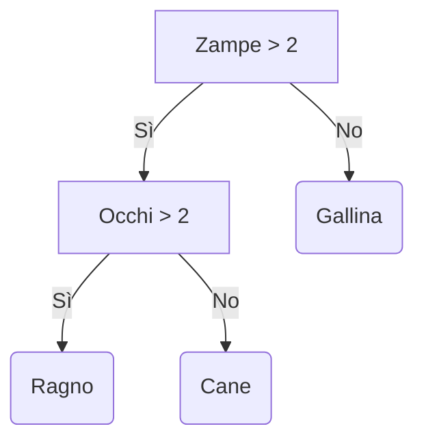
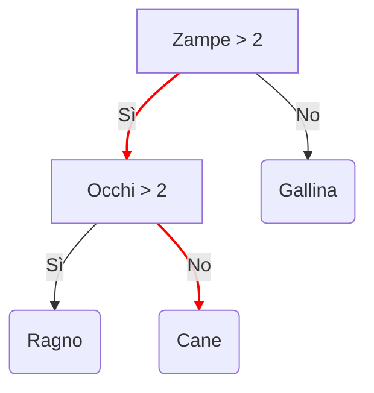
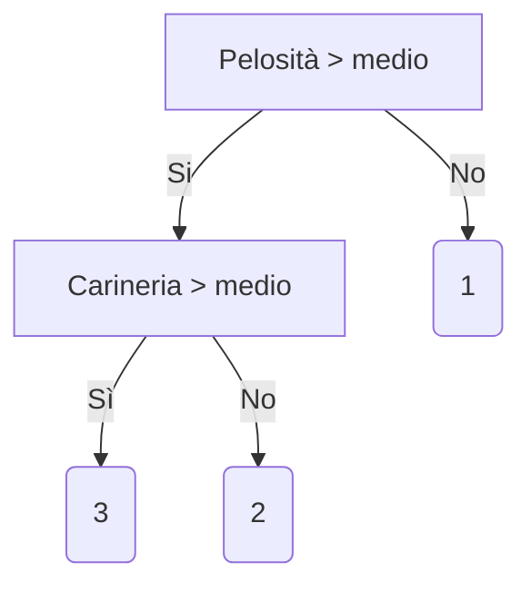
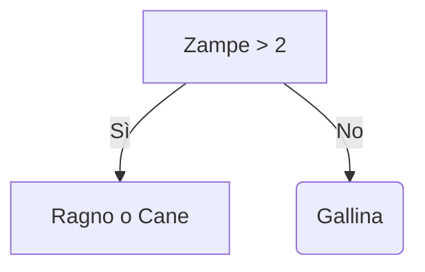
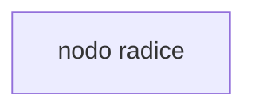
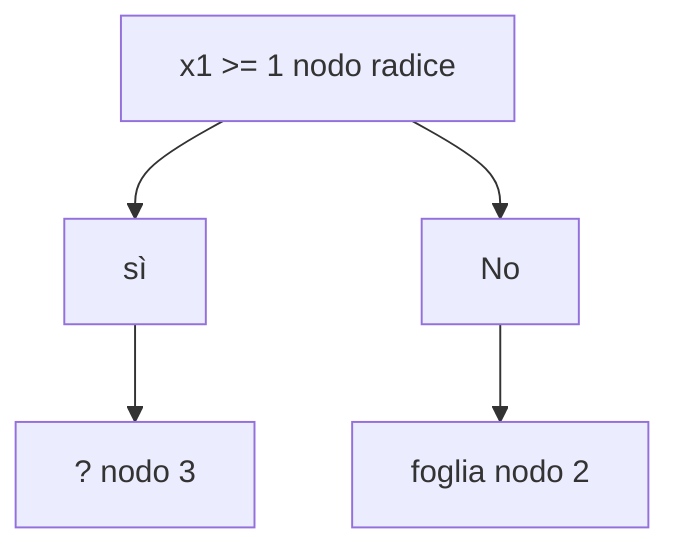
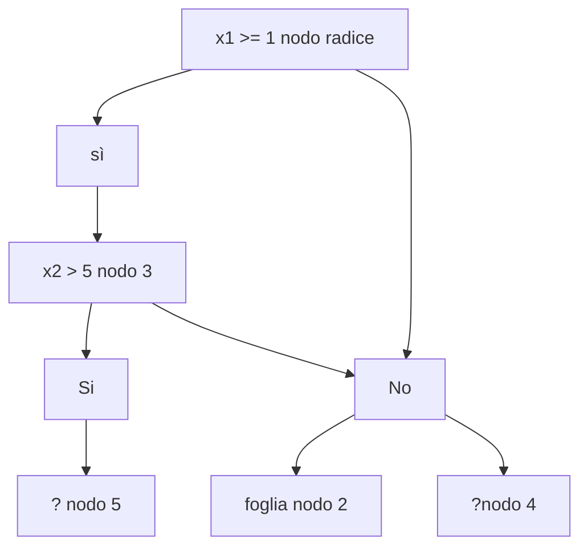

# 6.1 - Gli alberi decisionali

Gli *alberi decisionali* sono una tra le famiglie di modelli maggiormente utilizzate per l'apprendimento supervisionato, e sono in grado di risolvere sia problemi di classificazione, sia di regressione. In particolare, gli alberi decisionali offrono alcuni benefici rispetto ad altri tipi di modello, tra cui:

* **semplicità di configurazione**, grazie alla presenza di un numero limitato di parametri, la cui modifica influenza in maniera abbastanza limitata il risultato finale;
* **gestione di feature di diverso tipo**, ovvero sia numeriche, sia categoriche, con l'ovvia conseguenza di richiedere un preprocessing limitato rispetto ad altri modelli;
* **efficienza con dataset di piccole dimensioni**.

In pratica, gli alberi decisionali sono spesso in grado di fornire una buona accuratezza, sono semplici da configurare, robusti a rumore e feature mancanti, non richiedono preprocessing, ed i risultati ottenuti sono facilmente interpretabili. 

Gli alberi decisionali sono molto efficaci quando si usano dei dataset di tipo tabellare, normalmente contenuti in file CSV o tabelle di database, come ad esempio il dataset Titanic. Tuttavia, risultano inadeguati quando il tipo di dato utilizzato non è strutturato: in pratica, non possiamo efficacemente utilizzarli su immagini o testo.

Un altro punto di forza è che un albero decisionale è efficace anche su dataset di dimensioni ridotte, ovverosia quelli nei quali il rapporto tra feature e numero di campioni è di poco superiore ad uno; si parla, in questo caso, di *sample efficiency*.

!!!tip "Alberi e dati"
    Anche se gli alberi decisionali sono *sample efficient*, il loro funzionamento risulta comunque migliore nel caso di disponibilità di grosse quantità di dati.

## Funzionamento degli alberi decisionali

Un albero decisionale è un modello creato a partire da una serie di *condizioni*, che potremmo interpretare come delle "domande", organizzate in maniera gerarchica a ricalcare, per l'appunto, un albero. Ognuna delle foglie dell'albero contiene il valore predetto, che può essere sia una classe, sia un valore numerico; i restanti nodi, invece, descrivono una certa condizione. Un semplice esempio è mostrato nel seguente schema.



L'abero decisionale determina il valore predetto seguendo il percorso che va dalla radice fino ad una delle foglie, a seconda dei valori assunti dalle diverse feature. Questo cammino è detto *percorso di inferenza*. Nel nostro caso, alla radice dell'albero viene valutata la feature *Zampe*. In particolare, se questo valore è maggiore di $2$ andremo a valutare il valore della feature *Occhi*; in caso contrario, il percorso di inferenza ci porta direttamente a predire come *Gallina* l'animale caratterizzato.

Per quello che riguarda il nostro esempio, immaginiamo di avere un campione con i seguenti valori per le feature:

* Zampe: 4
* Occhi: 2

Dato che le zampe sono $4$, alla prima domanda si risponderà ovviamente con un *No*. Andando quindi a valutare la seconda condizione (il numero di occhi), avremo in questo caso un valore pari a $2$, per cui il risultato della predizione sarà un cane.



Nell'esempio appena visto, il valore predetto è categorico, e le feature numeriche. Facciamo un esempio per dimostrare la versatilità degli alberi decisionali, predicendo la tenerezza di un animale a partire dalle categorizzazioni delle feature *Pelosità* e *Carineria*.



Questo problema è caratterizzabile come un problema di regressione: infatti, a partire da feature di tipo categorico, il risultato predetto è numerico.

!!!tip "Risultati della regressione"
    Dall'esempio precedente, è evidente come cani, gatti e pulcini siano gli animali che ispirano più tenerezza nell'essere umano. D'altro canto, aracnidi, insetti e serpenti appaiono spesso molto meno teneri ed affettuosi.

Per andare avanti nella nostra discussione, dobbiamo adesso distinguere tra i diversi tipi di condizione descrivibili da un albero decisionale.

## Condizioni in un albero decisionale

Esistono due categorizzazioni possibili per le condizioni in un albero decisionale.

##### Axis-aligned vs. oblique

La prima categorizzazione possibile per le condizioni in un albero decisionale riguarda il fatto che queste interessino una o più feature. In particolare, una condizione che interessa un'unica feature è detta *axis-aligned*, mentre una condizione *oblique* riguarda diverse feature.

Tornando all'esempio precedente, la condizione $Zampe > 2$ è chiaramente *axis-aligned*, in quanto prevede la valutazione esclusiva del numero di zampe dell'animale. Se per qualche motivo la condizione fosse del tipo $Zampe < Occhi$, allora avremmo a che fare con una condizione *oblique*.

!!!tip "Cosa accade nella pratica?"
    Spesso gli alberi decisionali contengono soltanto condizioni axis-aligned, soprattutto a causa del fatto che può essere saggio eliminare feature interdipendenti prima di effettuare l'addestramento. Le condizioni oblique restano comunque potenzialmente molto potenti, in quanto in grado di modellare relazioni complesse, anche se, nella pratica, l'uso (ed abuso) di queste condizioni non garantisce necessariamente migliori performance.

##### Binarie vs. non binarie

La seconda distinzione che è possibile fare tra diversi tipi di condizione riguarda quelle *binarie*, ovvero quelle che hanno soltanto due possibili esiti, e *non binarie* che, prevedibilmente, hanno più di due possibili esiti. Prevedibilmente, un albero decisionale contenente esclusivamente delle condizioni binarie è detto *binario*, mentre uno contenente anche condizioni non binarie è detto *non binario*.

## Addestramento degli alberi decisionali

Come per tutti i modelli di apprendimento supervisionato, gli alberi decisionali sono addestrati a spiegare al meglio un insieme di esempi di training. Gli algoritmi utilizzati nell'addestramento usano spesso un approccio di tipo *divide-et-impera*. Infatti, l'algoritmo inizia creando un singolo nodo, ovvero la radice, e quindi va ad aumentare le dimensioni dell'albero in maniera ricorsiva usando un approccio *greedy*.

!!!tip "Approccio greedy"
    Per approccio *greedy* si intende il metodo secondo il quale l'algoritmo va a scegliere la migliore opzione possibile al momento, senza considerare quello che accadrà negli istanti successivi.

In particolare, l'addestramento valuta, per ogni nodo, tutte le possibili condizioni, scegliendo quella con il punteggio più alto, in modo da massimizzare il valore della metrica.

Ad esempio, nel nostro dataset, tutti i cani ed i ragni hanno un numero di zampe maggiore di quattro, mentre tutte le galline ne hanno due. Di conseguenza, la condizione $Zampe > 2$ ci permette di arrivare a determinare in maniera affidabile le galline, ma non riesce a discernere tra ragni e cani. Di conseguenza, al primo step, l'albero sarà in questa forma:



Successivamente, l'albero andrà ad esplorare i nodi *Ragno* e *Cane*, cercando una maniera per caratterizzarli sulla base delle feature disponibili. Se non viene individuata una condizione soddisfacente, il nodo diventa una foglia: in altre parole, senza il numero di occhi, l'albero non riuscirebbe a distinguere tra ragni e cani.

!!!tip "Ragni, cani, e zampe"
    Nella realtà, nel caso precedente, l'algoritmo andrebbe a specializzare ulteriormente il valore considerato per le zampe.

Vediamo adesso i passi necessari ad addestrare un certo albero decisionale nel dettaglio.


Vediamo i passi necessari ad addestrare un certo albero decisionale in dettaglio.

* Step 1: creiamo un nodo radice



Step 2: accresciamo il nodo 1. La condizione x1 >= 1 viene trovata. Sono creati due nodi figli:

```mermaid
A["x1 >= 1 nodo radice"] --> Yes --> B["? nodo 3"]
A --> No --> C["? nodo 2"]
```

Step 3: accresdciamo il nodo 2. Non sono state trovate condizioni soddisfacenti. Per cui, il nodo diventa una foglia.



Step 4: accresciamo il nodo 3. La condizione "x2 >= 0.5" è stata individuata. Due nodi figli sono creati.



Esistono altri metodi per accrescere gli alberi decisionali. Un'alternativa popolare è ottimizzare globalmente i nodi invece di usare una strategia divide-et-impera.

A seconda del numero e del tipo di feature di input, il numoer di possibili condizioni per un dato nodo può essere enorme, generalmente infiito. Ad esempio, data una condizione di soglia $feature_i \geq t$, la combinaizone di tutti i possibili valore di soglia $t \in \mathbb{R}$ è infiniat.

La routine responsabiel per individualre la miglireo condizione è chiamata *splitter*. Siccome deve testare un gran numero di possibili condizioni, gli splitter sono i colli di bottiglia quando si addestra un albero decisionale.

Il punteggio massimizzzato dallo splitter dipende dal task. AD esempio:

* Information Gaìni e Gini sono normalmente usati per la classiciazione.
* l'0errore quadratico medio è normalmente usato per la regressione

Ci sono molti algoretimi di splitting, ognuno con vario spporto per:

* tipo di feature; ad esempio, numerica, categorica, testuale;
* task: pèer esempio, classificazione binaria, multiclasse, regtressione;
* tipo di condizione: per esempio, condizione di soglia, obliqua, etc.;
* criterio di regolarizzaizone: per esempio, splitter essatti o approssimati per le condizioni di soglia.

Inoltre, ci sono deglle varianti equivalenti delgi splitter con diversi compromessi per l'uso di memoria, CPUI, e via dicendo.


## Classificazione binaria

Splitter per la classificazione binaria con feature numeriche

Vediamo il più semplice e comune algoritmo di splitting, che crea condizioni nella fomra $feature_i \geq t$ nel seguente setting:

* task di classificazione binaria
* senza valori mancanti negli esempi
* senza indici precalcolati sugli esempi

Assumiamo un insieme di $n$ campioni con una freatrure numerica ed una label bianrai "arancio" e "blu". Formalmente, il dataset può essere descritto come:

$$
D={(x_i, y_i)}_{i \in[1, n]}
$$

dove:

* $x_i$ è il valore di una featrure numerica in $\mathbb{R}$ (l'insieme di numeri reali)
* $y_i$ è una valore per la label di classificazione binaria tra arancio e blu

L'obiettivo è trovare un valore di soglia $t$ tale che dividendo i campioni $D$ nei gruppi $T(rue)$ ed $F(alse)$ secondo $x_i \geq t$ migliroaiamo la separazione delle label. Ad esmepio, più esempi arancioni saranno in $T$, e più esempi blu saranno in $F$.

L'entropia di Shanno è una misura di disordine. Per una label binaria:

* l'etnropia di Shanno è massima qunado le label negli esempi sono bilanciate ($50\%$ blu, $50\%$ arancioni)
* l'entropia di SHanno è minima (valore zero) quando le label negli esempi sono pure ($100\%$ blu o $100\%$ arancioni)

Formalmente, vogliamo trovare una condizione che diminuisce la somma pesata dell'entropia delle distribuzioni delle label in $T$ ed $F$. Il punteggio corrispondente è detto *information gain*, che è la differneza tra l'entropia di $D$ e quella dell'insieme ${T, F}$.

La seguente figura mostra una suddivisione errata, nella quale l'entropia rimane alta ed il guadagno informativo basso.

In contrasto, la seguente figura mostra uno split miglire nel quale le'ntropia diventa bassa (ed il guadagno informativo  alto).

Formalmente:

$$
T = {(x_i, y_i)|(x_i, y_i) \in D con x_i \geq t} \\
F = {(x_i, y_i)|(x_i, y_i) \in D con x_i < t} \\
R(X) = \frac{|{x|x \in X, x=pos}|}{|X|} \\
H(X) = -p log p - (1-p) log(1-p) con p = R(X) \\
IG(D, T, F) = H(D) - \frac{|T|}{|D|} H(T) - \frac{|F|}{|D|}H(F)
$$

con:

* $IG(D,T,F)$ guadagno infomrativo legato alla suddivisione di $D$ in $T$ ed $F$.
* $H(X) è l'entropia dell'insieme di campioni $X$.
* $|X|$ è il numero di elementi nell'insieme $|X|$.
* $t$ è il valore di sopglia.
* $pos$ è il valore della label *positivo*, ad esempio, blue nell'esempio prec edfentre. Scegelier una diversa label come positiva non cambia il valore dell'entropia o dell'information gain.
* $R(X)$ è il rapporto dei valori delle label positive nei campioni $X$.
* $D$ è il dataset.

Nel seguente esempio, consideriamo un datraset poer la classificazione binaria con una singola feature numerica $x$. La seguente figura mostra per differenti valori della soglia $t$ (sull'asse X):

1. L'istogramma della feature $x$.
2. Il rapporto di campioni "blu" negli insiemni $D$, $T$ ed $F$ secondo il valore di soglia.
3. L'entropia in $D$, $T$, ed $F$.
4. Il guadagno informativo, ovvero il delta, in termini di entropia, tra $D$ e ${T, F}$ pèersato per il numero di campioni.

Questi plot mostrano i seguenti:

* il plot di  frequenza mostra che le osserrvazioni sono relativamente ben diffuse con concentrazioni tra 18 e 60. Un valore dello spread ampio indica che ci sono molti split potenziali, il che è un bene per l'addestramento del modello.
* il rapporto di label blue nel dataset è di circa il 25%. Il plot relativo mostra questo per i valori di soglia tra 20 e 50:
  * l'insieme T contiene un eccesso di campioni blu (fino al 35% per la soglia 35)
  * l'insieme F contiene un deficit complementare di caompionio etichettati con blu (solo 8% per la soglia 35)
  Sia il "rapporto di label blu" sia il plot di entropia indicano che le label possono essere relativamente ben sepèarate in questo range di soglie.
* Questa osservazione è confermata nel plot "information gain". VEdiamo che il massimo guadagno informativo è ottenuto con $t \sim 28$ per un valore di circa $0.074$. Quindi, la condizione restituita dallo splitter sarà $x \geq 28$.
* Il guadagno informativo è sempre maggiore o uguale a zero. Converge a zero man mano che il valore di soglia va verso il suo valore massimo (minimo). In questi casi, o $F$ o $T$ diventano vuoti mentre l'altro contiene l'0iutenro dataset e mostra un'entropia uguale a quella in $D$. Il guadagno informatiov può anche essere zero quando $H(T)=H(F)=H(D)$. Alla soglia 60, il rapporto di label blue per sia $T$ sia $F$ è lo stesso di quello di $D$, ed il guadagno informatiov è nullo.

I valori candidati per $t$ nell'isnieme dei numeri reali ($\mathbb{R}$) sono infiniti. TTuttavia,d ato un numeor finito di campioni, osltmnatop un numero difnito di divisioni di $D$ in $T$ ed $F$ esiste. Quidni, solo un numero finito di valori di $t$ possono essere testati in modod singificativo.

Un approccio classico è quello di ordinare i valori $x_j$ in ordine crescente $x_{s(i)}$ in modo che:

$$
x_{s(i)} \leq x_{s(i+1)}
$$

Quindi, sit esta $t$ per ogni valore a metà tra valori ordinati consecutivi di $x_i$. Ad esempio, supponiamo di avere 1000 valori a virgola mobile per una certa feature. Dopo l'ordianmento, supponiamo che i primi due valori siano 8.5 e 8.7. In questo caso, il primo valore di soglia da testare dovrebbe essere 8.6.

Formalmente, consideriamo i seguenti valori candidati per $t$:

$$
X = \{\frac{x_{s(i)}+x_{s(i+1)}}{2}|x_{s(i)} \diff x_{s(i+1)}\}
$$

La complessità nel tempo di questo algoritmo è un $O(n log n)$, con $n$ il numero di campioni nel nodo (a causa dell'ordinamento dei valori delle feature). Quando applicato ad un albero decisionale, l'algoritmod i splitting viene applicato ad ogni nodo ed ogni feature. Notiamo che ogni nodo riceve circa la metàò degli esempi del suo nodo genitore. Quindi, in accordo al [teorema dell'esperto](https://it.wikipedia.org/wiki/Teorema_dell%27esperto), la complessità nel tempo di addestare un albero decisioanle con questo splitter è data da:

$$
O(mn log^2 n)
$$

dove:

* m è il numero di feature;
* $n$ è il numero di campioni di training.

In questo algoritmo, il valore delle feature non importa; soltanto l'ordine è importante. Per questra ragione, questo algoritmo lavora in modo indipendente dalla scala o dalla distribuzione dei valori delle feature. Questo è+ il motivo per cui non dobbiamo normalizzare o scalare le featrur numeriche quando addestriamo un albero decisionale.

## Overfitting e pruning

Usando l'algoritmo dfescritto in precedenza, possiamo addestrare un albero decisionale che classifichi perfettamente i campioni di training, a patto che questi siano separabili. Tuttavia, se il dataset contiene del rumore, questo albero andrà in overfitting sui dati, e mostrerà scarse abilità in fase di test.

La seguente figura mostra un dataset rumoroso con una relazione tra una feature $x$ e la label $y$. La figura mostra anche un albero decisioanle addestrato su qeusto dataset senza alcun tipo di regolarizzzione. Questo modello predice correttamente tutti i campioni di training (in pratica, le predizioni dle modello sono in grado di combaciare con gli esempi di training). Tuttavia, su un dataset contenente lo stesso pattern lineare con un diverso tipo di rumore, il modello offrirà performance subottimali.

Per limitare l'overfitting di un albeor decisionale, applichiamo uno o entrambi i seguenti criteri di regolarizzaizone mentre addestriamo l'albero stesso:

* impostare una profondità massiam: facciamo in modo che l'albero decisionale non vada oltre una massima profondità, come 10;
* impostiamo un numero minimo di campioni nelle foglie: una foglia con meno di un certo numero di campioni non sarà considerata per la divisoine.

La seguente figura illustra gli effetti di usare un numero minimo di campioni per foglia variabile. Il modello cattura un minor quantitativo di rumore.

TODO

Possiamo anche efefttuare la regolarizzaizone dopo l'addestramento rimuovendo in modo selettivo alcuni rami (pruning), ovvero, convertendo certi nodi non-foglia in foglia. UNa soluzione comune ad selezionare i rami da rimuovere è quella di usare und ataset per la validazione. Ovvero, se rimuovere un ramo migliora la qualità del modello sul dataset di valdiazione, quindi il ramo viene rimosso.

La seguente illustrazione mostra quesrta idea. Qui, testiamo se l'accuracy dik validazione dell'albero decsiionale è migliroata se il nodo non-foglia in verede è trasformato in foglia; ovvero, effettuando il pruning dei nodi arancvioini.


DA FIGURA 14

La segyunte figura illustra l'effetto di usare il 20% del dataset come validazione per effettaure il pruning dell'albero decisionale.


Notiamo che l'uso di un dataset di validazioen riduce il numero di esempi disponibili per l'addestramento iniziale dell'albero decisionale.

Molti modelli inoltre applicano più criteri. Ad sempio, possiamo usare i seguenti:

* applicare un numero minimo di campioni per nodo foglia
* applicare una profondità massima per limitare la crescita dell'albero decisionale
* effettuare il pruning dell'albero decisionale

Questi criteri introducono nuovi iperparametri che devono essere impostati (ad esempio, la massima profondità dell'albero), spesso con tuning degli iperparametri automatizzzato. Gli alberi decisionali sono in geenrale abbastanza veloci da addestrare usando l'ottimizzazione degli iperparametri in crss-validazione. Per esempio, su un dataset con "n" campioni:

* dividiamo i campioni di training in $p$ gruppi non-sovrapposti, per esempio $p=10$.
* per tutti i possibili valori degli iperprametri, valutiamo, su ogni gruppo, la qualità dell'albero decisionale addestrato sugli altri $p-1$ gruppi; facciamo poi la media delle valutazioni sui diversi gruppi;
* selezioniamo i valori degli iperparametri con la migliore valutazione media;
* addestriamo un albero decisionale finale usando tutti gli $n$ campioni con gli iperparametri selezionati.

In questa sezione abbiamo discusso il modo in cui gli alberi decisionali limintano l'overfitting. Nononstante questi metodi, l'underfitting e l'overfitting sono delle debolezze degli alberi decisionali. Le foreste decisionali introducono nuovi metodi per limtiare l'overfitting, come vedremo dopo.

## interpretazione diretta dell'albero decisionale

Gli alberi decisionali sono facili da interpretare. Detto questo, cambiare anche pochi esempi può modificare completamente la struttura (e quindi l'interpretazione) dell'albero decisionale.

!!!note "Nota"
    Specialmente quando il dataset contiene molte feature in qualche modo simili, l'albero decisionale appreso è solo uno di più alberi decisionali più o meno equivalnetni che fittano i dati.

Visto il modo in cui gli alberi decisionali sono costruiti, effettuando il partizionalmento dei campiioni di trainging, si può usare un albero decisioanle per interpretare il dataset (invece di modellarlo). Ogni foglia rappresnta un particolare angolo del dataset. 

## Importanza delle variabili

Per *importasnza delle variabili* (detto anche *feature importance*) si intende un punteggio che indica quanto "importante" sia una feature per il modello. Ad esempio, se per un dato modello con due feature in input $f_1$ ed $f_2$ l'importanza delle variabili sono $f_1 = 5.8, f_2=2.5$, allora la feature $f1$ è più importante per il modello della feature $f2$. Così come per altri modelli di machine learning, l'importanza delle variabili è un modo semplice di comprendere come funziona un albero decisionale.

Possiamo definire l'importanza delle feature in modo agnostico usando metodi come permutation impotrance.

Gli alberi decisionali hanno anche delle specifiche importanze per le variabili, come:

* somma dei punteggi parziali associati ad unac erta feaature
* numero di nodi con una data feature
* profondità media della prima occorrenza di unaf eature in tutti  i percorsi dell'albero

L'importanza delle variabili può differire in base a qualità come semantica, scala o proprietà. Inoltre, l'importanza delle variabili foirnisce diversi tipi di informazione circa modello, dataset, e processo di addestramento.

Ad esempio, il numero di condizioni contenenti una certa feature indca quanto un albero decisionale sta guardando a quella specifica feature, il che può indicare l'importanza della variabile. Dopo tutto, l'algoritmo di apprendimento non avrebbe usato una feature in diverse condizioni se questa non avesse avuot importanza. Tuttavia, la stessa feature che appare in più condizioni può anche indicare che il modello sta provando a generalizzare il pattern per quella feature, fallendo. Ad esempio, questo può accadere quando una feature è specifica per ogni campione (il nome e cognome), senza alcuna infomrazione da generalizzare.

D'altro canto, un alto valore di importanza per la variabile indica che rimuovere quella feature inficia il modello, il che è un'indicazione dell'importanza della variabile. Tuttavia, se il modello è robusto, rimuovere una qualsiasi delle feature non dovrebbe influenzare il modello.

Dato che diverse variabili informano su diversi aspetti del modello, osservare contestualmente l'importanza di diverse varaibili è informativo. Ad esempio, se una feature è importante in accordo a tutte le altre, è plausibile che sia molto importante. 

## Esempio con tensorflow-decision

Vediamo come usare la libreria TF-DF per addestrare, rifinire ed interpretare un albero decisionale.

Possiamo farlo sia in locale, sia da un notebook Colab. Per farlo, dovremo installare la libreria TensorFlow Decision Forests.

```sh
pipenv install tensorflow_decision_forests
```

All'apice del nostro codice, importiamo le seguenti librerie:

```py
import numpy as np
import pandas as pd
import tensorflow_decision_forests as tfdf
```

Useremo il dataset relativo ai Palmer Pengiuns, che contiene le misurazioni in termini di dimensione per tre specier di pinguini , ovvero il pigoscelide antartico (Chinstrap), il pinguino Gentoo, ed il pinguino di Adelia (Adelie).

Per prima cosa, carichiamo il dataset in memoria utilizznado Pandas:

```py
path = "https://storage.googleapis.com/download.tensorflow.org/data/palmer_penguins/penguins.csv"
dataset = pd.read_csv(path)
```

Visualizziamo la testa del dataset.

```py
dataset.head()
```

TODO: IMMAGINE

Notiamo come il dataset contenga diversi tipi di dato, sia numerici (ad esempio, bill_length_mm), sia categorici (ad esempio, sex). Vi sono inoltre delle feature mancanti. A differenza delle reti nuerali, tuttavia, le foreste decisionali sono in grado di supportare tutti questi tipi di feature in maneira nativa, per cui non dobbiamo effettaure encoding, normalizzazioni o roba del genere.

Per semplificare l'interpretabilità, convertiamo manualmente le specie dei pinguini in label intere:

```py
label = "species"

classes = list(pandas_dataset[label].unique())
print(f"Label classes: {classes}")
# >> Label classes: ['Adelie', 'Gentoo', 'Chinstrap']

pandas_dataset[label] = pandas_dataset[label].map(classes.index)
```

https://developers.google.com/machine-learning/decision-forests/practice?hl=en
