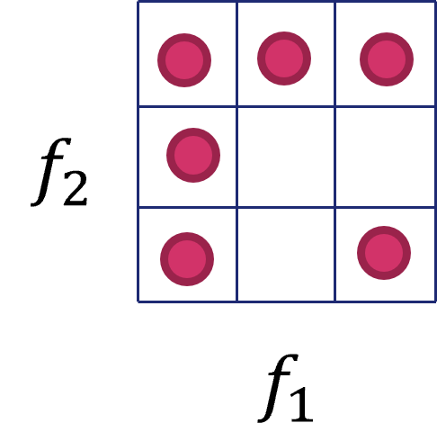
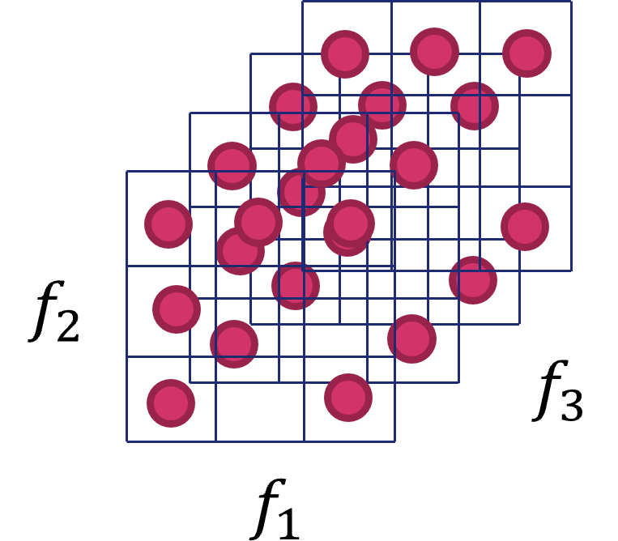

# 3.7 - Sfide aperte nel machine learning

Lo sviluppo e le innovazioni introdotte da machine learning prima, e deep learning dopo, sono in parte motivate dal fallimento degli algoritmi tradizionali nella [generalizzazione](../01_intro/05_generalization.md) su diversi task di intelligenza artificiale. In particolare, la generalizzazione diventa sempre più difficile man mano che si lavora con dati ad elevata dimensionalità, dove i meccanismi tradizionali diventano insufficienti ad apprendere funzioni complesse ed adeguate al problema. Questi spazi, inoltre, spesso impongono l'uso di algoritmi ad alto costo computazionale: in tal senso, i recenti avanzamenti nel deep learning sono stati esplicitamente progettati per superare, tra gli altri, questi ostacoli. Vediamone alcuni

## Curse of dimensionality

Come abbiamo accennato, i problemi di machine learning sono tanto più difficili quanto maggiore è la dimensionalità dei dati. Questo fenomeno è conosciuto come *curse of dimensionality*, ed è legato al fatto che il numero di possibili configurazioni distinte dei dati caratterizzati da un insieme di feature aumenta esponenzialmente man mano che il numero di queste variabili aumenta.

La sfida posta dalla curse of dimensionalità è di tipo squisitamente statistico. Nella pratica, il numero di possibili configurazioni di un dato $x_i$ diventa sempre più grande all'aumentare del numero di feature dello stesso, il che richiede un numero di campioni di training sempre più elevato. Consideriamo ad esempio la situazione mostrata in figura 1, nel quale si mostra uno spazio a due dimensioni, ognuna delle quali rappresenta una possibile feature categorica a tre diversi valori. Come è possibile notare, lo spazio è interamente caratterizzabile da $9$ campioni, per cui un ipotetico modello addestrato su questo dataset avrebbe bisogno di un numero abbastanza ridotto di esempi per avere delle buone performance di generalizzazione.

<figure markdown>
  
  <figcaption>Figura 1 - Possibili combinazioni in un dataset a due dimensioni.</figcaption>
</figure>

Cosa accade aggiungendo un'altra feature, come illustrato in figura 2, con quattro possibili valori? In questo caso, il numero di possibili configurazioni diventa $9 \cdot 4$, ovvero $36$, per cui avremo bisogno di un numero *molto* più elevato di campioni per caratterizzare completamente il nostro spazio delle feature. Trasportando questo problema in $n$ dimensioni, appare chiaro come in questi casi avremo bisogno di un numero estremamente elevato, e potenzialmente non ottenibile, di campioni, il che ci porterà ad addestrare il nostro dataset su una rappresentazione parziale e, giocoforza, *limitata* dello spazio dei dati.

<figure markdown>
  
  <figcaption>Figura 2 - Possibili combinazioni in un dataset a tre dimensioni.</figcaption>
</figure>

Per arginare questo problema, vedremo come sia possibile usare delle tecniche di *feature selection* o *dimensionality reduction*.
