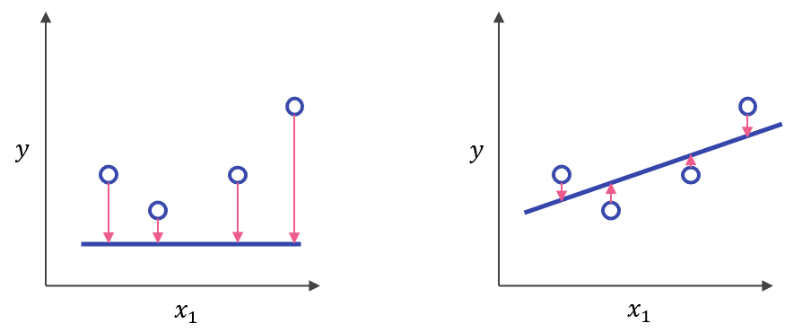
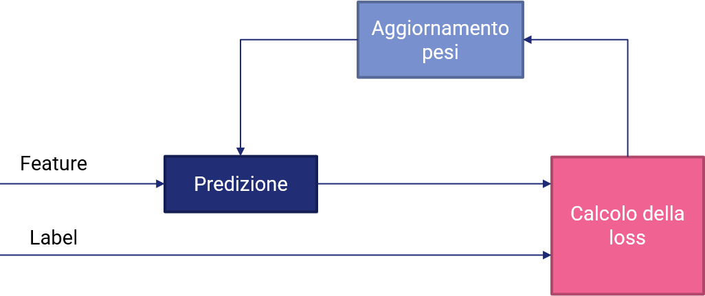
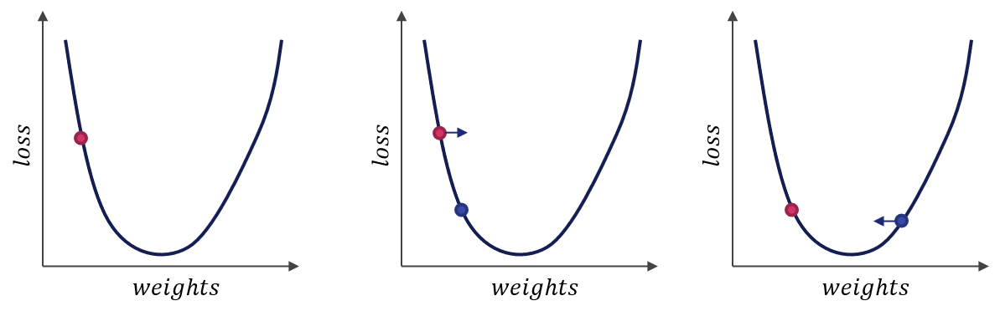

# 16 - Apprendimento supervisionato: la regressione

Quelli di apprendimento supervisionato sono probabilmente tra i sistemi di machine learning più diffusi, soprattutto a causa dei numerosi casi d'uso disponibili. Abbiamo detto che esistono fondamentalmente due tipi di tecniche di apprendimento supervisionato, ovvero *regressione* e *classificazione*. Vediamole maggiormente nel dettaglio.

## 16.1 - Un esempio di regressione

A tutti noi è intuitivamente noto che i millimetri di pioggia che cadono sono in qualche modo correlati alle temperature medie che abbiamo durante la giornata. Immaginiamo quindi di avere un dataset che contenga al suo interno i dati medi sui millimetri di pioggia degli ultimi dieci anni per undici valori differenti di temperatura. Se provassimo a visualizzare i dati mediante un `relplot()`, otterremmo la seguente figura.


Proviamo ad usare la funzione `lmplot()` che, ricordiamo, effettua una *regressione* tra i dati.


## 16.2 - Rappresentazione analitica del modello

Notiamo subito che, come prevedibile, i millimetri di pioggia attesi diminuiscono all'aumentare della temperatura, andando a definire una sorta di *relazione lineare* tra i dati sull'asse delle ascisse (ovvero i gradi) e quelli sull'asse delle ordinate (ovvero la pioggia).

Ovviamente, la retta di regressione non tocca direttamente tutti i punti, ma li *approssima*. Possiamo quindi dire che la relazione tra gradi e mm di pioggia è riconducibile ad una forma del tipo:

$$
y = mx + b
$$

dove:

* $y$ sono i millimetri di pioggia medi caduti nell'arco di tutte le giornate con un dato valore medio di temperatura;
* $x$ è il valore medio di temperatura;
* $m$ è il coefficiente angolare della retta di regressione;
* $b$ è l'incercetta della retta di regressione.

Questa notazione analitica si traduce in un modello usando la seguente notazione:

$$
y' = b + w_1 x_1
$$

dove:

* $y'$ è l'output predetto dal modello;
* $b$ è il *bias*, equivalente al concetto analitico di intercetta;
* $w_1$ è il peso della prima feature, equivalente al concetto analitico di coefficiente angolare;
* $x_1$ è il valore di ingresso assunto dalla prima feature.

Per *inferire* un nuovo valore di $y'$ ci basterà quindi cambiare il valore assunto da $x1$. In pratica, potremo prevedere che per una temperatura di 8 gradi, avremo un valore di precipitazioni pari a 25 mm, mentre per una temperatura di 32 gradi il valore di precipitazioni sarà pari a 0.

!!!note "Nota"
    In questo caso, abbiamo presupposto che vi sia un'unica variabile indipendente, o feature, a determinare il valore dell'output. Esistono ovviamente casi più complessi, nei quali il valore di $y'$ è determinato a partire da più feature come $y' = b + w_1 x_1 + \ldots + w_n x_n$.

## 16.3 - Addestramento e funzione di costo

Addestrare un modello significa fare in modo che determini dei valori ottimali per tutti i pesi ed i bias a partire dagli esempi dotati di label. Per determinare tali valori, i modelli ad apprendimento supervisionato provano ad esaminare iterativamente tutti i campioni presenti nel set di addestramento alla ricerca di un modo per minimizzare un *costo*, il quale rappresenta una certa *penalità* assegnata al modello in caso di predizione errata.

In pratica, il costo (o, in inglese, *loss*) è un numero che determina se la predizione effettuata dal modello su un singolo è stata più o meno conforme alla label assegnata. In caso di predizione perfetta, la loss è pari a $0$; tuttavia, nel caso la predizione sia sbagliata, la loss sarà tanto più grande quanto più il valore predetto sarà divergente dal valore atteso. Proviamo ad interpretare graficamente questo concetto, riferendoci ai modelli di regressione:



In particolare, nella figura precedente, le frecce rappresentano la loss, mentre il segmento blu rappresenta la predizione. Appare evidente come il secondo esempio abbia una loss complessiva inferiore rispetto al primo.

Per calcolare la loss complessiva del modello su un insieme di campioni è possibile utilizzare una *funzione di costo*, o *loss function*. Esistono molteplici esempi di funzioni di costo; tuttavia, uno dei più semplici da comprendere è l'*errore quadratico medio*, calcolato a partire dalla seguente formula:

$$
MSE = \frac{1}{N} \sum_{(x, y) \in D} (y - y')^2
$$

Nella formula precedente:

* $(x, y)$ è una coppia di feature e label;
* $y'$ è il valore predetto della label a partire dall'applicazione del modello;
* $D$ è il nostro dataset etichettato;
* $N$ è il numero di campioni prensenti in $D$.

In pratica, l'MSE è tanto più alto quanto maggiore è la distanza quadratica *complessiva* tra ogni label "vera" ed il rispettivo valore predetto dall'algoritmo di machine learning. Nel caso precedente, è chiaro come l'MSE sia maggiore per la prima approssimazione rispetto alla seconda.

## 16.5 - Addestramento iterativo

Gli algoritmi di machine learning tendono ad essere addestrati seguendo un approccio iterativo, che prevede che al termine di ciascuna iterazione i valori dei pesi siano *aggiornati* in maniera da ridurre ulteriormente il valore della funzione di costo. Questo è riassumibile nel seguente schema:

{: .center}

In pratica, durante l'addestramento, ad ogni iterazione il modello effettua una predizione sulle feature. Questa predizione viene comparata con la label, e la loss viene calcolata. I pesi sono quindi aggiornati in base ad una determinata *regola di ottimizzazione*, ed il ciclo si ripete.

!!!note "Nota"
    Le iterazioni non sono *infinite*: normalmente, si imposta un numero preciso di *epoche di training*, oppure si aspetta che l'algoritmo arrivi ad una sorta di "convergenza", nella quale il valore della loss non decresce ulteriormente.

### 16.5.1 - Ottimizzazione della loss

Abbiamo in precedenza accennato al fatto che l'aggiornamento dei pesi segue una certa regola di ottimizzazione volta a minimizzare la loss. Ne esistono diverse versioni, ma in generale si rifanno al concetto di *discesa di gradiente*, illustrato nella seguente immagine.



Spieghiamo brevemente cosa accade guardando da sinistra verso destra.

Possiamo immaginare la funzione che modella la nostra loss come una sorta di paraboloide, dotato di un valore minimo prossimo allo zero che viene raggiunto in corrispondenza di una determinata combinazione dei valori dei pesi.

Ipotizzando di trovarci all'inizio dell'addestramento nella situazione raffigurata nella figura a sinistra, ovvero con dei pesi nel ramo sinistro del paraboloide, il nostro obiettivo sarà quello di muoverci verso "destra", ovvero verso il minimo globale della funzione. Per farlo, intuitivamente, dovremo valutare la *derivata* o, nel caso di funzioni ad $n$ dimensioni, con $n$ numero di feature, il **gradiente** della nostra funzione di costo, ed aggiornare i pesi in maniera tale che questo assuma, alla successiva iterazione, un valore inferiore.

Questo aggiornamento ci porta alla figura centrale, in cui vediamo che il gradiente si è spostato dal punto rosso al punto blu. In questa iterazione dovremo ancora *aumentare* il valore dei pesi affinchè il valore della funzione di costo diminuisca, portandoci quindi nella situazione raffigurata nella figura a destra.

In quest'ultima situazione vedremo che il segno del gradiente sarà diventato positivo, in quanto ci troveremo su una parte ascendente del paraboloide; di conseguenza, dovremo *diminuire* i pesi per far convergere l'algoritmo.

!!!note "Learning rate"
    Il "quantitativo" di cui sono aggiornati i pesi è spesso denotato come *learning rate*. Un learning rate troppo basso porta ad una convergenza molto lenta dell'algoritmo, che potrebbe "esaurire" le iterazioni prima di arrivare al minimo della funzione di costo. Un learning rate eccessivamente altro potrebbe invece fare in modo che l'algoritmo "salti" da una parte all'altra del minimo, non arrivando neanche in questo caso a convergenza.

!!!note "Minimi locali"
    Il nostro banale esempio presuppone che la funzione di costo non abbia alcun minimo locale. Ciò non è ovviamente vero, e delle scelte sbagliate in termini di punto di partenza o learning rate potrebbero farci finire all'interno di un minimo locale, impedendoci di arrivare a convergenza.

### 16.5.2 - Overfitting e regolarizzazione

Alle volte, accade che il nostro modello sia in grado di arrivare ad una loss estremamente bassa sui dati di training, ma che tuttavia inizia ad aumentare sui dati di validazione, un po' come nella figura successiva:

{: .center}

Ciò può accadere per diversi motivi, come errori nei parametri di addestramento o dati non ben bilanciati. Ad ogni modo, questo fenomeno prende il nome di *overfitting*, e comporta che il modello, che si comporta benissimo sui dati di training, non riesca a *generalizzare*, comportandosi in maniera meno egregia sui dati di validazione. L'overfitting si manifesta all'aumentare delle epoche di training, quando il nostro modello diventa sempre più "complesso", ed apprende sempre meglio a caratterizzare relazioni di complessità crescente intercorrenti tra feature e label.

Per arginare il fenomeno dell'overfitting, oltre ad agire sui dati e sui parametri del modello, si inserisce spesso un termine di *regolarizzazione*, che tende a penalizzare un modello in grado di caratterizzare relazioni eccessivamente complesse. Il termine di regolarizzazione interviene direttamente sul valore trattato dall'ottimizzatore, che non avrà più come unico obiettivo quello di minimizzare la loss, ma quello di *minimizzare congiuntamente la loss e la complessità del modello ottenuto*.

Una funzione di regolarizzazione molto usata è la *regolarizzazione $L_2$*, definita come la somma dei quadrati dei pesi associati alle feature:

$$
L_2 = ||w||_2^2 = w_1^2 + w_2^2 + \ldots + w_n^2
$$

Minimizzare questo termine significa dare meno "importanza" ad alcuni pesi che inficiano la complessità totale del modello. Se, ad esempio, avessimo i seguenti pesi:

$$
{w_1 = 0.1, w_2 = 0.025, w_3 = 0.4, w_4 = 10}
$$

il termine di regolarizzazione $L_2$ diverrebbe pari a:

$$
L_2 = 0.01 + 0,000625 + 0.16 + 100 \sim 100.17
$$

E' evidente come la maggior parte del contributo sia data dal quarto peso, per cui risulta essere necessario diminuirne l'influenza nel modello allo scopo di bilanciare l'overfitting.

## 16.6 La regressione lineare in Scikit Learn

La regressione lineare in Scikit Learn è implementata mediante gli oggetti di classe [`LinearRegression()`](http://scikit-learn.org/stable/modules/generated/sklearn.linear_model.LinearRegression.html) contenuti all'interno del package `linear_model` delal libreria.

Oggetti di questo tipo sono degli estimator, e funzionano in questo modo:

```py
import numpy as np
from sklearn.linear_model import LinearRegression

reg = LinearRegression()
data = np.array([[0, 0], [1, 1], [2, 2]])
reg.fit(data)
```

Nel codice precedente stiamo creando un oggetto di classe `LinearRegression()` ed un array NumPy chiamato genericamente `data`. Per effettuare l'addestramento del nostro modello, dovremo chiamare il metodo `fit` di `reg` passandogli `data`; fatto questo, l'istanza `reg` sarà stata regolarmente addestrata, e sarà pronta per effettuare le predizioni.

In tal senso, dovremo usare il metodo `predict()`:

```py
reg.predict([[4, 4]])
```

Per accedere ai parametri dello stimatore (ovvero al coefficiente angolare ed all'intercetta) dovremo usare gli attributi `coef_` ed `intercept_`:

```py
reg.coef_
```

La classe `LinearRegression()` ci mette a disposizione anche il metodo `score()`, che ci permette di ottenere il coefficiente $R^2$ ottenuto dal modello di regressione. Questo è pari a:

$$
R^2 = (1 - \frac{u}{v})
$$

dove:

* $u$ è pari alla sommatoria dei quadrati dei *residui*, ovvero $\sum (y - y')^2$;
* $v$ è pari alla sommatoria della differenza tra i valori veri ed il valor medio, ovvero $\sum (y - \mu(y))^2$.

Conoscere il valore di $R^2$ è importante per avere un'idea della bontà del modello. Nel caso ideale, infatti, questo valore è $1$, mentre valori inferiori (o addirittura negativi) rappresentano delle possibili criticità del modello.
