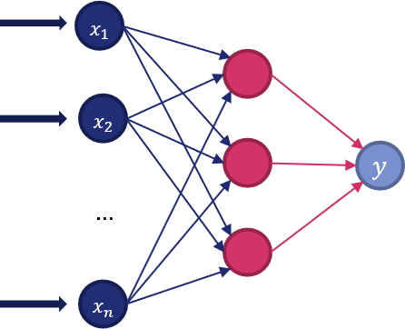

# 19 - Classificatori e regressori

## 19.1 - Alberi decisionali

Gli *alberi decisionali* creano un modello che predice una classe o un valore in output a partire da regole di tipo binario inferite dalle feature dei dati. Per far questo, utilizzano una tecnica chiamata *recursive partitioning*: in pratica, l'insieme di test viene suddiviso imponendo delle soglie sulle diverse variabili, le quali saranno modificate fino a che tutti i dati appartenenti ad una certa classe (o con valori simili di regressione) ricadono all'interno di uno stesso sottoinsieme.

Gli alberi decisionali sono facili da interpretare, in quanto rappresentano una serie di regole binarie: un esempio è mostrato nella seguente figura.

Inoltre, non richiedono particolari accortezze in fase di preparazione dei dati, ed hanno una complessità computazionale di tipo logaritmico (e quindi abbastanza bassa).

Dall'altro lato, però, sono spesso soggetti ad overfitting, ed inoltre non assicurano una predizione continua, ma piuttosto un'approssimazione lineare a tratti.

Scikit Learn implementa due versioni degli alberi decisionali: la prima è dedicata alla classificazione, ed è chiamata [`DecisionTreeClassifier()`](http://scikit-learn.org/stable/modules/generated/sklearn.tree.DecisionTreeClassifier.html), mentre la seconda è orientata alla regressione ed è chiamata [`DecisionTreeRegressor()`](http://scikit-learn.org/stable/modules/generated/sklearn.tree.DecisionTreeRegressor.html).

## 19.2 - Random forest

I *random forest* sono dei metodi *ensemble* basati su alberi decisionali. Un metodo ensemble (letteralmente "insieme") permette di combinare i risultati provenienti da diversi algoritmi, ottenendo in generale risultati migliori.

In particolare, il random forest sfrutta un insieme di alberi decisionali, ognuno dei quali modellato su un sottoinsieme di dati e feature presenti nel set di training; i risultati provenienti da ciascuno degli alberi saranno poi mediati e combinati. La presenza di queste due componenti di casualità permette di raggiungere un obiettivo ben preciso, ovvero diminuire l'overfitting proprio di un singolo albero decisionale, ottenendo un modello generalmente migliore.

Anche per il random forest esistono due versioni, ovvero quella dedicata alla regressione ([RandomForestRegressor()](http://scikit-learn.org/stable/modules/generated/sklearn.ensemble.RandomForestRegressor.html)) e quella dedicata alla classificazione ([RandomForestClassifier()](http://scikit-learn.org/stable/modules/generated/sklearn.ensemble.RandomForestClassifier.html)).

## 19.3 - Multilayer perceptron

Un *multilayer perceptron* è il più semplice modello di rete neurale che è possibile concepire. Nella pratica, è un algoritmo che considera una relazione del tipo:

$$
f:\mathbb{R}^m \rightarrow \mathbb{R}^o
$$

dove $m$ è il numero di input ed $o$ è il numero di dimensioni per l'output. Ad esempio, se avessimo un insieme di feature $X=x_1, x_2, \ldots, x_m$ ed un'output $y$, sia esso una classe o un valore di regressione, il multilayer perceptron apprenderà una funzione $f: \mathbb{R}^m \rightarrow \mathbb{R}^1$.

Una rappresentazione del multilayer perceptron è mostrata nella seguente figura.

Nella pratica, il layer di input (a sinistra) consiste di un insieme di neuroni, uno per ogni feature. Ogni neurone nello strato nascosto trasforma i valori del layer precedente con una sommatoria pesata $w_1 x_1 + \ldots + w_m x_m$ seguita da una funzione di attivazione non lineare del tipo $g: \mathbb{R} \rightarrow \mathbb{R}$.

!!!note "La funzione di attivazione"
    Le funzioni di attivazioni più usate sono state per lungo tempo le sigmoidali e le loro varianti. Vedremo in seguito come negli ultimi anni quelle maggiormente gettonate siano diventate le ReLU.

Nell'ultimo layer, infine, i valori ricevuti dal layer nascosto sono sommati e combinati nell'output.

Ovviamente, Scikit Learn offre due varianti dell'algoritmo, quella per la classificazione ([`MLPClassifier()`](http://scikit-learn.org/stable/modules/generated/sklearn.neural_network.MLPClassifier.html)) e quella per la regressione ([`MLPRegressor()`](http://scikit-learn.org/stable/modules/generated/sklearn.neural_network.MLPRegressor.html))
