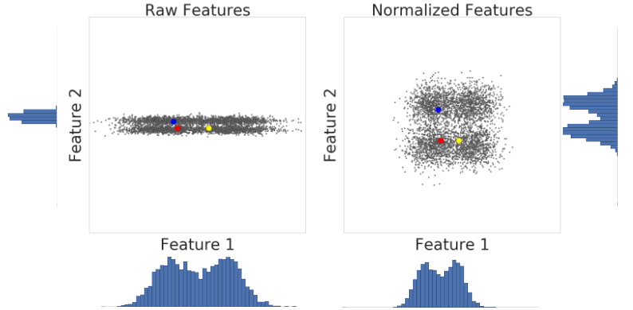

Supponiamo di stare apprendendo delle cose su qualcosa, magari sulla musica. UN approccio potrebbe essere vedere dei gruppi o delle collezioni significativi. Potremmo voler organizzare la musica per genere, mentre i nostri amici organizzano la musica per decadi. Come scegliamo i gruppi di oggetti ci aiuta a capire più di questi come parti individuali della musica. POtremmo vedere che abbiamo un'affinità abbastanza profonda con il punk rock e andare a suddividere ulterioremente il genere in diversi approcci o in musica da diverse località. D'altro canto, il nostor amico potrebbe vedere alla musica degli anni 80 ed essere in grado di capire come la musica a quell'epoca influenzava il clima sociale e politico. In entmrabi i casi, sia noi sia il nostro amico abbiamo appreso qualcosa di interessante sulla musica, anche se abbiamo considerato diversi approcci.

Anche nel machine learning, spesso categorizziamo i campioni come primo passo per comprendere un soggeto (il dataset). Raggruppare degli esempi senza label è chiamato *clustering*. 

Dato che gli esempi non hanno una label, il clustering si affida all'apprendimento non supervisionato. Se gli esempi fossero etichettati, allora il clustering diventerebbe *classificazione*.

pirma di raggrupapre tra loro campioni simili, dovremmo per prima cosa trovare il concetto di similitudine. Possiamo misurare la somiglianza tra gli esempi combiando i dati delle feature in una metrica chiamata *similarity measure*. Quano ogni campione è definito da uno o due feature, è facile misurare la similarità. Ade sempio, possiamo trovare dei libri simili a seconda degli autori. Man mano che il numero di feature aumetnta, creare una misura di simiglianza diventa più complesso. Vedremo dopo come creare una misura di somiglianza in diversi scenari.

## quali sono le applicazioni del clustering?

Il clustering ha una miriade di usi in diverse industrie. Alcune applicazioni comuni per il clustering includono le seguenti:

* segmentazione del mercato
* analisi delle reti sociali
* segmentazione delle immagini
* individuazione di anomalie

Dopo il clustering, ad ogni cluster viene assegnato un numero chiamato *cluster ID*. ORa, possiamo condensare l'intero isieme delle feature per esempio nel suo cluster ID. Rappresentare un esempio complesso mediante un unico ID rende il clustering estremamente potente. Estendendo l'idea, il clustering di dati può semplificare i grossi dataset.

ad esempio, possiamo raggruppare gli oggetti secondo diverse feature, come dimostrato nei seguenti esempi:

* raggruppare le stelle per luminosità
* raggruppare i documenti per topic

i sistemi di machine learning possono usare uesti ID per semplificare l'elaborazione di grossi dataset. Quindi, l'output del clustering serve come dei feature data per i sistemi ML in uscita.

## generalizzaizoni

quando alcuni campioni in un cluster hanno delle feature mancanti, possiamo inferire i dati mancanti da altri esempi nel cluster. 

## data compression

abbiamo detto che i feature data per tutti i campioni in un cluster possono essere rimpiazzati a partire dall'ID del cluster. questo rimpiazzo semplifica la feature data, e risparmia memoria. Questi benefici potrebbero diventare significativi quando si scala su grossi dataset. Inoltre, i sistemi di machine learning possono usare il cluster ID come ingresso invece dell'intero dataset delle feature. Ridurre la complessità dei dei dati di input rende il modello di machine learning semplice e veloce.

## tipi di clustering

quando scegliamo un algoritmo di clustering, dobbiamo considerare se il nostro algoritmo è in grado di essere scalabile a sufficienza per il nostro dataset. I dataset nel machine learning possono avere milioni di esempi, ma non tutti gli algoritmi di clustering sono in grado dis calare in maniera efficace. Molti algoritmi di clutering funzionano calcolando le similarità tra tutte le coppie di esempi. Questo significa che il lroo runtiem aumenta come il quadrato del numero di campioni $n$, ovvero $O(n^2)$. Un buon algoritmo per iniziare è invec il k-means, che ha un $O(n)$, il che significa che scala linearmente con $n$.

### centrod-based clustering

Il centroid-based clustering organizza i dati in cluster non gerarchici. Il k-means è la tecnica più usata in tal senso. Questo tipo di algoritmi è molto efficace, ma è sensibile alle condizioni inzialie ed agli outliers.

### dnesity based

il cluster density based connette aree di campioni ad alta densità in cluster. Questo permette a distribuzioni a forma arbitraria di essere connesse fino a che sono dense. Questi algoritmi hanno delle difficoltà con dati con densità variabili ed a alta dimensionalità. Inoltre, questi algoritmi non assegnano gli outlier ai cluster per questioni di design.

## distribution-based

questo approccio alclustering assume che i dati siano composti da distribuzioni come quelli gaussiana. Ad esempio, l'algoritmo in ifgura mostra tre cluster basati su tre distribuzioni gaussiane. Man mano che la distanza dal centro della distribuzione aumenta, la probabilità che un punto appartenga alla distribuzione decresce. Quando non sappiamo il tipo di distribuzione nei dati, dovremmo scegliere un algoritmo differente.

### hierarchical

il clustering gerarchico crea un albero di cluster. In maniera non sorprendente è adatto a dati gerarchici, come le tassonomie. Inoltre, un piccolo numreo di cluster può esserescelto tagliando l'albero al livello giusto.

## workflow del clustering

per effettuare il clustering, dobbiamo:

### preparare i dati

così come negli altri problemi di machine learnning, dobbiamo normalizzare, scalare e trasformare le feature. quando si effettua il clustering, tuttavia, occorre assicurarsi del fatto che i dati preparati ci permettano di calcolare in maniera accurata la similarità tra i campioni.
## preparazione dei dati

nel clustering, si calcola la similarità tra due campioni combinando tutti i dati per questi campioni in un singolo valore numerico. Combinare i dati delle feature richiede che questi abbiano la stessa scala. vedremo quindi come normalizzare, trasformare e creare quanitli, e discuteremo perché i quantili sono la migliore scelta di defautl per trasformare una qualsiasi distribuzione dati.

### normaalizzazione dei dati

possiamo trasformare id ati per più feature nella stessa scal normalizzandoli. La normalizzazione viene normalmente effettuata calcolando lo z-score di una distribuzione, che ricordiamo essere pari a:

$$
x' = \frac{x - \mu}{\sigma}
$$

Diamo un'occhiata alla similarità tra compioni con e senza la normalizzazione. Nella figura a sinistra, vediamo che il rosso sembra essere più simile al blu rispetto al giallo. Tuttavia, le feature sll'asse x e sull'asse y non hanno la stssa scala. Quindi, lla similarità osservata può essere un artefatto dovuto ai dati non scalati. Dopo la normalizzazione mediante z-score, tutte le feature hanno la stessa scala. Adesso, vediamo che il rosso è in realtà più simile al giallo., Quidni, dopo aver normalizzto i dati, possiamo calcolare la similarità in maniera più accurata.

### creare una metrica di similiartà

prima che un algoritmo di clustering possa raggruppare i dati, deve sapere come individuare le coppie di esempi simili. Quantifichiamo la similarità tra i campioni creando una metrica di similiarità. Questo richiede di comprendere i dati e come derivare la similarità a partire dalle nostre feature.

le metriche di similarità possono essere generate a partire dai singoli dati oppure a partire da rappresentazioni sintetiche dei dati.e Ad esempio, se stessimo comparando due paia di scarpe, e considerassimo come feature soltanto la taglia ed il prezzo, potremmo usare la distanza euclidea:

$$
d = (t_1 - t_2)^2 + (p_1 - p_2)^2
$$

Nel momento in cui consideriamo però dati multidimensionali può essere saggio effettuare una comparazione non direttamente tra tutte le feature di due dati ma tra delle rappresentazioni notevoli degli stessi, come ad esempio quelle estratte da operazioni di feature seleciotn o da degli embeddings di reti neurali.

### eseguire gli algoritmi di clustering

un algoritmo di clustering usa la metrica di simialrità per effettuare il clustering dei dati.

vediamo il k-means

Il k-means raggruppa i punti in $k$ cluster minimizzando le distanze tra i putni ed il *centroide* del clustrer, ovvero la media di tutti i  punti nel cluster.

Prima di iniziare, dobbiamo scegliere il numero di clsuter, $k$. Inizialmente possiamo fare una stima iniziale per il valroe di $k$, per poi rifinirlo.

Al primo step, l'algopritmo sceglie casualmente un centroide per ogni cluster.  Se ad esempio scegliessimo $k=3$, l'algortimo sceglierebbe casualmente tre centroidi.

Al secondo step, l'algoritmoa ssegna ogni punto al centroide più vicino per ottenere i $k$ cluster iniziali.

Al terzo step, pèer ogni cluster, l'algoritmo ricalcola il cnetroide prendendo la media di tutti i punti nel cluster. Dal momento che il centroide tende a cambiare, l'algoritmo riassegna i putni al centroide più vicino.

L'algoritmo reitraera questa procedura fino a che i punti non si stabilizzano, o fino a che non si stoppa manualmente l'algoritmos tesso.

### interpretare risultati e modificare

controllare la qualità dell'output del clustering è un processo iterativo ed esplorativo in quanto il clustering non ha a disposizione delle label per verificare l'output. Di conseguenza, verifichiamo i risultati manualmente, e migliorare i risultati richiede un approccio di tipo iterativo.

Step One: Quality of Clustering
Checking the quality of clustering is not a rigorous process because clustering lacks “truth”. Here are guidelines that you can iteratively apply to improve the quality of your clustering.

First, perform a visual check that the clusters look as expected, and that examples that you consider similar do appear in the same cluster. Then check these commonly-used metrics as described in the following sections:

Cluster cardinality
Cluster magnitude
Performance of downstream system

Cluster cardinality

Cluster cardinality is the number of examples per cluster. Plot the cluster cardinality for all clusters and investigate clusters that are major outliers. For example, in Figure 2, investigate cluster number 5.

A barchart showing the magnitude of
          several clusters. One cluster has significantly higher magnitude
                                            than the other clusters.Figure 3: Magnitude of several clusters.
Cluster magnitude

Cluster magnitude is the sum of distances from all examples to the centroid of the cluster. Similar to cardinality, check how the magnitude varies across the clusters, and investigate anomalies. For example, in Figure 3, investigate cluster number 0.

A scatter plot showing
          the cardinality versus magnitude for several clusters. One
          cluster is an outlier on the plot.Figure 4: Cardinality vs. Magnitude of several clusters.
Magnitude vs. Cardinality

Notice that a higher cluster cardinality tends to result in a higher cluster magnitude, which intuitively makes sense. Clusters are anomalous when cardinality doesn't correlate with magnitude relative to the other clusters. Find anomalous clusters by plotting magnitude against cardinality. For example, in Figure 4, fitting a line to the cluster metrics shows that cluster number 0 is anomalous.

Performance of Downstream System

Since clustering output is often used in downstream ML systems, check if the downstream system’s performance improves when your clustering process changes. The impact on your downstream performance provides a real-world test for the quality of your clustering. The disadvantage is that this check is complex to perform.

Questions to Investigate If Problems are Found

If you find problems, then check your data preparation and similarity measure, asking yourself the following questions:

Is your data scaled?
Is your similarity measure correct?
Is your algorithm performing semantically meaningful operations on the data?
Do your algorithm’s assumptions match the data?
Step Two: Performance of the Similarity Measure
Your clustering algorithm is only as good as your similarity measure. Make sure your similarity measure returns sensible results. The simplest check is to identify pairs of examples that are known to be more or less similar than other pairs. Then, calculate the similarity measure for each pair of examples. Ensure that the similarity measure for more similar examples is higher than the similarity measure for less similar examples.

The examples you use to spot check your similarity measure should be representative of the data set. Ensure that your similarity measure holds for all your examples. Careful verification ensures that your similarity measure, whether manual or supervised, is consistent across your dataset. If your similarity measure is inconsistent for some examples, then those examples will not be clustered with similar examples.

If you find examples with inaccurate similarities, then your similarity measure probably does not capture the feature data that distinguishes those examples. Experiment with your similarity measure and determine whether you get more accurate similarities.

Step Three: Optimum Number of Clusters
k-means requires you to decide the number of clusters  beforehand. How do you determine the optimal value of ? Try running the algorithm for increasing  and note the sum of cluster magnitudes. As  increases, clusters become smaller, and the total distance decreases. Plot this distance against the number of clusters.

As shown in Figure 4, at a certain , the reduction in loss becomes marginal with increasing . Mathematically, that's roughly the  where the slope crosses above -1 (). This guideline doesn't pinpoint an exact value for the optimum  but only an approximate value. For the plot shown, the optimum  is approximately 11. If you prefer more granular clusters, then you can choose a higher  using this plot as guidance.
