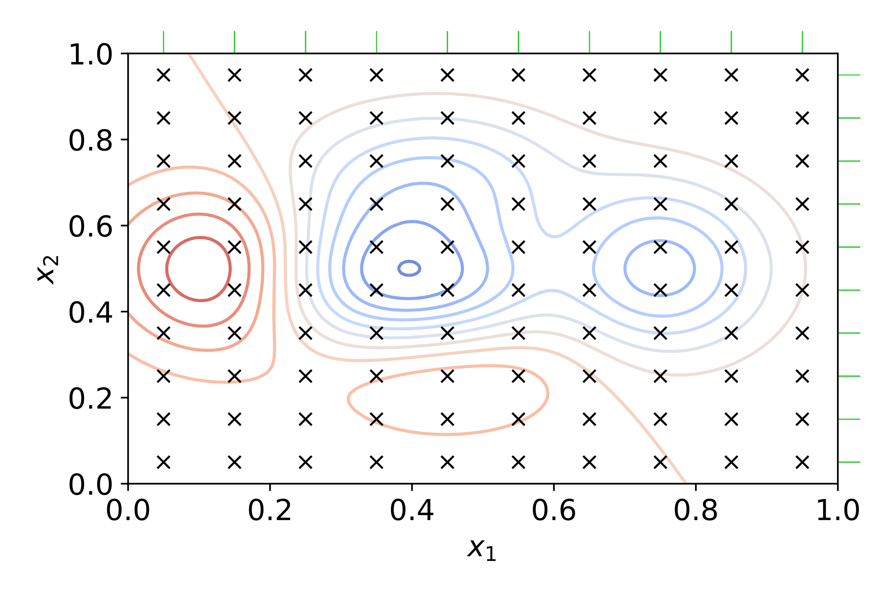

# 22 - Scikit Learn: Tips & Tricks

In questa lezione vedremo alcuni concetti e costrutti che ci permettono di semplificarci la vita nell'utilizzo di Scikit Learn.

## 22.1 - Pipeline

Finora abbiamo visto gli algoritmi come dei singoli blocchi a sè stanti. Tuttavia, spesso questo non corrisponde a ciò che accade nella realtà: infatti, si parla di *processing pipeline*, intesa come sequenza di più algoritmi e metodi da applicare per trasformare dei dati e portarli all'elaborazione.

In tal senso, potremmo decidere di applicare "a cascata" diversi transformer e stimatori oppure, in maniera più compatta, sfruttare le potenzialità offerte dalla classe [`Pipeline()`](http://scikit-learn.org/stable/modules/generated/sklearn.pipeline.Pipeline.html) di Scikit Learn.

Per capire come questa funziona, facciamo un esempio. Immaginiamo di fare in modo che ad un algoritmo di clustering segua uno step di normalizzazione usando uno standard scaler. Abbiamo in tal senso due possibilità.

La prima è quella di usare il transformer e lo stimatore in cascata:

```py
from sklearn.cluster import KMeans
from sklearn.datasets import make_blobs
from sklearn.preprocessing import StandardScaler

X, y = make_blobs()
scaler = StandardScaler()
X_new = scaler.fit_transform(X)
kmeans = KMeans()
kmeans.fit_predict(X_new)
```

L'altra è quella di utilizzare un oggetto di tipo `Pipeline()`, che ci permette di indicare i singoli step da seguire nella nostra linea di elaborazione dati:

```py
from sklearn.pipeline import Pipeline

pipe = Pipeline(steps=[
    ('scaler', StandardScaler()),
    ('kmeans', KMeans())
])

pipe.fit_predict(X)
```

!!!note "Nota"
    Notiamo come l'oggetto di classe `Pipeline()` implementi nativamente i metodi `fit`, `predict` e `transform` (più altri) per permettere l'uso di pipeline in cui lo step finale è un transformer o uno stimatore.

### 22.1.1 - Accesso e modifica dei parametri degli stimatori

Possiamo accedere ed impostare manualmente i parametri dei singoli stimatori e transformer dall'interno della pipeline.

Questo può essere fatto al momento dell'inizializzazione:

```py
pipe = Pipeline(steps=[
    ('scaler', MinMaxScaler(range=(0, 2))),
    ('kmeans', KMeans(n_clusters=3))
])
```

oppure successivamente mediante il comando `set_params` e la notazione `stimatore__parametro`:

```py
pipe.set_params(kmeans__n_clusters=4)
```

Possiamo anche accedere al singolo stimatore come se la pipeline fosse un dizionario:

```py
pipe['kmeans']
```

## 22.2 - ColumnTransformer

Abbiamo visto come i dataset che utilizziamo non abbiano sempre dati di tipo uniforme (ad esempio, tutti numerici o categorici), e che alle volte sia necessario applicare differenti trasformazioni a feature differenti.

Così come la pipeline di processing, anche questa operazione può essere svolta una feature alla volta o, in maniera *estremamente più semplice*, creando un oggetto di classe [`ColumnTransformer()`](http://scikit-learn.org/stable/modules/generated/sklearn.compose.ColumnTransformer.html).

Immaginiamo ad esempio di dover trasformare tutte le colonne del dataset tips, normalizzando quelle numeriche ed usando un `OrdinalEncoder()` per le categoriche. Per farlo, possiamo usare un `ColumnTransformer()` in questo modo:

```py
import seaborn as sns
from sklearn.compose import ColumnTransformer
from sklearn.preprocessing import OrdinalEncoder, StandardScaler

tips = sns.load_dataset('tips')
ct = ColumnTransformer(
    [('scaler', StandardScaler(), ['total_bill', 'tip']),
     ('encoder', OrdinalEncoder(), ['sex', 'smoker', 'day', 'time'])],
    remainder='passthrough'
)

ct.fit(tips)
ct.transform(tips)
```

!!!note "Nota"
    Il `ColumnTransformer()` lavora sui dataframe.

Possiamo anche combinare il concetto di `ColumnTransformer()` con quello di `Pipeline()`, usando al posto di un singolo transformer una pipeline di transformer. Ad esempio, se volessimo assegnare i dati mancanti usando un `SimpleImputer()` prima dello scaling, potremmo usare una pipeline da passare al transformer:

```py
from sklearn.impute import Imputer

numerical_transformer = Pipeline(
    [('imputer', SimpleImputer()),
    ('scaler', StandardScaler())]
)

ct = ColumnTransformer(
    [('scaler', numerical_transformer, ['total_bill', 'tip']),
     ('encoder', OrdinalEncoder(), ['sex', 'smoker', 'day', 'time'])],
    remainder='passthrough'
)
```

!!!note "Nota"
    Ovviamente, anche un `ColumnTransformer()` può essere usato in una pipeline!

## 22.3 - Crossvalidazione

Quando abbiamo parlato di preparazione dei dati abbiamo visto come sia necessario [suddividere gli stessi in due insiemi]((../14_data_prep/lecture.md#1424---suddivisione-dei-dati)), ovvero quello di training e quello di validazione, allo scopo di assicurarsi che il modello sia in grado di generalizzare.

Tuttavia, questa procedura spesso non è sufficiente, perché all'interno dei dati di training o testing, anche se scelti con meccanismi casuali, è possibile che siano presenti dei particolari meccanismi di generazione *propri di quel sottinsieme*. In altre parole, c'è il rischio che l'algoritmo vada comunque in overfitting sui dati di training!

Per ovviare a questa evenienza, molto spesso non ci si limita ad un'unica iterazione di addestramento, ma si effettua la procedura chiamata *$k$-fold cross validation*. La cross validation consiste di $k$ iterazioni, e prevede che l'intero set di dati sia suddiviso in $k$ porzioni, ognuna delle quali sarà usata ad ogni iterazione come test set, mentre la restante parte del dataset sarà utilizzata per il training. Dopo $k$ iterazioni, i risultati saranno quindi mediati tra loro, ed il modello risulterà essere più robusto all'overfitting. Questa procedura è descritta graficamente nella seguente immagine (presa direttamente dalla documentazione di Scikit Learn).


Ovviamente, in Scikit Learn è possibile effettuare la procedura di cross validazione utilizzando la funzione [`cross_validate()`](https://scikit-learn.org/stable/modules/generated/sklearn.model_selection.cross_validate.html), che permette di effettuare $k$ round di cross-validazione di un algoritmo su un dataset.

```py
from sklearn.model_selection import cross_validate

kmeans = KMeans()
cross_validate(kmeans, X, y, scoring=['adjusted_rand_score', 'adjusted_mutual_info_score'])
```

Se ci si vuole concentrare su un'unica metrica, si può usare la funzione [`cross_val_score()`](https://scikit-learn.org/stable/modules/generated/sklearn.model_selection.cross_val_score.html#sklearn.model_selection.cross_val_score):

```py
from sklearn.model_selection import cross_val_score

cross_val_score(kmeans, X, y, scoring='adjusted_rand_score')
```

Infine, possiamo usare la funzione [`cross_val_predict()`]() per ottenere i valori predetti a valle della cross-validazione:

```py
from sklearn.model_selection import cross_val_predict

cross_val_predict(kmeans, X, y)
```

## 22.4 - Ottimizzazione degli iperparametri

Le funzioni che abbiamo visto finora hanno due problemi.

Il primo è che le funzioni di cross-validazione non restituiscono uno stimatore fittato, mentre il secondo è che la valutazione di diversi iperparametri è delegata manualmente all'utente. Per ovviare a questi problemi, esistono delle tecniche di *ottimizzazione degli iperparametri*, che permettono di esplorare una serie di valori per ogni parametro dell'algoritmo selezionato, valutando la combinazione degli stessi che produce i risultati migliori.

### 22.4.1 - Tecniche di ottimizzazione degli iperparametri: la grid search

Esistono numerose tecniche di ottimizzazione degli iperparametri; in questo frangente, valuteremo la più semplice di tutte, ovvero la *grid search* (traducibile in italiano con "ricerca a griglia").



La tecnica della grid search è schematizzata nella precedente immagine. Immaginiamo per semplicità che il nostro algoritmo abbia soltanto due possibili parametri, e che tutti i possibili valori che vogliamo esplorare possano essere disposti lungo una griglia. All'interno di questa, i valori di una metrica a nostra scelta (ad esempio, l'accuratezza) si andranno a disporre secondo picchi e valli; il nostro obiettivo, in questo specifico caso, è ovviamente trovare il massimo picco della funzione che correla i valori dei parametri con l'accuratezza. Per farlo, la grid search prova ad eseguire l'algoritmo sui dati di training *per ogni combinazione di parametri*, fino a trovare la migliore possibile.

Scikit Learn implementa oggetti di classe [`GridSearchCV()`](http://scikit-learn.org/stable/modules/generated/sklearn.model_selection.GridSearchCV.html), che prendono uno stimatore (o una pipeline), effettuano la crossvalidazione sui dati, e restituiscono quello con i parametri migliori dopo l'addestramento. Ad esempio:

```py
from sklearn.model_selection import GridSearchCV

parameters = {
    'n_clusters': [3, 4, 5]
}
kmeans = KMeans()
est = GridSearchCV(kmeans, parameters)
est.fit(X)
```

E' anche possibile usare la grid search in combinazione con con una pipeline.

```py
from sklearn.model_selection import GridSearchCV
from sklearn.decomposition import PCA

pipe = Pipeline([
    ('pca', PCA()),
    ('kmeans', KMeans())
])

param_grid = {
    'pca__n_components': [2, 3],
    'kmeans__n_clusters': [3, 4, 5]
}

est = GridSearchCV(pipe, param_grid)
est.fit(X)
```

## 22.5 - Feature selection

Concludiamo con un breve cenno alle tecniche di feature selection, che ci permettono di isolare le feature maggiormente significative all'interno del nostro dataset, scartando le altre. In tal senso, Scikit Learn ci offre un intero package, ovvero il `feature_selection`, operante in tal senso.
