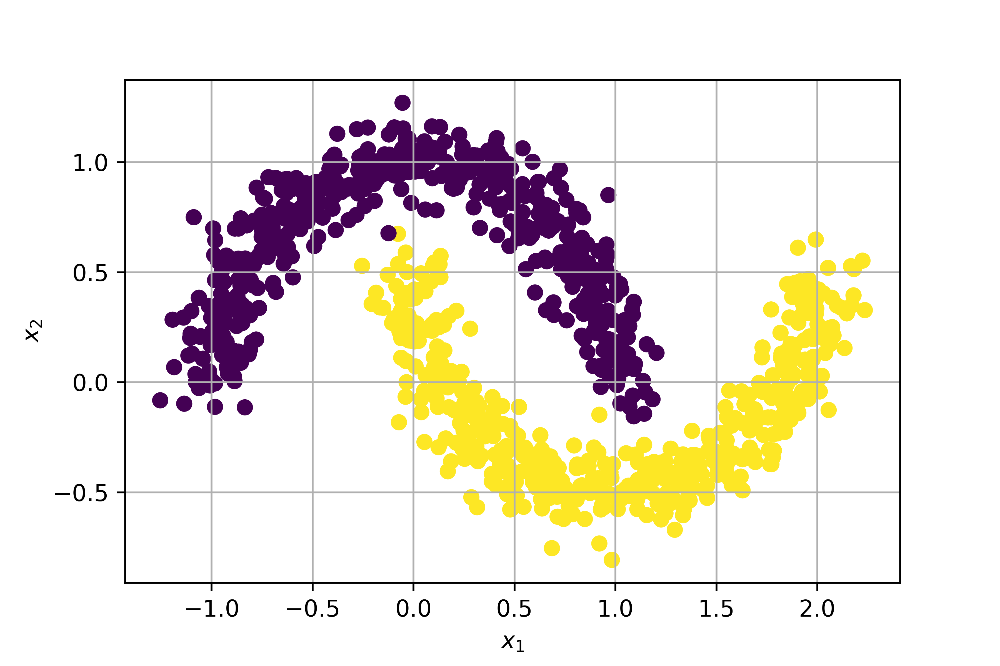
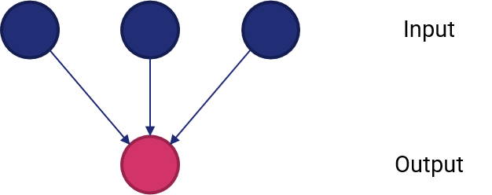
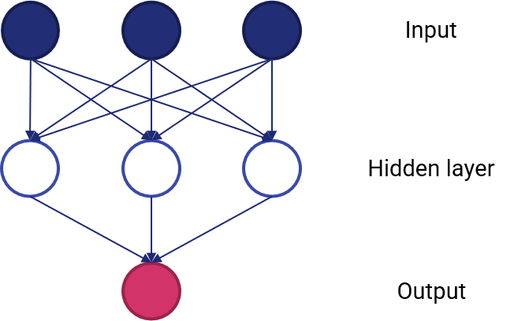

# 25 - Anatomia di una rete neurale

Le reti neurali sono ormai sulla bocca di tutti: chiunque le usa per risolvere con successo ogni tipo di problema. Tuttavia, il passo giusto prima di usarle è quello di comprendere effettivamente a cosa servono: in tal senso, introduciamo il concetto di *problema non lineare*.

## 25.1 - Problemi non lineari

Diamo un'occhiata al dataset rappresentato nella figura 25.1.

<figure markdown>
  { width="450" }
  <figcaption>Figura 25.1 - Dataset non lineare</figcaption>
</figure>

Questo dataset è evidentemente *non lineare*: in pratica, questo significa che non esiste un algoritmo in grado di separare in maniera lineare le due classi tra loro o, in termini matematici, non esiste un modello in forma:

$$
y = ax_1 + bx_2 + c
$$

che permetta di determinare $y$ a partire dalle feature $x_1$ ed $x_2$.

!!!tip "Numero di feature"
    Ovviamente, se il numero di feature fosse più elevato, il sommatore lineare dovrebbe considerare un maggior numero di variabili indipendenti.

I lettori più audaci potrebbero provare ad usare delle approssimazioni lineari a tratti. Costoro dovrebbero considerare la figura 25.2.

<figure markdown>
  { width="450" }
  <figcaption>Figura 25.2 - Dataset *estremamente* non lineare</figcaption>
</figure>

## 25.2 - Reti neurali e problemi non lineari

Per capire come le reti neurali ci aiutano a modellare un problema non lineare, visualizziamo un semplice sommatore pesato.

<figure markdown>
  { width="450" }
  <figcaption>Figura 25.3 - Un sommatore lineare</figcaption>
</figure>

In questo semplice caso abbiamo tre input ed un output. Proviamo ad aggiungere un ulteriore strato.

<figure markdown>
  { width="450" }
  <figcaption>Figura 25.4 - Un sommatore lineare a più strati</figcaption>
</figure>

Lo strato che abbiamo aggiunto è detto *nascosto*, e rappresenta una serie di valori intermedi considerati dal sommatore nel calcolo dell'uscita. Quest'ultima non sarà più una somma pesata degli input, ma *una somma pesata dei valori in uscita dallo strato nascosto*, che a loro volta sono dipendenti dall'input.

Tuttavia, il modello *rimane lineare*: potremo aggiungere un numero arbitrario di strati nascosti, ma questo sarà sempre vero, a meno che non si usi una particolare funzione, detta di *attivazione*.

### 25.2.1 - Funzioni di attivazione

La modellazione di un problema non lineare prevede l'introduzione di (appunto) non linearità all'interno del modello. Nella pratica, potremo inserire delle opportune funzioni non lineari tra i diversi strati della rete. Queste funzioni sono dette *di attivazione*.

<figure markdown>
  { width="450" }
  <figcaption>Figura 25.5 - Semplice rete neurale con funzioni di attivazione</figcaption>
</figure>

Ovviamente, con un maggior numero di strati nascosti, l'impatto delle non linearità diventa maggiore: in questo modo, saremo in grado di inferire delle relazioni anche molto complesse tra gli input e gli output (predetti).

Le funzioni di attivazione più utilizzate in passato erano di tipo sigmoidale (simili, per intenderci, alla funzione che abbiamo visto in uscita alla regressione logistica). Attualmente, le funzioni più usate sono le *rectified linear unit*, o *ReLU*, che hanno risultati comparabili in termini di accuratezza del modello alla sigmoidale, ma risultano essere significativamente meno complesse dal punto di vista computazionale.

Le ReLU sono espresse dalla seguente funzione:

$$
y = max(0, x)
$$

che graficamente si traduce in una forma espressa come:

<figure markdown>
  { width="450" }
  <figcaption>Figura 25. - ReLU</figcaption>
</figure>

!!!tip "ReLU nella pratica"
    In pratica, una ReLU "fa passare" soltanto i valori positivi, portando a zero tutti quelli negativi.

Riassumendo:

* una rete neurale è data da un insieme di nodi, o *neuroni*, organizzati in uno o più *strati*;
* ogni neurone è connesso a quelli dello strato successivo mediante dei *pesi*, che rappresentano la "forza" della connessione;
* esiste una funzione di attivazione che trasforma l'uscita di ogni neurone verso lo strato successivo inserendo delle non linearità.
