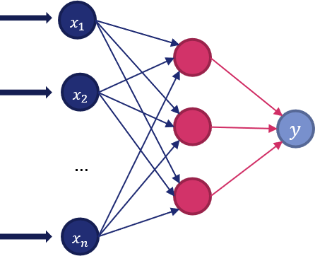

# 4.3.2 - Classificatori e regressori

!!!tip "Notebook di accompagnamento"
	Per questa lezione esiste un *notebook di accompagnamento*, reperibile a [questo indirizzo](https://github.com/anhelus/pcs-exercises/blob/master/02_ml/03_estimator/02_clf_rgr.ipynb).

## Alberi decisionali

Scikit-Learn implementa due versioni degli alberi decisionali: la prima è dedicata alla classificazione, ed è chiamata [`DecisionTreeClassifier()`](http://scikit-learn.org/stable/modules/generated/sklearn.tree.DecisionTreeClassifier.html), mentre la seconda è orientata alla regressione ed è chiamata [`DecisionTreeRegressor()`](http://scikit-learn.org/stable/modules/generated/sklearn.tree.DecisionTreeRegressor.html).

In entrambi i casi, l'interfaccia per utilizzare l'albero decisionale è quella comunemente offerta dagli stimatori di Scikit-Learn:

```py
from sklearn.tree import DecisionTreeClassifier

dt = DecisionTreeClassifier()
dt.fit(X_train, y_train)
y_pred = dt.predict(X_train)
```

Da notare che, una volta addestrato, è possibile mostrare a schermo l'albero decisionale mediante la funzione [`plot_tree`](https://scikit-learn.org/stable/modules/generated/sklearn.tree.plot_tree.html#sklearn.tree.plot_tree):

```py
from sklearn.tree import plot_tree

plot_tree(dt)
```

Da notare che Scikit-Learn offre supporto *nativo* ai problemi multi-output.

##### Consigli pratici sull'utilizzo degli alberi decisionali

1. Gli alberi decisionali tendono all'overfitting in presenza di un elevato numero di feature. In questo caso, può essere utile utilizzare tecniche di riduzione della dimensionalità o di feature selection.
2. Visualizzare e comprendere la struttura del nostro albero ci può dare dei suggerimenti su come l'albero sta effettuando le predizioni.
3. Dato che il numero di campioni richiesti per popolare l'albero raddoppia ad ogni livello, è necessario impostare opportunamente il parametro `max_depth` per prevenire l'overfitting.
4. I parametri `min_samples_leaf` e `min_samples_split` controllano quali percorsi saranno considerati dall'albero. In particolare, va scelto un numero adeguato, in quanto un valore troppo piccolo potrà condurre verso l'overfitting, mentre un valore troppo elevato potrebbe impedire all'albero di apprendere correttamente.
5. Fornire un dataset bilanciato può condurre verso risultati migliori.

## Random forest

I *random forest* sono dei metodi *ensemble* basati su alberi decisionali. Un metodo ensemble (letteralmente "insieme") permette di combinare i risultati provenienti da diversi algoritmi, ottenendo in generale risultati migliori.

In particolare, il random forest sfrutta un insieme di alberi decisionali, ognuno dei quali modellato su un sottoinsieme di dati e feature presenti nel set di training; i risultati provenienti da ciascuno degli alberi saranno poi mediati e combinati. La presenza di queste due componenti di casualità permette di raggiungere un obiettivo ben preciso, ovvero diminuire l'overfitting proprio di un singolo albero decisionale, ottenendo un modello generalmente migliore.

Anche per il random forest esistono due versioni, ovvero quella dedicata alla regressione ([RandomForestRegressor()](http://scikit-learn.org/stable/modules/generated/sklearn.ensemble.RandomForestRegressor.html)) e quella dedicata alla classificazione ([RandomForestClassifier()](http://scikit-learn.org/stable/modules/generated/sklearn.ensemble.RandomForestClassifier.html)).

L'utilizzo di un random forest è analogo a quello degli altri stimatori:

```py
from sklearn.ensemble import RandomForestClassifier

rf = RandomForestClassifier()
rf.fit(X_train, y_train)
y_pred = rf.predict(X_train)
```

##### Extremely Randomized Trees

Scikit-Learn offre un'ulteriore variante di random forest, chiamata *Extremely Randomized Trees*. In questo tipo di foresta decisionale, viene inserito un ulteriore elemento di casualità legato a come vengono calcolate le regole per lo split dei dati: infatti, viene scelto un insieme casuale di soglie, a partire dal quale viene individuata quella che garantisce la maggior discriminatività.

Questo tipo di foresta è utilizzabile usando le classi [`ExtraTreesClassifier()`](https://scikit-learn.org/stable/modules/generated/sklearn.ensemble.ExtraTreesClassifier.html#sklearn.ensemble.ExtraTreesClassifier) ed [`ExtraTreesRegressor()`](https://scikit-learn.org/stable/modules/generated/sklearn.ensemble.ExtraTreesRegressor.html#sklearn.ensemble.ExtraTreesRegressor); l'utilizzo è analogo al classico random forest.

```py
from sklearn.ensemble import ExtraTreesClassifier

et = ExtraTreesClassifier()
et.fit(X_train, y_train)
y_pred = et.predict(X_train)
```

##### Parametri di un random forest

I principali parametri da impostare per le foreste casuali sono `n_estimators` e `max_features`. Come suggerisce il nome, il primo rappresenta il numero di stimatori nella foresta che, idealmente, dovrebbe essere quanto più elevato possibile, ovviamente al costo di una maggiore complessità computazionale. Il parametro `max_features`, invece, rappresenta il sottoinsieme casuale di feature da considerare quando si suddivide un nodo: considerarne un numero limitato permette di ridurre la varianza dei risultati, ma introduce anche un bias legato alle feature selezionate. Valori sperimentalmente buoni per `max_features` sono:

* `None` per i problemi di regressione, nei quali si considerano quindi tutte le possibili feature;
* `sqrt` per i problemi di classificazione, nei quali si considerano quindi soltanto la radice quadrata delle possibili feature.

## Multilayer perceptron

Un *multilayer perceptron* è il più semplice modello di rete neurale che è possibile concepire. Nella pratica, è un algoritmo che considera una relazione del tipo:

$$
f:\mathbb{R}^m \rightarrow \mathbb{R}^o
$$

dove $m$ è il numero di input ed $o$ è il numero di dimensioni per l'output. Ad esempio, se avessimo un insieme di feature $X=x_1, x_2, \ldots, x_m$ ed un'output $y$, sia esso una classe o un valore di regressione, il multilayer perceptron apprenderà una funzione $f: \mathbb{R}^m \rightarrow \mathbb{R}^1$.

Una rappresentazione del multilayer perceptron è mostrata nella seguente figura.

<figure markdown>
  
  <figcaption>Figura 1 - Schema di un multi-layer perceptron.</figcaption>
</figure>

Nella pratica, il layer di input (a sinistra) consiste di un insieme di neuroni, uno per ogni feature. Ogni neurone nello strato nascosto trasforma i valori del layer precedente con una sommatoria pesata $w_1 x_1 + \ldots + w_m x_m$ seguita da una funzione di attivazione non lineare del tipo $g: \mathbb{R} \rightarrow \mathbb{R}$.

!!!note "La funzione di attivazione"
    Le funzioni di attivazioni più usate sono state per lungo tempo le sigmoidali e le loro varianti. Vedremo in seguito come negli ultimi anni quelle maggiormente gettonate siano diventate le ReLU.

Nell'ultimo layer, infine, i valori ricevuti dal layer nascosto sono sommati e combinati nell'output.

Ovviamente, Scikit-Learn offre due varianti dell'algoritmo, quella per la classificazione ([`MLPClassifier()`](http://scikit-learn.org/stable/modules/generated/sklearn.neural_network.MLPClassifier.html)) e quella per la regressione ([`MLPRegressor()`](http://scikit-learn.org/stable/modules/generated/sklearn.neural_network.MLPRegressor.html)), utilizzabili in modo analogo a tutti gli altri stimatori.

```py
from sklearn.neural_network import MLPClassifier

mlp = MLPClassifier()
mlp.fit(X_train, y_train)
y_pred = mlp.predict(X_train)
```

##### Suggerimenti pratici

A differenza degli alberi decisionali, il multilayer perceptron richiede diversi accorgimenti per essere usato nel migliore dei modi. Infatti:

* è fortemente consigliata una procedura di normalizzazione delle feature mediante uno `StandardScaler`;
* è consigliato effettuare una ricerca empirica del parametro di regolarizzazione $\alpha$ della funzione di costo usata per l'addestramento del percettrone, con un valore scelto nell'intervallo $[10^{-1}, 10^{-7}]$;
* è necessario scegliere l'algoritmo di ottimizzazione in base alle proprie esigenze. In particolare, il consiglio è quello di usare `L-BFGS` su piccoli dataset, `Adam` su grossi dataset, ed `SGD` nei casi più generali, specie quando è possibile impostare in maniera adeguata il learning rate del percettrone.
