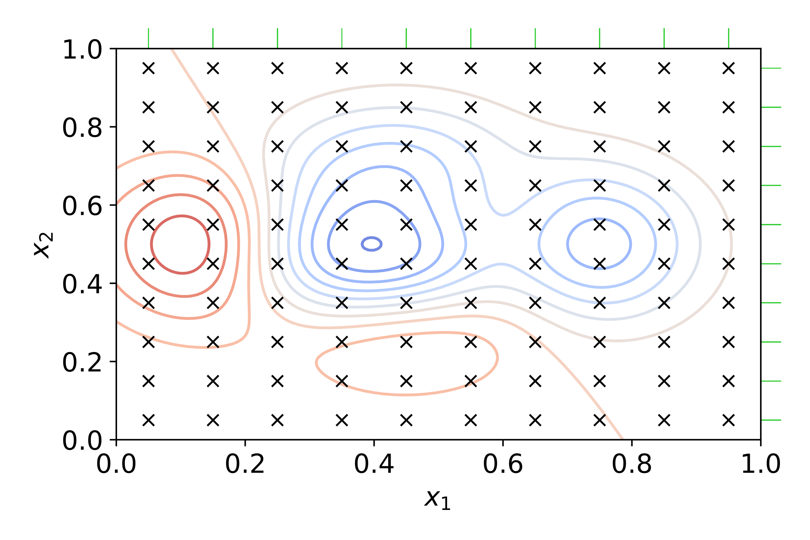

# 4.5.5 - Ottimizzazione degli iperparametri

Ai più attenti non sarà sfuggito che tutto ciò che abbiamo visto finora è inficiato da una sfida molto complesssa, legata alla natura degli algoritmi utilizzati, per i quali può essere necessario valutare più combinazioni di "parametri" da passare al modello, spesso seguendo un approccio di tipo empirico.

Ciò deriva dal fatto che questi "parametri", che nel gergo sono chiamati *iperparametri*, *non* sono appresi dal modello a partire dai dati forniti. Di conseguenza, sono state sviluppate nel corso del tempo delle tecniche di *ricerca* ed *ottimizzazione* degli iperparametri, che ci permettono di selezionarli sulla base del miglior punteggio ottenuto da una specifica combinazione in fase di [cross-validazione](./03_k_fold.md).

Scikit-Learn, ovviamente, ci offre delle soluzioni già pronte a ciò, che andremo brevemente a discutere nel seguito.

## Ricerca ed ottimizzazione degli iperparametri in Scikit-Learn

In generale, la ricerca ed ottimizzazione degli iperparametri ha bisogno di cinque fattori, ovvero:

* uno stimatore da ottimizzare;
* uno spazio dei parametri da ricercare;
* una tecnica per la scelta dei valori da ricercare;
* uno schema di cross validazione;
* una metrica.

Scikit-Learn offre due approcci generici all'ottimizzazione degli iperparametri, ovvero la *grid search* e la *random search*. Vediamoli brevemente.

## Grid search

La *grid search* effettua una ricerca *esaustiva* di *tutti* i valori che gli iperparametri possono assumere. In altre parole, vengono specificati degli intervalli discreti per i valori assumibili dagli $n$ iperparametri da ricercare, ed a partire da questi viene creata una griglia in un iperspazio ad $n$ dimensioni. Tale griglia sarà quindi esplorata in maniera esaustiva, alla ricerca del valore massimo (o minimo) associato alla metrica di scoring selezionata. Questo principio di funzionamento è brevemente riassunto per $n=2$ in figura 1.

<figure markdown>
  
  <figcaption>Figura 1 - Schema della grid search.</figcaption>
</figure>

Notiamo come all'interno della griglia i valori della metrica scelta (ad esempio, l'accuratezza) si vanno a disporre secondo dei picchi (indicati dalle isoipse rosse) e delle valli (indicati dalle isoipse blu). L'obiettivo sarà quinid andare a trovare il massimo globale dell'accuratezza, sulla base dei valori degli iperparametri che abbiamo individuato. Per farlo, la grid search andrà ad eseguire una cross-validazione del modello sui dati di training per ciascuna combinazione dei parametri possibile, fino a trovare la migliore.

Per la grid search, Scikit-Learn offre la classe [`GridSearchCV()`](http://scikit-learn.org/stable/modules/generated/sklearn.model_selection.GridSearchCV.html) che, dato uno stimatore (o, equivalentemente, una pipeline di processing), restituisce i parametri migliori individuati dopo la $k$-fold cross-validation. Ad esempio, possiamo provare a valutare il funzionamento di un `MLPClassifier` con diversi algoritmi di ottimizzazione e parametri di regolarizzazione:

```py linenums="1"
from sklearn.model_selection import GridSearchCV

parameters = {
    'solver': ['lbfgs', 'adam', 'sgd'],
    'alpha': [1e-1, 1e-2, 1e-3, 1e-4, 1e-5, 1e-6, 1e-7]
}
clf = MLPClassifier()
search = GridSearchCV(clf, parameters, scoring='accuracy_score')
search.fit(X_train, y_train)
```

In particolare, alla riga 8 creeremo un oggetto di tipo `GridSearchCV`, specificando lo stimatore (il nostro `MLPClassifier`), la griglia di parametri, ed infine l'accuracy come metrica da ottimizzare. 

Se volessimo usare una pipeline di processing:

```py linenums="1"
from sklearn.model_selection import GridSearchCV
from sklearn.decomposition import PCA

pipe = Pipeline([
    ('pca', PCA()),
    ('clf', MLPClassifier())
])

param_grid = {
    'pca__n_components': [2, 3],
    'clf__solver': ['lbfgs', 'adam', 'sgd'],
    'clf__alpha': [1e-1, 1e-2, 1e-3, 1e-4, 1e-5, 1e-6, 1e-7]}

search = GridSearchCV(pipe, param_grid, scoring='accuracy_score')
search.fit(X_train, y_train)
```

Appare evidente come il funzionamento sia concettualmente analogo al caso in cui si usi un singolo stimatore, grazie soprattutto all'[equivalenza tra pipeline e stimatori](./01_pipeline.md). Tuttavia, è interessante sottolineare che, come evidenziato nelle righe 10, 11 e 12, è necessario usare una notazione simile al [name mangling](../../01_python/02_syntax/05_classes.md#modificatori-di-accesso) per specificare la combinazione tra l'elemento della pipeline ed il valore associato agli iperparametri da ricercare.

## Random search

Prevedibilmente, utilizzare la grid search porterà sempre all'individuazione del picco (o della valle) all'interno delle possibili combinazioni di iperparametri selezionate. Questo è legato al fatto che l'approccio usato dalla grid search è *a forza bruta*: in altre parole, sono testate tutte le possibili combinazioni di parametri fino a che non si trova la migliore.

Tuttavia, appare evidente come il costo computazionale legato ad una ricerca talmente estesa non sia alle volte giustificabile alla luce di miglioramenti tutto sommato marginali nel valore assunto dalla metrica di scoring. Di conseguenza, sono stati sviluppati degli approcci a minor costo, tra cui il più semplice è quello proposto dalla *random search* che, come suggerisce il nome stesso, effettua una selezione casuale dei valori associati agli iperparametri a partire da una determinata distribuzione. Questa scelta ha due vantaggi rispetto alla grid search:

* il primo è che è possibile imporre un valore massimo di ricerche, associando un *budget* alla procedura di ottimizzazione;
* il secondo è che è possibile limitare l'impatto in fase di ricerca di iperparametri che non influenzano la metrica di scoring selezionata.

Per implementare la random search, Scikit-Learn offre la classe [`RandomizedSearchCV()`](https://scikit-learn.org/stable/modules/generated/sklearn.model_selection.RandomizedSearchCV.html#sklearn.model_selection.RandomizedSearchCV), il cui funzionamento è in linea di principio analogo alla `GridSearchCV()`, con una notevole differenza: infatti, va specificata una distribuzione di parametri, o a partire da una distribuzione presente nel package [`scipy.stats.distribution`](https://docs.scipy.org/doc/scipy/reference/stats.html), oppure da una lista di valori discreti fornita dall'utente. Nel primo caso, sarà scelto un metodo di campionamento scelto a partire dal parametro `rvs` associato alla distribuzione, mentre nel secondo sarà usato un campionamento uniforme.
