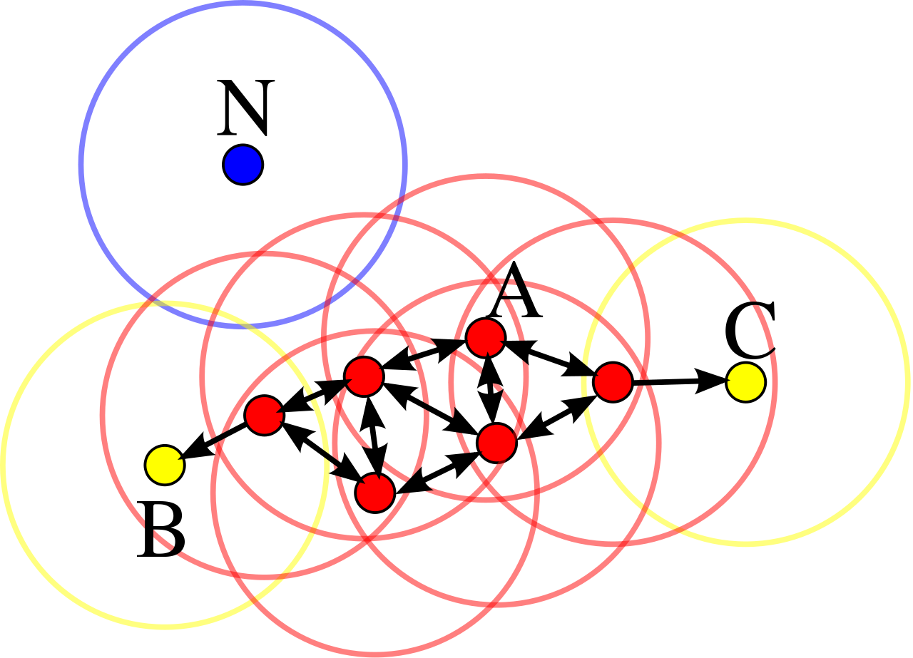

## 20.6 - Un altro algoritmo: il DBSCAN

Il [DBSCAN](https://en.wikipedia.org/wiki/DBSCAN) è un algoritmo di clustering di tipo agglomerativo density-based che opera considerando due parametri principali:

* la *distanza massima* $\epsilon$ per considerare due punti come appartenenti allo stesso cluster;
* il *numero minimo di campioni* $m$ per il quale è possibile definire un cluster.

Nella pratica, il DBSCAN seleziona un campione casuale tra quelli non visitati, e valuta se ci sono $m$ campioni all'interno della distanza $\epsilon$, nel qual caso si ha un *core point*. In alternativa, se il numero di campioni presenti in $\epsilon$ è minore di $m$, ma comunque maggiore di 0, i campioni si dicono $density reachable$ e, se connessi ad un *core point*, appartengono allo stesso cluster. Infine, se non vi sono campioni presenti in $\epsilon$, allora il punto è isolato, ed è interpretato come un outlier. Un'interpretazione visiva è quella proposta in figura; in particolare, i punti in rosso definiscono diversi *core points*, i punti in giallo sono *density reachable*, e quindi fanno parte dello stesso cluster dei core points, mentre $N$ è un outlier.

<figure markdown>
  { width="300" }
  <figcaption>Figura 20.4 - Algoritmo DBSCAN.   Di Chire - Opera propria, CC BY-SA 3.0, <a href="https://commons.wikimedia.org/w/index.php?curid=17045963">Wikipedia</a></figcaption>
</figure>
