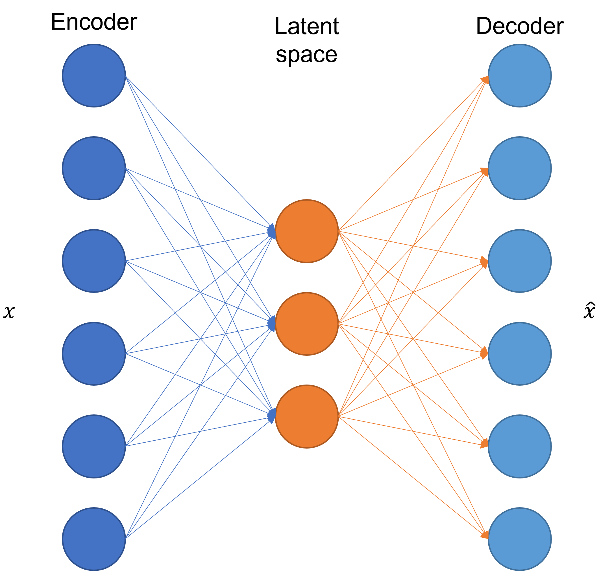

# 5.2.1 - Introduzione agli autoencoder

Un *autoencoder* è un tipo di rete neurale usato per la *codifica non supervisionata* di un insieme di dati in ingresso.

In pratica, un autoencoder ha l'obiettivo di apprendere una rappresentazione a bassa dimensionalità di un dato ad alta dimensionalità effettuando, nei fatti, una procedura di riduzione della dimensionalità non lineare detta anche *encoding*. Per farlo, l'autoencoder viene addestrato a ricostruire l'input originario a partire dalla rappresentazione a bassa dimensionalità, minimizzando contestualmente l'errore di ricostruzione.

## Architettura di un autoencoder

L'architettura di un generico autoencoder è mostrata in figura 1.

<figure markdown>
  { width="600" }
  <figcaption>Figura 1 - Architettura di un generico autoencoder</figcaption>
</figure>

E' quindi evidente come vi siano tre diverse parti, chiamate rispettivamente *encoder*, *bottleneck* e *decoder*. Vediamole più nel dettaglio.

##### Encoder

La prima parte di un autoencoder è chiamata *encoder*, ricorda un'architettura standard di rete neurale. In particolare, l'encoder è costituito da un insieme di neuroni il cui compito è quello di estrarre una rappresentazione compatta del dato in ingresso $x$.

!!!note "Layer di un encoder"
    Sottolineamo come l'encoder non sia necessariamente composto da un solo layer: molto spesso, infatti, la parte di codifica di un autoencoder è composta da un numero più o meno elevato di strati.

##### Bottleneck

Il *bottleneck* si colloca a valle dell'encoder, ed è la parte dell'autoencoder che contiene la rappresentazione codificata in maniera *non lineare* dell'input nel cosiddetto *spazio latente* delle feature.

!!!note "Perché non lineare?"
    Il motivo per il quale abbiamo sottolineato la *non linearità* della rappresentazione contenuta nel bottleneck sarà più chiaro nel seguito; tuttavia, per adesso, ci basti pensare che, dato che l'encoder è una vera e propria rete neurale feedforward, conterrà al suo interno delle funzioni di attivazione intrinsecamente non lineari.

La dimensione del bottleneck influenza la possibilità che la rete vada o meno in overfitting. In pratica, un bottleneck di piccole dimensioni riduce il rischio di overfitting, in quanto la rete può memorizzare un minor numero di informazioni riguardo uno specifico input; tuttavia, ciò comporta il rishcio che informazioni importanti vengano comunque omesse in fase di decodifica.

##### Decoder

Il bottleneck è seguito dal *decoder*, che consite in una serie di layer e neuroni *speculare* all'encoder, il cui compito è quello di riportare la rappresentazione compressa nello spazio latente nello spazio originale delle feature. Nel caso standard, l'uscita del decoder $\hat{x}$ deve essere identica all'input a meno di un contributo stocastico legato all'errore di ricostruzione.

## Addestramento di un autoencoder

L'addestramento di un autoencoder avviene considerando quattro diversi iperparametri:

1. *dimensione del bottleneck*: questo iperparametro decide l'entità della compressione dei dati;
2. *numero di layer*: una profondità maggiore per encoder e decoder aumenta la complessità del modello, che quindi può meglio caratterizzare relazioni complesse e non lineari; tuttavia, come per tutte le reti neurali, a profondità maggiori corrisponde un costo computazionale più elevato;
3. *numero di nodi per layer*: anche il numero di layer influisce sia sulla complessità sia sulla capacità del modello di caratterizzare relazioni complesse. Di solito, il numero di neuroni per ciascun layer si dimezza ad ogni strato successivo nell'encoder, raddoppiando contestualmente nel decoder;
4. *reconstruction loss*: la funzione di costo usata per addestrare l'autoencoder dipende da input ed output, e va ad influenzare la tipologia di autoencoder costruito.

Con particolare riferimento all'ultimo punto, vedremo quattro diversi tipi di autoencoder, ovvero [*undercomplete autoencoder*](02_undercomplete.md), [*sparse autoencoders*](03_sparse.md), [*denoising autoencoder*](04_denoising.md), e [*variational autoencoder*](05_variational.md).
