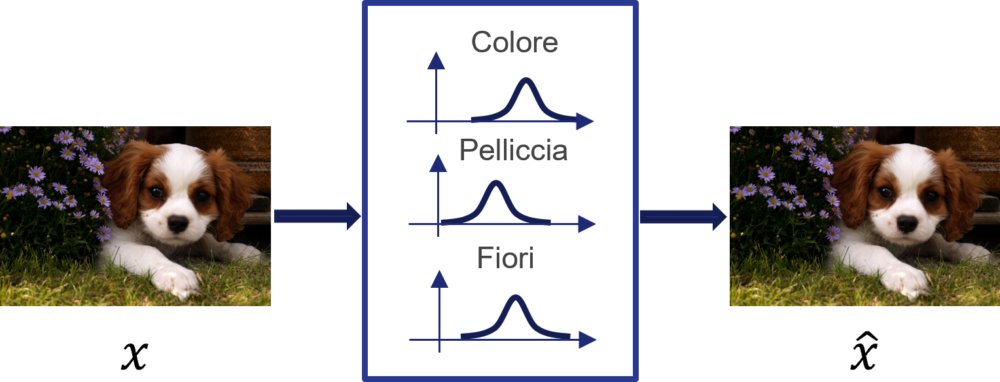

# 5.2.5 - Variational autoencoder

Abbiamo visto come gli autoencoder classici come gli UAE comprimono l'input $x$ in una rappresentazione compressa $h$ a partire dal quale è possibile ricostruire $x$ stesso. Normalmente, la rappresentazione compressa $h$ è di tipo deterministico, e permette una ricostruzione simile a quella mostrata in figura 1.

<figure markdown>
  { width="600" }
  <figcaption>Figura 1 - Rappresentazione deterministica appresa da un UAE</figcaption>
</figure>

Una rappresentazione $h$ di tipo deterministico permette di ricostruire in maniera adeguata l'input $x$. Tuttavia, potrebbe essere interessante valutare come si distribuiscano i parametri caratterizzanti $h$ all'interno dello spazio della rappresentazione latente: in questo modo, potremmo ottenere delle distribuzioni di probabilità da utilizzare per *generare* dei dati simili ad $x$. I **variational autoencoder** (*VAE*) si occupano proprio di far questo, generando gli attributi latenti in un modo simile a quello mostrato in figura 2:

<figure markdown>
  { width="600" }
  <figcaption>Figura 2 - Rappresentazione probabilistica appresa da un VAE</figcaption>
</figure>

Il motivo per cui gli attributi latenti possono essere espressi sotto forma di distribuzioni di probabilità può essere spiegato come segue. Proviamo ad esempio ad identificare le caratteristiche del vettore latente $h$ che ricostruisce l'output a partire da un certo input $x$, modellando la distribuzione $x[p(z|x)]$.

La stima esatta di questa distribuzione può essere molto costosa dal punto di vista computazionale; in tal senso, un'opzione molto più semplice è costruire un modello parametrizzato $q$ minimizzando una metrica di distanza, come la [*divergenza di Kullback-Leibler*](https://it.wikipedia.org/wiki/Divergenza_di_Kullback-Leibler), tra la distribuzione "vera" e quella parametrizzata. Grazie al modello parametrizzato $q$ potremo inferire gli attributi latenti ed usarli per ricostruire il dato iniziale. Per quello che riguarda i parametri da utilizzare, questi variano a seconda delle ipotesi fatte su $h$: infatti, nel caso semplicistico di una distribuzione normale, potremo utilizzare la media e la varianza.

La funzione di costo di un VAE prevede quindi due contributi. Il primo è quello legato alla reconstruction loss che, focalizzandosi soltanto sulla minimizzazione dell'errore di ricostruzione, fa in modo che la rete provi ad apprendere delle distribuzioni estremamente centrate sui parametri che servono a soddisfare questa condizione. L'altro contributo è dato dalla divergenza di Kullback-Leibler, che viene utilizzata per fare in modo che la distribuzione dei parametri sia il quanto più vicina possibile a quella considerata come reale. Di conseguenza, la funzione di costo complessiva può essere espressa come:

$$
L_{VAE} = |x - \hat{x}|+\beta \sum_i KL(q_j(z|x)\|N(0,1))
$$

dove $N$ indica la distribuzione normale a media nulla e varianza unitaria, e $\beta$ è il fattore di peso associato al contributo della divergenza di Kullback-Leibler.
