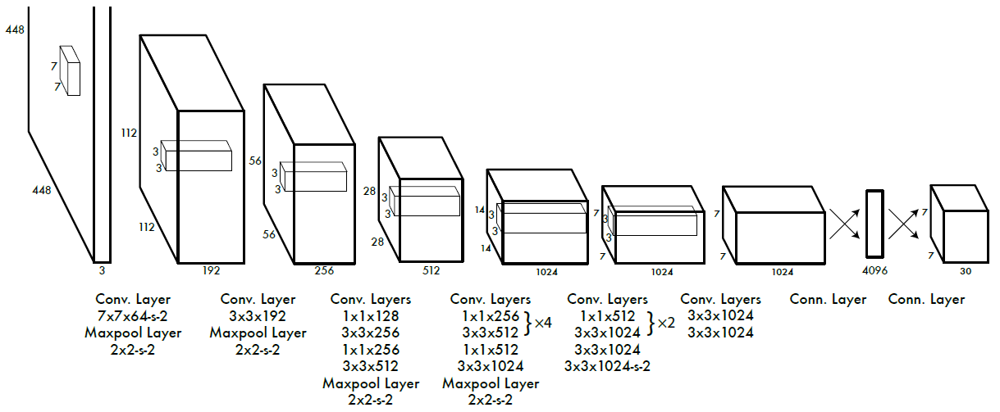
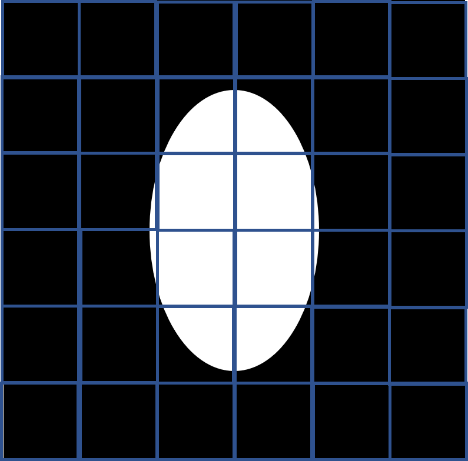
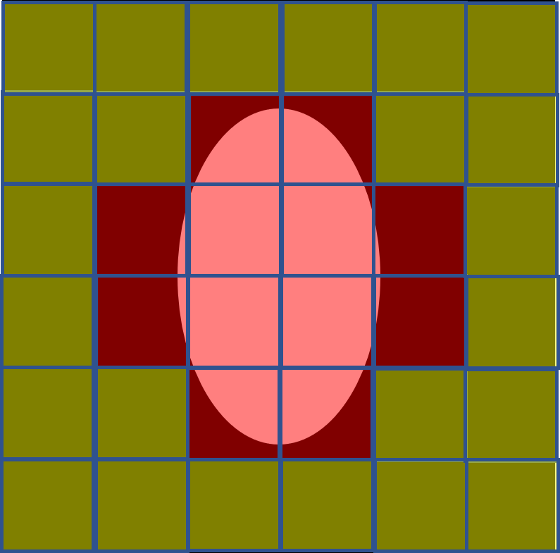
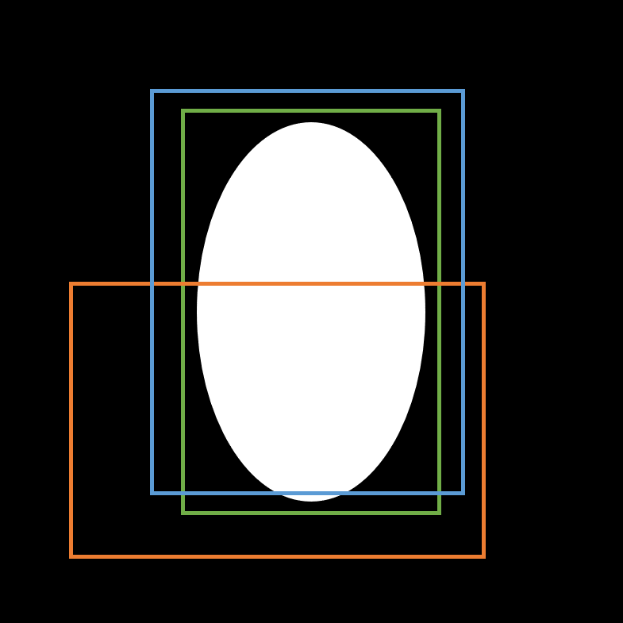

## YOLO

YOLO, acronimo di *You Only Look Once*, è attualmente l'algoritmo (o, per meglio dire, la *famiglia* di algoritmi) per la object detection a singolo stage più utilizzato. Introdotto da [Joseph Redmon nel 2015](https://arxiv.org/abs/1506.02640), YOLO si basa su un'architettura composta da 24 layer convoluzionali, quattro layer di max pooling, e due layer completamente connessi, come mostrato in figura 2.

<figure markdown>
  
  <figcaption>Figura 2 - L'architettura alla base della prima versione di YOLO.</figcaption>
</figure>

Notiamo che:

* le immagini sono ridimensionate in un input di dimensione $448 \times 448$;
* sono utilizzate convoluzioni $1 \times 1$, che permettono di ridurre la dimensionalità dei tensori che attraversano la rete;
* viene utilizzata una funzione di attivazione ReLU (a meno del layer finale);
* sono sfruttate diverse tecniche di regolarizzazione, come batch normalization e dropout, per ridurre l'overfitting del modello.

Detto questo, possiamo schematizzare il funzionamento di YOLO in quattro punti fondamentali.

##### Step 1: suddivisione in celle dell'immagine

YOLO suddivide l'immagine originaria in una griglia di $N \times N$ celle di forma e dimensioni uguali. Ciascuna cella sarà dedicata alla localizzazione e predizione degli oggetti al suo interno, a cui assegnerà un certo punteggio (*confidence score*).

<figure markdown>
  
  <figcaption>Figura 3 - Suddivisione dell'immagine originaria in griglia.</figcaption>
</figure>

##### Step 2: determinazione delle bounding box

Il secondo step consiste nella determinazione delle bounding box. In particolare, YOLO caratterizza una bounding box come segue:

$$
Y = [p_c, b_x, b_y, b_h, b_w, c_1, c_2]
$$

In particolare:

* $Y$ è la bounding box;
* $p_c$ corrisponde al confidence score associato al fatto che la griglia contenga o meno un oggetto. Ad esempio, tutte le griglie mostrate in rosso in figura 4 hanno un punteggio più alto di zero, mentre quelle in verde hanno un punteggio pari a zero.
* $b_x$ e $b_y$ sono le coordinate $(x, y)$ del centro della bounding box rispetto alla cella che racchiude l'oggetto;
* $b_h, b_w$ sono invece l'altezza e l'ampiezza della bounding box che contiene l'oggetto di interesse;
* $c_1, c_2$ corrispondono alle due classi (giocatore e palla). Ovviamente, possiamo avere tante classi quante richieste dal caso d'uso specifico.

<figure markdown>
  
  <figcaption>Figura 4 - Assegnazione del punteggio di confidenza alle celle della griglia.</figcaption>
</figure>

##### Step 3: Intersection Over Union (IoU)

Nella quasi totalità dei casi, YOLO determinerà più "candidati" sulle stesse celle. Ovviamente, non tutti saranno rilevanti o corretti: per questo, nel terzo step si valuta la *Intersection Over Union*, ovvero una metrica data dal rapporto tra l'intersezione tra il ground truth e la bounding box rilevata, e l'unione delle stesse aree. Il valore della IoU è sempre compreso tra $0$ ed $1$, ed è tanto più alto quanto più la bounding box si sovrappone al ground truth. L'obiettivo è quindi quello di scartare le bounding box non rilevanti, a favore di quelle più significative. Nella pratica:

* viene definito (anche dall'utente) un valore di soglia minimo per la IoU (di solito, $0.5$);
* l'algoritmo calcola la IoU per ogni bounding box individuata;
* le box con una IoU minore alla soglia sono scartate.

Un esempio è mostrato in figura 5, nella quale la bounding box verde è il ground truth, quella arancione ha una IoU minore di $0.5$, mentre quella blu maggiore di detto valore.

<figure markdown>
  
  <figcaption>Figura 5 - Valutazione delle bounding box in base alla IoU.</figcaption>
</figure>

##### Step 4: Non-Max Suppression (NMS)

L'ultimo passo è detto *Non-Max Suppression*, e prevede l'eliminazione di tutte le bounding box sovrapponibili a meno di quella con il valore di IoU massimo.
