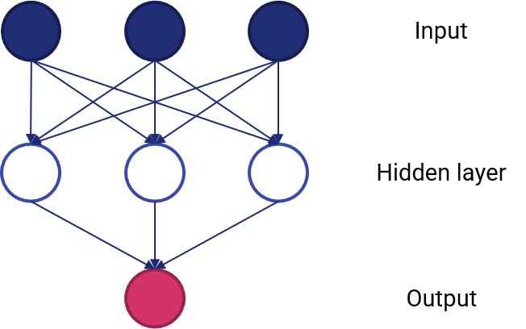

# 25 - Anatomia di una rete neurale

Le reti neurali sono ormai sulla bocca di tutti: chiunque le usa per risolvere con successo ogni tipo di problema. Tuttavia, prima di poterle usare, bisogna capire effettivamente *a cosa servono*: per far questo, è il caso di introdurre il discorso relativo ai *problemi non lineari*.

## 25.1 - Problemi non lineari

Diamo un'occhiata al dataset rappresentato nella figura 25.1.

<figure markdown>
  { width="450" }
  <figcaption>Figura 25.1 - Dataset non lineare</figcaption>
</figure>

Questo dataset è evidentemente *non lineare*: in pratica, questo significa che non esiste un algoritmo in grado di separare in maniera lineare le due classi tra loro o, in termini matematici, non esiste un modello in forma:

$$
y = ax_1 + bx_2 + c
$$

che permetta di determinare $y$ a partire da $x_1$ ed $x_2$.

I lettori più audaci potrebbero provare ad usare delle approssimazioni lineari a tratti. Costoro dovrebbero considerare la figura 25.2.

<figure markdown>
  { width="450" }
  <figcaption>Figura 25.2 - Dataset *estremamente* non lineare</figcaption>
</figure>

## 25.2 - Reti neurali e problemi non lineari

Per capire come le reti neurali ci aiutano a modellare un problema non lineare, occorre partire da un semplice sommatore pesato.

<figure markdown>
  { width="450" }
  <figcaption>Figura 25.3 - Un sommatore lineare</figcaption>
</figure>

In questo semplice modello, abbiamo tre input ed un oputput. Ovviamente, essendo un sommatore pesato, dobbiamo adattarlo per fare in modo che isa in grado di gestire dei problemi non lineari.

<figure markdown>
  { width="450" }
  <figcaption>Figura 25.4 - Un sommatore lineare a più strati</figcaption>
</figure>

Il primo step è quello di aggiungere uno *strato nascosto*, rappresentativo di una serie di valori intermedi. L'output in questo caso non sarà più una somma pesata degli input, ma *una somma pesata dei valori in uscita dallo strato nascosto*, che a loro volta sono dipendenti dall'input.

Tuttavia, il modello rimane lineare: in realtà, possiamo aggiungere quanti strati nascosti vogliamo, ma il modello rimarrà sempre e comunque lineare, a meno che non usiamo un accorgimento.

### 25.2.1 - Funzioni di attivazione

Per mdoellare un problema non lineare, abbiamo la necessità di introdudre delle *non linearità* all'interno dello stesso. In pratica, dovremo insierire delle funzioni non lineari tra uno strato e l'altro.

Queste funzioni, che vediamo nella figura successiva, prendono il nome di *funzioni di attivazione*.

<figure markdown>
  { width="450" }
  <figcaption>Figura 25.5 - Semplice rete neurale con funzioni di attivazione</figcaption>
</figure>

Ovviamente, man mano che inseiriamo più layer, l'impatto delle non linearità diventa maggiore. Aggiungere non linearità su non linearità fa in modo che si inseriscano delle relazioni anche molto complesse tra gli input e gli output predetti. In breve, ogni layer sta effettivamente apprendendo una funzione *più complessa* degli  input.

Le funzioni di attivazione più utilizzate in passato erano quelle di tipo sigmoidale, simili, per intenderci, alla funzione che abbiamo visto in uscita alla regressione logistica.

Attualmente, le funzioni più in voga sono le *rectified linear unit*, o *ReLU*, che hanno risultati comparabili in termini di accuratezza del modello alla sigmoidale, ma risultano essere significativamente meno complesse dal punto di vista computazionale.

Le ReLU sono espresse come segue:

$$
y = max(0, x)
$$

ed hanno una funzione di questo tipo:

<figure markdown>
  { width="450" }
  <figcaption>Figura 25. - ReLU</figcaption>
</figure>

In pratica, una ReLU "fa passare" soltanto i valori positivi, portando a zero tutti quelli negativi.

Riassumendo:

* una rete neurale è data da un insieme di nodi, o *neuroni*, organizzati in uno o più *strati*;
* ogni neurone è connesso a quelli dello strato successivo mediante dei *pesi*, che rappresentano la "forza" della connessione;
* esiste una funzione di attivazione che trasforma l'uscita di ogni neurone verso lo strato successivo inserendo delle non linearità.
