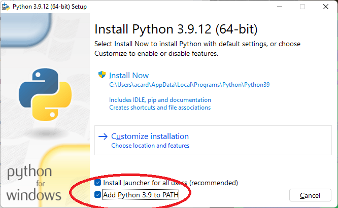

# Appendice A - Configurazione dell'ambiente di sviluppo Python

## Installazione di Python

1. Andare al seguente [indirizzo](https://www.python.org/downloads/release/python-3912/), e selezionare la versione adatta al proprio sistema operativo.
2. Iniziare la procedura di installazione (ad esempio, in Windows, cliccando sull'eseguibile appena scaricato). **E' fortemente consigliato aggiungere Python al proprio PATH spuntando l'opportuna casella durante l'installazione**, come mostrato in figura.

{: .center}

3. Una volta completata la procedura di installazione, aprire uno shell (ad esempio, il prompt dei comandi), e digitare `python`. Se tutto è andato per il verso giusto, apparirà una schermata simile alla successiva.

{: .center}

## Installazione di Visual Studio Code

1. Andare al seguente [indirizzo](https://code.visualstudio.com/download), e selezionare la versione adatta al proprio sistema operativo.
2. Seguire la procedura di installazione mostrata a schermo. **E' anche in questo caso consigliata l'aggiunta di Visual Studio Code al path, come mostrato in figura.**

{: .center}