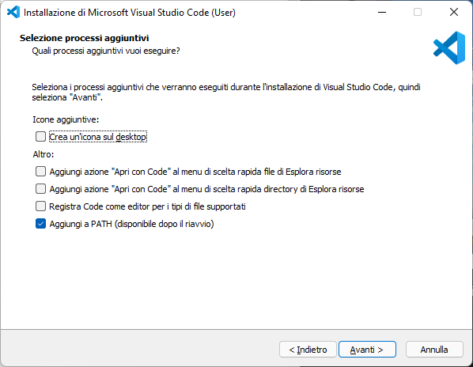

# Appendice A - Configurazione dell'ambiente di sviluppo Python

!!!tip "Versione video"
    Una versione video di questa procedura di installazione è in arrivo.

## Installazione di Python

1. Andare al seguente [indirizzo](https://www.python.org/downloads/release/python-3912/), e selezionare la versione adatta al proprio sistema operativo.
2. Iniziare la procedura di installazione (ad esempio, in Windows, cliccando sull'eseguibile appena scaricato). **E' fortemente consigliato aggiungere Python al proprio PATH spuntando l'opportuna casella durante l'installazione**, come mostrato in figura 1.

<figure markdown>
  { width="450" }
  <figcaption>Figura 1 - Aggiunta di Python al PATH</figcaption>
</figure>

3. Una volta completata la procedura di installazione, aprire uno shell (ad esempio, il prompt dei comandi), e digitare `python`. Se tutto è andato per il verso giusto, apparirà una schermata simile a quella mostrata in figura 2.

<figure markdown>
  {: .center, width="450"}
  <figcaption>Figura 2 - Interprete Python</figcaption>
</figure>

## Installazione di Visual Studio Code

1. Andare al seguente [indirizzo](https://code.visualstudio.com/download), e selezionare la versione adatta al proprio sistema operativo.
2. Seguire la procedura di installazione mostrata a schermo. **E' anche in questo caso consigliata l'aggiunta di Visual Studio Code al path, come mostrato in figura 3.**

<figure markdown>
  {: .center, width="450"}
  <figcaption>Figura 3 - Installazione di Visual Studio Code</figcaption>
</figure>
