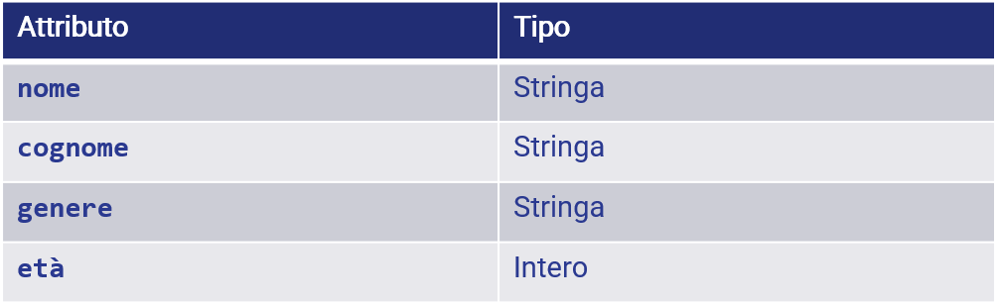
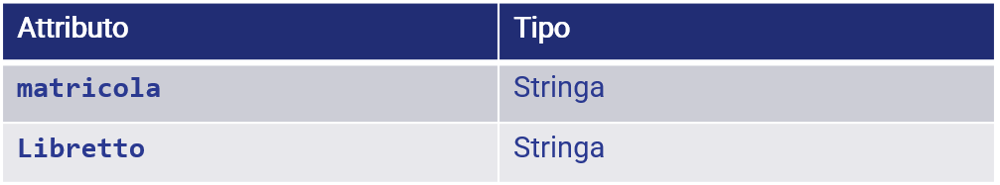
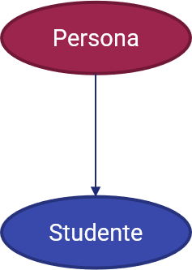
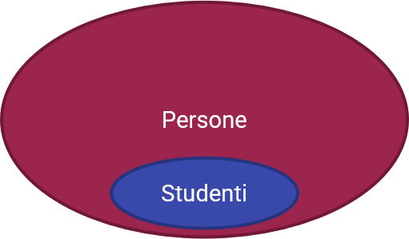
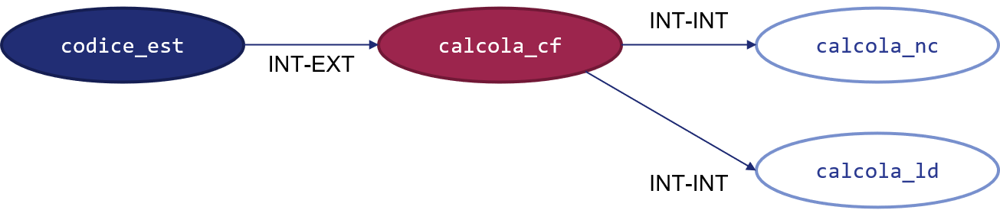
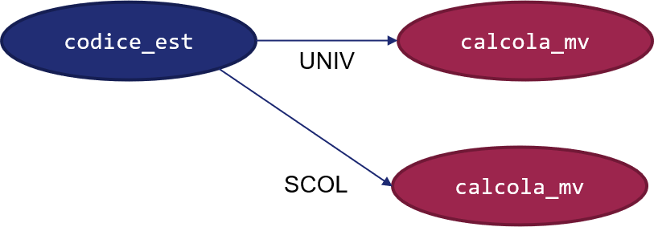

# Appendice D - Principi di Programmazione Orientata agli Oggetti

La programmazione orientata agli oggetti (in inglese *object-oriented programming*, *OOP*) è un paradigma di programmazione che sposta il focus dalle *funzioni* ai *dati*. In particolare, la OOP prevede che tutto sia un *oggetto*: una qualsiasi variabile è interpretata come un oggetto, così come anche le funzioni stesse (in alcuni linguaggi).

Ciò si estende ovviamente anche ai tipi definiti dall'utente, che assumono il nome di *classi*. Facciamo un esempio.

## La classe `Persona`

Immaginiamo di voler definire una struttura dati che contenga al suo interno le informazioni necessarie a definire una persona, come nome, cognome, genere ed età. Per farlo, ovviamente, dovremo "unire" tra di loro diversi dati primitivi: potremo usare una stringa per il nome, una per il cognome, una per il genere e, infine, un intero per l'età.

In tal senso, possiamo creare quindi la *classe* `Persona`, che avrà quattro *attributi*, come mostrato in figura.

{: .center}

Sottolineamo come una classe rappresenti *tutte le possibili persone*: infatti, si cerca di creare delle strutture dati *generiche*, che abbiano degli attributi comuni a tutte le possibili *istanze*. Nel nostro caso, sappiamo che ogni persona ha un nome, un cognome, un genere ed un'età, quindi usiamo questi quattro valori come attributi di classe.

!!!note "Differenza tra classe ed istanza"
    Abbiamo detto che una classe rappresenta tutte le possibili istanze della stessa. Ciò si traduce, nel nostro esempio, nel fatto che la classe `Persona` è in grado di rappresentare tutte le persone, e un'istanza della classe `Persona` è una singola variabile, o oggetto, che rappresenta una certa persona. Per capirci: un'istanza di `Persona` è "Angelo, Cardellicchio, Uomo, 37", mentre un'altra istanza è data da "Frank, Hood, Uomo, 42", un'altra ancora da "Camilla, Lilla, Donna, 55", e così via.

Ovviamente, potremo in qualche modo agire con degli opportuni *metodi* su questi attributi. Ad esempio, se avessimo a disposizione anche il luogo e la data di nascita, potremmo creare un metodo `calcola_cf` che, per l'appunto, permette di generare il codice fiscale di una singola istanza.

Oltre al concetto di classe, tuttavia, la OOP definisce altri tre concetti base. Vediamoli di seguito.

## Concetto 1: Ereditarietà

Per *ereditarietà* si intende la capacità di una classe di "discendere" da un'altra. Non dobbiamo, però, pensare al nostro albero genealogico: infatti, noi abbiamo *parte* delle caratteristiche di ciascuno dei nostri genitori, mentre una classe figlia eredita *in toto* le caratteristiche di una classe madre.

Ad esempio, potremmo definire la classe `Studente` come figlia della classe `Persona`, cui aggiungerà i seguenti attributi:

{: .center}

Possiamo visualizzare questa relazione in ordine gerarchico come segue:

{: .center}

Da notare che la classe `Studente` può aggiungere anche dei metodi, oltre che degli attributi a quelli offerti da `Persona`, come ad esempio `genera_media_voto`.

In ultimo, notiamo come ogni istanza di `Studente` è un'istanza di `Persona`, *ma non è vero il contrario*, e quindi non tutte le persone sono degli studenti. Per aiutarci a comprendere questo concetto, possiamo visualizzare gli insiemi delle istanze di `Persona` e di `Studente`:

{: .center}

!!!note "Generalizzazione e specializzazione"
    La relazione di ereditarietà può anche essere vista in termini di *generalizzazione* e *specializzazione*. In questo contesto, la classe `Studente` è una *specializzazione* di `Persona`, in quanto sottende ad un insieme più specifico; al contrario, le persone sono viste come una *generalizzazione* degli studenti.

!!!tip "Ereditarietà multipla e multilivello"
    Alcuni linguaggi, compreso Python, offrono la possibilità di ereditare da più classi; tale concetto è chiamato *ereditarietà multipla*. Se invece stabiliamo una vera e propria gerarchia di classi, con una classe "nonna", una "madre" ed una "figlia", avremo una struttura *multilivello*.

## Concetto 2: Incapsulamento

Il concetto di *incapsulamento* prevede che sia possibile accedere ad un metodo (o anche ad un attributo) di una classe *esclusivamente mediante la sua interfaccia verso il mondo esterno*. Vediamo cosa significa.

Immaginiamo di voler calcolare il codice fiscale di una persona: dovremo seguire una procedura ben precisa e moderatamente complessa, che potremo tranquillamente "nascondere" al codice che usa la classe `Persona`, il quale dovrà semplicemente invocare il metodo `calcola_cf`. Tuttavia, se volessimo seguire il principio di modularità, che ci suggerisce di "suddividere" funzioni complesse in maniera tale da renderle più semplici, dovremmo creare altre funzioni ausiliarie, che potrebbero calcolare la rappresentazione di nome e cognome (`calcola_nc`) e i dati alfanumerici derivanti da luogo e data di nascita (`calcola_ld`). Ovviamente, non vi è il bisogno di accedere dall'esterno della classe a questi metodi, in quanto hanno valenza esclusiva nell'ambito del calcolo del codice fiscale: per questo motivo, li si potrà dichiarare come *privati*, e potranno essere acceduti *soltanto dall'interno della classe*.

In questo modo, la classe mantiene un'interfaccia *stabile* ed *essenziale* verso l'esterno: il codice che usa la classe avrà sempre un punto di accesso ben definito e, nel caso si debbano modificare dei comportamenti interni alla classe, non sarà influenzato da dette modifiche. Ad esempio, infatti, se per qualche motivo si decidesse di cambiare l'ordine con cui si mostrano nel codice fiscale la rappresentazione del cognome e del nome, basterebbe modificare il metodo `calcola_nome_cognome_codice_fiscale`, ed il resto dell'implementazione (sia della classe, sia del codice chiamante) non ne sarebbe influenzata.

{: .center}

## Concetto 3: Polimorfismo

Il concetto di *polimorfismo* prevede che sia possibile modificare il comportamento associato ad un metodo a seconda della classe che lo utilizza.

Immaginiamo ad esempio di specializzare la classe `Studente` in due ulteriori rappresentazioni, ovvero `StudenteUniversitario` e `StudenteScolastico`. Ovviamente, il metodo `genera_media_voto` sarà ereditato da entrambe le classi; tuttavia, l'implementazione dovrà essere necessariamente differente, in quanto la media di laurea è pesata in modo diverso rispetto alla classica media aritmetica usata nelle scuole fino alla secondaria.

Il polimorfismo ci permette di raggiungere questo obiettivo: potremo effettuare una procedura di *override* del metodo `genera_media_voto` che, pur conservando la stessa firma, avrà differenti implementazioni nelle classi `StudenteUniversitario` e `StudenteScolastico`. Ovviamente, il fatto che il metodo conservi la stessa firma rappresenta un vantaggio paragonabile a quello ottenuto mediante il polimorfismo: infatti, un programmatore potrà usare il metodo `genera_media_voto` alla stessa maniera per uno studente universitario ed uno di scuola media secondaria, senza per questo dover tenere a mente due diverse interfacce.

{: .center}
