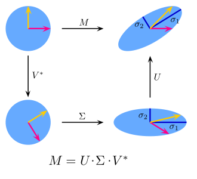

# Appendice F.1 - Decomposizione ai valori singolari

La *decomposizione ai valori singolari* (SVD) è una tecnica di *decomposizione matriciale*, che permette quindi di trovare un prodotto di matrice che equivalga alla matrice iniziale. 

La decomposizione ai valori singolari prevede che una data matrice $M$ sia decomposta in tre matrici:

$$
M = U \Sigma V^*
$$

dove:

* $M$ è una generica matrice ad $m$ righe ed $n$ colonne;
* $U$ è la matrice $m \times m$ dei vettori singolari sinistri;
* $\Sigma$ è la matrice $m \times n$ dei valori singolari;
* $V^*$ è la matrice $n \times n$ dei vettori singolari destri.

Inoltre:

* $U$ e $V$ sono matrici ortogonali, per cui $U^T = U^{-1}$ e $V^T = V^{-1}$;
* $\Sigma$ è una matrice diagonale *non necessariamente quadrata*.

Prima di dare una definizione intuitiva di SVD, però, è opportuno introdurre il concetto di trasformazione lineare.

## Trasformazione 1: rescaling di matrice

Applichiamo al vettore $v$ una trasformazione lineare definita da una matrice diagonale $d$:

$$
v = \left[
    \begin{array}{c}
    x \\
    y
    \end{array}
\right] \\
d = \left[
    \begin{array}{cc}
    3 & 0 \\
    0 & 3
    \end{array}
\right]
$$

Se moltiplichiamo $d$ per $v$, abbiamo:

$$
\left[
    \begin{array}{c}
    x^{'} \\
    y^{'}
    \end{array}
\right] = \\ \left[
    \begin{array}{cc}
    3 & 0 \\
    0 & 3
    \end{array}
\right] \times \left[
    \begin{array}{c}
    x \\
    y
    \end{array}
\right] = \\
= \left[
    \begin{array}{c}
    3x + 0 \\
    0 + 3y
    \end{array}
\right] = \\ \left[
    \begin{array}{c}
    3x \\
    3y
    \end{array}
\right]
$$

In pratica, abbiamo triplicato il nostro vettore!

## Trasformazione 2: rotazione di matrice

Laddove le matrici diagonali sono normalmente utilizzate per effettuare un rescaling, le matrici non diagonali possono essere usate per indurre una rotazione su un vettore. Ad esempio, possiamo pensare ad una matrice $R$ di questo tipo:

$$
R = \left[
    \begin{array}{cc}
    cos(\theta) & sin(\theta) \\
    sin(\theta) & cos(\theta)
    \end{array}
\right]
$$

Se applicata ad un vettore, questa matrice applicherà una certa rotazione a $\theta$:

$$
\left[
    \begin{array}{c}
    x^{'} \\
    y^{'}
    \end{array}
\right] = \\ \left[
    \begin{array}{c}
    x cos(\theta) + y sin(\theta) \\
    x sin(\theta) + y cos(\theta)
    \end{array}
\right]
$$

Se consideriamo un vettore a coordinate $x = 1, y = 0$, ed un valore di $\theta$ pari a $45°$, allora:

$$
x^{'} = 1 \cdot cos(45) + 0 \cdot sin(45) = cos(45)
$$

e:

$$
y^{'} = 1 \cdot sin(45) + 0 \cdot cos(45) = sin(45)
$$

In questo caso specifico, i nuovi valori di $(x^{'}, y^{'})$ saranno pari a $\sqrt{2}/2$, per cui avremo "ruotato" il nostro punto originario di 45 gradi.

## Interpretazione della SVD

Possiamo quindi adesso applicare le nozioni viste in precedenza per "comprendere" la SVD, che può essere vista come una serie di *trasformazioni lineari*.

In particolare, se partissimo dal cerchio di raggio unitario, ed applicassimo le trasformazioni lineari imposte da una generica matrice $M$, avremmo una certa trasformazione delle coordinate definite sul cerchio. Mediante le tre diverse matrici definite dalla SVD *scomponiamo linearmente* in tre passi questa trasformazione, imponendo prima una rotazione, poi uno scaling, e poi un'ultima rotazione. Ciò implica che *il prodotto delle tre matrici in uscita dalla SVD applica una trasformazione lineare equivalente a quella applicata dalla sola matrice $M$*.

Questo concetto è riassunto nella seguente figura.

{: .center}

Il ruolo principale della SVD è quindi quello di definire una serie di *valori singolari* (la matrice $\Sigma$) di una matrice $M$, i quali possono essere ricondotti ai valori originari mediante trasformazioni lineari. In tal senso, se la matrice originaria rappresenta un insieme di feature per un dato dataset, i valori singolari rappresentano un nuovo insieme di queste feature, corrispondenti ad una combinazione lineare di quelle originarie, ordinati secondo il grado di variabilità dei dati originari che riescono a "rappresentare", o "spiegare".

Ne consegue che se un numero ridotto di feature individuate dalla SVD riesce a rappresentare un buon grado di variabilità dei dati iniziali, è possibile scartare le feature rimanenti, effettuando quindi un'operazione di *riduzione della dimensionalità*.
