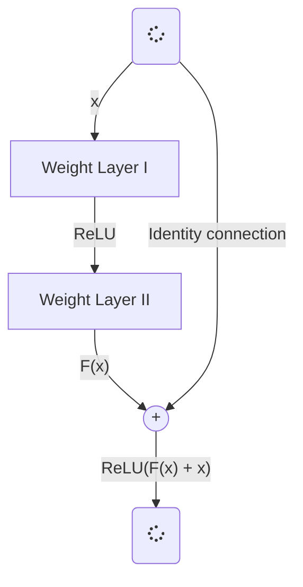
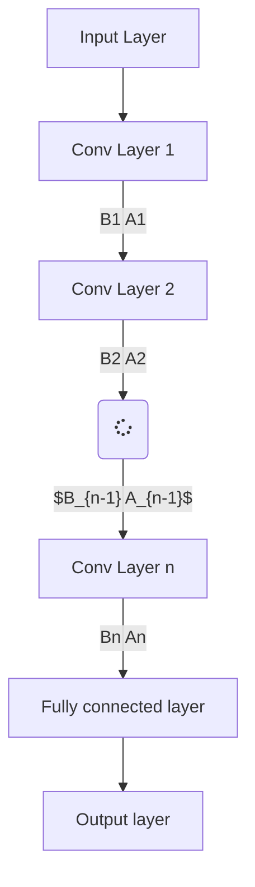
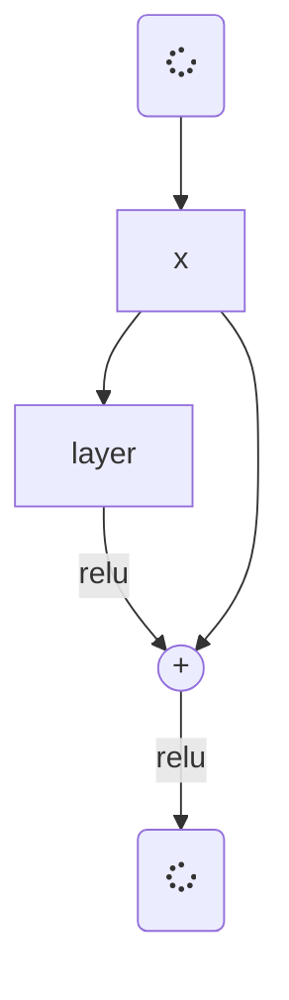

# intro

anche se il problema della object classification è molto vecchio, la gente lo sta sempre risolvendo per rendere il modello più robusto. LeNet è stata la prima Deep Neural Network nel 1998 volta a risolvere il problema di riconosciemnto delle cifre. Ha 7 layer che sono uno dopo l'altro per riconoscere le cifre scritte negli assegni bancari. Nonostante l'introduzione di LeNet, dati più avanzati come immagini ad alta risoluzione non possono essere usati per addestrarla.  Inoltre, la potenza computazionale dei sistemi nel 1998 era molto inferiore.

La comunità del deep learning ha ottenuto risultati entusisasmenti durante il 2012 con AlexNet, che venne introdotta per risolvere la classification challenge posta da ImageNet. AlexNet ha un totale di 8 layer che sono suddivisi in 5 layer di convoluzione e 3 layer completamente connessi. A differenza di LeNet, AlexNet ha più filtri per effettuare l'operazione di convoluzione in ogni layer convoluzionale. Oltre al numero di filtri, la dimensione dei filtri usati in AlexNet era 11x11, 5x5 e 3x3. Il numero di parametri presenti in AlexNet è circa 62 milioni. L'addestramento avvenne in maniera parallela, usando due GPU Nvidia per addestrare la rete sul dataset ImageNet. AlexNet riuscì ad ottenere il 57% e l'80.3% come top-1 e top-5 accuracy, rispettivamente. Inoltre, l'idea del Dropout venne intordotta per proteggere il modello dall'overfitting. Di conseguenza, alcuni milioni di parametri vennero usati dai 62 iniziali grazie al dropout.

Dopo AlexNet, il successivo campione della competizione ImageNet fu VGG-16. Vi sono molte differenze tra AlexNEt e VGG-16. In primis, VGG-16 ha più layer di convoluzione,il che implica che la ricerca iniziò a concentrarsi sul come aumentare la profondità della rete. Secondo, VGG-16 usava soltanto i kernel 3x3 in ogni layer di convoluzione per effettuare l'operazione di convoluzione. A differenza di AlexNet, i piccli kernel di VGG-165 possono estrarre delle feature fini presenti nell'immagine. L'architettura di VGG-16 ha complessivamente 5 blocchi. I primi due blocchi della rete hanno 2 layer di convoluzione ed n layer di max-pooling in ogni blocco. I rimanenti tre blocchi della rete hanno 3 layer di convoluzione ed un layer di max-pooling. Terzo, tre layer completamente connessi sono aggiunti dopo il quinto blocco della rete: i primi due layer hanno 4096 neuroni ed il terzo ha 1000 neuroni per fare il task di classificazione in ImageNet. Quindi, la comunità di deep learning si riferisce a VGG-16 come una dlele reti più ampie mai create. Inoltre, il numero di parametri nei primi due layer completamente connessi di VGG-16 ha circa 100 milioni sui 138 complessivi della rete. Il layer finale +è un layer di softmax. Le accuracy top-1 e top-5 sono del 71.3 e 90.1 rispettivamente.

# googlenet: network in network

dopo VGG-16, GOogle ha creato GoogleNet, chiamata anche Inception-V1, con un valore di accuracy più alto rispetto al suo predecessore. A differenza delle reti precedenti, GoogleNet ha una architettura più piccola ma innovativa. Per prima cosa, le reti come VGG-16 hannoi layer di convoluzione l'uno dietro l'altro, ma GoogleNet dispone i layer di pooling e di convoluzione in una maniera parallela, per estrarre le feature usando diverse dimensioni del kernel. L'intenzione complessiva è quella di aumentare la profondita della retee guadagnare un livello di performance più alto rispetto ai vincitori precedenti della classification challenge di ImageNet. Secondariamente, la rete usa delle convoluzioni $1 \times 1$ per controllare la dimensione del volume passato per ulteriore processing in ogni modulo inception. Il modulo inception è la collezione di operazione di convoluzione e pooling effettuate in maniera parallela in modo che lef feature possano essere estratte a scale differenti. Terzo, il numero di parametri presenti nella rete è 24 milioni, che rende Gloogle NEt meno costosa dal punto di vista computazionale se confrontata con AlexNet e VGG-16. Quarto, la rete usa un layer di Global Average Pooling invece dei layer completamente connessi. GoogleNet ha ottenuto il top-5 error più basso, di 6.67%.

# deep residual network

Il vincitore di ImageNet nel 2015 è statoResNet152, ovvero una REsidual NEtwork con 152 layer variant Vedremo di coprire il concetto alla base di ResNet che può essere generalizzato. Prima della spiegazione delle deep residual network, vorremmo parlare delle deep network semplici (le reti che hanno un maggior numero di convoluzioni, pooling e activation layer uno dietro l'altro). Dal 2013, la comunità del deep learning ha iniziato a creare delle reti più profonde perché erano in grado di ottenere valori di accuracy maggiori. Inoltre, reti più profonde possono rappresentare feature più complesse, quindi la robustezza e le performance del modello possono esesre aumentate. Tuttavia, mettere molti layer l'uno dietro l'altro non funziona sempre: quando si addestrano reti più oprfonode, si può infatti osservare il problema del degrado dell'accuracy. In altre parole, aggiungere più layer della rete fa in modo che il valore di accuracy si saturi, oppure inizi rapidamente a scendere. Il colpevole è l'effetto di vanishing gradient, che può essere osservato nelle reti pi profonde.

Durante la backpropagation, l'errore viene calcolato, ed i valori del gradiente vengono determiani. I gradienti sono mandati agli hidden layer, ed i pesi vengono aggiornati in accordo. Il processo di determinare il gradiente e mandarlo indietro al successivo layer nascosto continua fino a che l'input layer non viene raggiunto. Il gradiente diventa sempre più piccolo man mano che raggiunge il fondo della rete. Quindi, i pesi dei layer iniziali si aggiorneranno molto lentamente, o rimarranno gli stessi. In altre parole i layer iniziali della rete non apprenderanno in maniera efficace. Quindi, il training della rete non convergerà, e l'accuracy inizierà a degradrasi o saturare ad un certo valore. Anche se il problema del vanishing gradient è stato affrnato usando l'inizializzazione normalizzata dei pesi, l'accuracy delle reti più profonde continuava a non aumentare.

# cosa è la deep residual netowrk

Le deep residual netwokr sono molto simili alle reti che hanno convoluzione, poling activatione  fully connecte duno dietro l0'latro. L'unica costruzione che le differenzia dalle reti "semplici" è la cosiddetta *identity connection* tra i layer. 

Possiamo vedere l'identity connection come la freccia curva che si origina dall'input e va verso la fine del residual block.

## qual è l'intuizione dietro il residual block?

Come abbiamo visto prima, aumentare il numero di layer nella rete degrada improvvisamente l'accuracy della stessa. si voleva una architettura più profonda che potesse lavorare bene o almeno allo stesso livello di una rete più shallow. Ora, proviamo ad immaginare una classica deep netowrk. Assumiamo che la funzioen che stiamo provando ad apprendere dopo ogni layer sia data da $A_i(x)$ dove $A$ la funzione di output dell'$i$-mo layer per il dato input $x$. POssiamo riferirci al prossimo grafico per comprendere il concetto.

In questo modo, la rete sta provando ad apprendere direttamente queste funzioni di output, ovvero senza alcun supporto extra. In pratica, non è possibile per la rete apprendere queste funzioni ideali $A_1, A_2, A_3, \ldots, A_n$). La rete può apprendere solo le funzioni $B_1, B_2, B_3, \ldots, B_n$ che sono più vicine alle An. TUttavia, la nostra rete "presunta" si comporta così male che non può neanche apprendere Bn, che sarebbe vicina ad An, a causa dell'ìeffetto dei vanishing gradient (AND ALSO DUE TO THE UNSUPPORTED WAY OF TRAINING??????).

Il supporto per il training sarebbe dato dall'aggiunta dell'identity mapping al residual output. Per prima cosa, vediamo qual è il singificato di identity mapping. In breve, applicare l'identity mapping all'input ci dà l'output che è lo stesso dell'input (AI=A: dove l'A è la matrice di input ed I è l'Identity Mapping).

https://cv-tricks.com/keras/understand-implement-resnets/#:~:text=ResNet%20uses%20Batch%20Normalization%20at,network%20from%20vanishing%20gradient%20problem.

# 1. il problema delle plain network

le normali reti di deep learning hanno i conv layer quindi i layer fully connected per i task di classificazione come AlexNet, ZFNet e VGGNet. Quando le plain networ sono abbastanza profonde, può avvenire il problema dei vainshing gradient.

Durante la backpropagation, uando le derivate parziali della funzione dell'errore rispetto all'attuale peso in gi iterazione di training, questo ha l'effetto di moltiplicare $n$ di di questi piccoli o grandi numeri per calcolare i gradienti dei layer frontali in una rete ad $n$ livelli.

quando la rete è profonda, e si moltiplicano $n$ di questi piccoli numeri, il gradiente diventerà zero (vanishing).

Quando la rete è prfonoda, e si moltiplicano $n$ di questi grossi numeri, il gradiente diventerà troppo grande (exploded).

Ci aspettiamo che le reti più profonde abbiano predizioni più accurate. Tuttavia, quando ciò non avviene, è probabile che ci sia un degradation problem legato ai vanishing gradient.

## 2. Skip/Shortcut Connection in Residual Network (ResNet)

Per risolvere il problema dei gradienti, una *skip/shortcut connection* viene aggiunta per fare in modo che si aggiunga l'input $x$ all'output dopo pochi weight laeyr, come mostrato di seguito.

Indichiamo l'output del layer 1 con $F(x)$, e l'output in uscita al layer sommatore come $H(x) = F(x) + x$. Di conseguenza, il layer sta apprendendo un tipo di residual mapping, dato che $F(x) = H(x) - x$.

Anche se c'è un vanishing gradient per il weight layer, abbiamo sempre l'identità $x$ to TRANSFER BACK ai layer precedenti.

https://towardsdatascience.com/review-resnet-winner-of-ilsvrc-2015-image-classification-localization-detection-e39402bfa5d8

https://towardsdatascience.com/review-densenet-image-classification-b6631a8ef803

